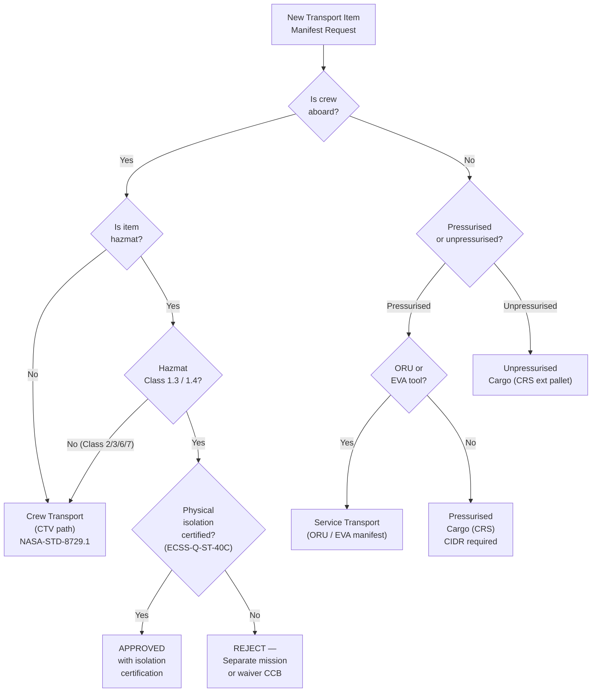

# STA 180-189 · 182-050 — Cargo Crew and Service Transport Boundaries

## 1. Purpose

This document defines the normative boundaries between crew transport, cargo transport, and service transport operations within the **ATLAS-1000** register[^baseline][^archtable]. These boundaries govern manifesting rules, hazardous-materials handling, human-rating requirements, containment standards, and ORU/EVA delivery protocols.

The **crew-cargo separation rule** is a safety-critical constraint: no simultaneous carriage of crew and hazmat Class 1.4 or Class 1.3 cargo unless physically isolated per ECSS-Q-ST-40C requirements. The `no_aaa_rule` applies to all boundary identifiers and classification codes.

## 2. Scope

- **Crew transport boundary definition**: CTV must satisfy all NASA-STD-8729.1 human-rating criteria; crew compartment atmospheric pressure maintained at 101.3 kPa ±3.5 kPa nominal (or reduced-pressure protocol documented in ICD); thermal envelope 18–27 °C crew habitat.
- **Abort system authority**: launch abort system (LAS) — autonomous abort authority takes precedence over ground command from T-30 s to orbit insertion; abort mode definitions (Mode I: pad abort, Mode II: low-altitude abort, Mode III: high-altitude abort) shall be documented in Crew Transport Certification dossier.
- **Crew ingress/egress timeline**: from crew ingress T-3 h to hatch close T-45 min; post-landing egress ≤ 60 min nominal, ≤ 3 h contingency; emergency egress ≤ 5 min.
- **Cargo boundary — pressurised**: pressurised cargo transported in ISS-compatible bags or equivalent containment; International Partner Standard Payload Rack (ISPR) envelope where applicable; all cargo items must carry a cargo item data record (CIDR).
- **Cargo boundary — unpressurised**: unpressurised cargo attached to external pallet or berthing fixture; thermal cycling compliance per environmental specification; contamination controls for optics-critical payloads.
- **Hazardous materials classification**: hazmat Class 1 (explosives), Class 2 (gases), Class 3 (flammable liquids), Class 6 (toxic), Class 7 (radioactive) — each class has specific containment and quantity-distance requirements per ECSS-Q-ST-40C and IATA DGR (space-adapted).
- **Crew-cargo separation rule**: simultaneous crew and hazmat Class 1.3/1.4 cargo is prohibited unless physically separated by a Class-rated bulkhead with pressure and fire containment; waiver requires CCB approval and independent safety review.
- **Leak-before-break criterion**: pressurised cargo containers must satisfy leak-before-break: fracture mechanics analysis demonstrating that through-wall crack is detectable before critical crack growth; per NASA-STD-5019 § 6.3.
- **Service transport boundary — ORU delivery**: orbital replacement unit (ORU) delivery specifications: mass ≤ 600 kg per ORU unless robotic handling confirmed; stowage volume per ISPR or ISS cargo transfer bag (CTB) equivalent; delivery timeline coordinated with EVA plan.
- **EVA tool package requirements**: EVA tool packages manifested as service cargo; electrical bonding and grounding conformance for EVA tools; tool tether points per EVA tool standard; tool containment bag with tamper-evident seal for re-entry disposal items.
- **Robotic arm grapple fixture standards**: PGDF-type (Passive Grapple Fixture) for SSRMS compatibility; load rating ≥ 1000 N axial; positional accuracy ≤ 5 mm for berthing approach guidance.
- **In-space assembly support manifest**: assembly support cargo manifested separately from consumables; includes structural members, fasteners, EVA equipment, and inspection tools; manifest frozen at FRR minus 30 days.

## 3. Diagram — Crew / Cargo / Service Boundary Decision Tree

## 4. Footprint

| Metric | Value |
|---|---|
| Architecture | `STA` — Space Technology Architecture |
| Master range | `100–199` |
| Code range | `180-189` |
| Section | `08` — Infraestructura y Logística Espacial |
| Subsection | `182` — Transporte Espacial |
| Subsubject | `005` — Cargo, Crew and Service Transport Boundaries |
| Primary Q-Division | Q-SPACE[^qdiv] |
| Support Q-Divisions | Q-DATAGOV, Q-HPC, Q-HORIZON, Q-GREENTECH, Q-STRUCTURES, Q-INDUSTRY |
| ORB support | ORB-PMO, ORB-LEG |
| Governance class | `baseline`[^gov] |
| Document | `182-050-Cargo-Crew-and-Service-Transport-Boundaries.md` (this file) |
| Parent subsection | [`README.md`](./README.md) · [`182-000-General.md`](./182-000-General.md) |
| Parent section | [`../README.md`](../README.md) |
| Parent architecture | [`../../README.md`](../../README.md) |
| Parent baseline | [`organization/Q+ATLANTIDE.md`](../../../../organization/Q+ATLANTIDE.md) |

## 5. References & Citations

| Standard | Body | Edition | Scope |
|---|---|---|---|
| NASA-STD-8729.1 | NASA | 2022 | Human-rating — crew transport |
| ECSS-Q-ST-40C | ESA/ECSS | 2011 | Safety — hazardous cargo analysis |
| NASA-STD-5019 | NASA | 2016 | Fracture control — pressurised containers |
| ECSS-E-ST-35C | ESA/ECSS | 2011 | Propulsion — service transport propellant |
| IATA DGR | IATA | Current | Dangerous goods — space-adapted |

[^baseline]: **Q+ATLANTIDE controlled baseline (v1.0.0)** — [`organization/Q+ATLANTIDE.md`](../../../../organization/Q+ATLANTIDE.md). Defines the controlled `000-999` architecture-band taxonomy and the ATLAS-1000 register subpart.

[^archtable]: **STA §3 Architecture Table** — [`../../README.md` §3](../../README.md#3-architecture-table). Authoritative source for the `180-189` row.

[^qdiv]: **Q-Division authority** — Q-Divisions provide technical authority over an architecture row (Q+ATLANTIDE Note N-002). See [`organization/Q+ATLANTIDE.md` §4](../../../../organization/Q+ATLANTIDE.md#4-notes).

[^gov]: **Governance class** — `baseline` denotes documents under controlled change management within the Q+ATLANTIDE baseline.
