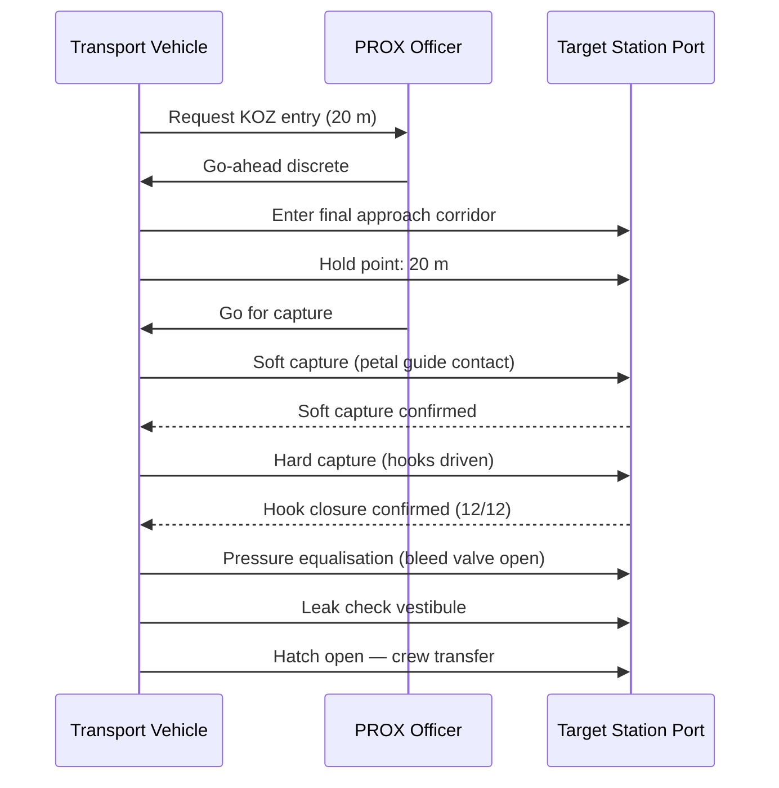

# STA 180-189 · 182-060 — Docking Berthing and Transfer Interfaces

## 1. Purpose

This document defines all docking, berthing, and pressurised-transfer interface requirements for space transport vehicles operating within the **ATLAS-1000** register[^baseline][^archtable]. It covers docking mechanism standards, berthing sequence protocols, approach corridor geometry, keep-out zone (KOZ) definitions, and pressurised-tunnel transfer procedures.

All docking and berthing interface definitions are normative and traceable to the International Docking System Standard (IDSS) Rev. F (NASA-TM-2016-219116), the Common Berthing Mechanism (CBM) ICD, and ECSS-E-ST-60C rendezvous GNC requirements. The `no_aaa_rule` applies to all docking port, berthing port, and corridor identifiers.

## 2. Scope

- **IDSS docking mechanism**: International Docking System Standard (NASA-TM-2016-219116) Rev. F; androgynous design allows any IDSS port to dock with any other; petal-guide capture range ±0.254 m lateral, ±5° angular; soft-capture via petal guides → hard-capture via structural hooks; 12 × hooks provide structural load path after hook-drive.
- **Active vs passive docking roles**: one port designated active (approach vehicle, powered petals) and one passive; role assignment is trajectory-dependent and confirmed in rendezvous/proximity operations (RPO) plan.
- **APAS-89/95 legacy interface**: Androgynous Peripheral Attach System; retained for heritage compatibility with ISS and Soyuz/Progress; not baselined for new Q+ATLANTIDE transport vehicles; legacy adapter ring required if mixed-fleet operations.
- **CBM (Common Berthing Mechanism)**: used for berthing via SSRMS (robotic arm capture); active CBM on ISS/station side; passive CBM on visiting vehicle; capture bar and grapple fixture must be SSRMS-compatible (PGDF); four-bolt pattern sealing interface.
- **Approach ellipsoid definition**: keep-away ellipsoid centered on target docking port — major axis (along V-bar or R-bar approach axis): 200 m from target; minor axes: 50 m; vehicle must receive explicit go-ahead from proximity operations officer (PROX) to enter ellipsoid.
- **Keep-out zone (KOZ)**: hard KOZ — 20 m sphere centered on docking port; no approach vehicle may enter KOZ without go/no-go discrete from crew and ground; approach may abort-to-depart at any point before contact.
- **Closing rate limits**: V-bar approach ≤ 0.3 m/s at 200 m, ≤ 0.1 m/s at 20 m; R-bar approach ≤ 0.15 m/s at 50 m, ≤ 0.05 m/s at 10 m; lateral velocity ≤ 0.05 m/s throughout final approach corridor.
- **Abort-to-depart authority**: crew aboard visiting vehicle has autonomous authority to initiate abort-to-depart manoeuvre at any time during approach; ground commanding cannot override crew abort initiation.
- **Transfer tunnel pressurisation equalisation**: prior to hatch opening, differential pressure across hatch must be ≤ 0.069 kPa (10 mbar); equalisation via bleed valve; hatch structural loading from ΔP at 70.3 kPa (10.2 psi) max design ΔP.
- **Hatch opening sequence**: pressure equalisation → leak check of vestibule → vestibule pressurisation to nominal habitat pressure → hatch open; total sequence ≤ 45 min from hard capture to crew transfer initiation.
- **Umbilical connectors at docking interface**: power transfer (28 VDC ±4 V), data (1553B bus or Ethernet), fluid lines (water, coolant, oxygen — quick-disconnect type); connector mating is automatic on hard capture.
- **Integrated interface verification**: docking/berthing interface verified at vehicle level via mate/demate functional test; pressure integrity verified via leak test at 1.5 × MEOP; interface verification records filed in TCIL.

## 3. Diagram — Docking and Berthing Sequence

## 4. Footprint

| Metric | Value |
|---|---|
| Architecture | `STA` — Space Technology Architecture |
| Master range | `100–199` |
| Code range | `180-189` |
| Section | `08` — Infraestructura y Logística Espacial |
| Subsection | `182` — Transporte Espacial |
| Subsubject | `006` — Docking, Berthing and Transfer Interfaces |
| Primary Q-Division | Q-SPACE[^qdiv] |
| Support Q-Divisions | Q-DATAGOV, Q-HPC, Q-HORIZON, Q-GREENTECH, Q-STRUCTURES, Q-INDUSTRY |
| ORB support | ORB-PMO, ORB-LEG |
| Governance class | `baseline`[^gov] |
| Document | `182-060-Docking-Berthing-and-Transfer-Interfaces.md` (this file) |
| Parent subsection | [`README.md`](./README.md) · [`182-000-General.md`](./182-000-General.md) |
| Parent section | [`../README.md`](../README.md) |
| Parent architecture | [`../../README.md`](../../README.md) |
| Parent baseline | [`organization/Q+ATLANTIDE.md`](../../../../organization/Q+ATLANTIDE.md) |

## 5. References & Citations

| Standard | Body | Edition | Scope |
|---|---|---|---|
| NASA-TM-2016-219116 | NASA | 2016 | International Docking System Standard (IDSS) |
| ECSS-E-ST-60C | ESA/ECSS | 2013 | GNC — rendezvous and proximity operations |
| ECSS-E-ST-32C | ESA/ECSS | 2008 | Structural engineering — docking interface loads |
| NASA-STD-8729.1 | NASA | 2022 | Human-rating — crew transfer procedures |
| CCSDS 910.11-B-1 | CCSDS | 2012 | Proximity operations communications |

[^baseline]: **Q+ATLANTIDE controlled baseline (v1.0.0)** — [`organization/Q+ATLANTIDE.md`](../../../../organization/Q+ATLANTIDE.md). Defines the controlled `000-999` architecture-band taxonomy and the ATLAS-1000 register subpart.

[^archtable]: **STA §3 Architecture Table** — [`../../README.md` §3](../../README.md#3-architecture-table). Authoritative source for the `180-189` row.

[^qdiv]: **Q-Division authority** — Q-Divisions provide technical authority over an architecture row (Q+ATLANTIDE Note N-002). See [`organization/Q+ATLANTIDE.md` §4](../../../../organization/Q+ATLANTIDE.md#4-notes).

[^gov]: **Governance class** — `baseline` denotes documents under controlled change management within the Q+ATLANTIDE baseline.
