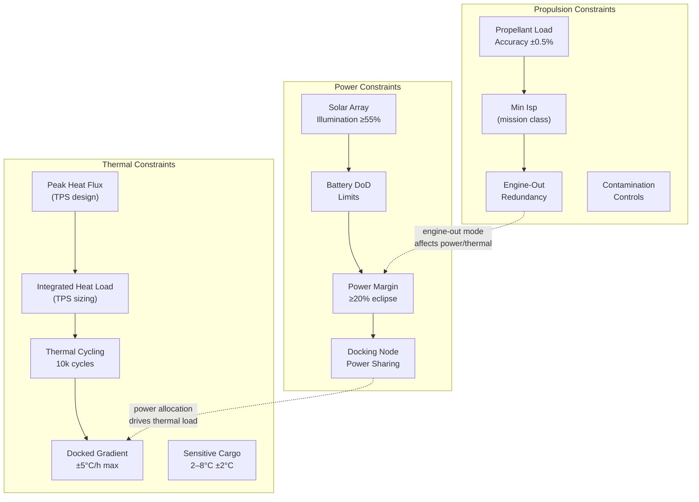

# STA 180-189 · 182-070 — Propulsion Power and Thermal Transport Constraints

## 1. Purpose

This document defines the propulsion, electrical power, and thermal constraints applicable to all space transport vehicles within the **ATLAS-1000** register[^baseline][^archtable]. Constraints are normative design drivers that must be reflected in the transport vehicle's system requirements specification (SRS) and verified at Critical Design Review (CDR) and Qualification Review (QR).

These constraints are designated **space-transport critical**. Violations require formal deviation/waiver through the CCB process and reassessment of the transport RTM in `182-090-Traceability-Evidence-and-Lifecycle-Governance.md`. The `no_aaa_rule` applies to all constraint identifiers.

## 2. Scope

- **Minimum Isp requirements by mission class**: chemical CTV/OTV ≥ 320 s (LH₂/LOX), ≥ 360 s (LCH₄/LOX vacuum Isp); electric OTV Hall thruster ≥ 1500 s; gridded ion ≥ 3000 s; these are minimum qualification thresholds; mission delta-V budgets use actual measured Isp with 3σ off-nominal deduction.
- **Propellant loading accuracy**: ±0.5 % of nominal loaded propellant mass for all in-space transfer missions; crewed missions additionally require pre-launch propellant mass verification via certified mass measurement (calibrated load cells, ±0.1 % accuracy).
- **Engine-out redundancy criteria**: for crewed transport vehicles, loss of any single engine must not prevent completion of the mission or, alternatively, must provide safe crew return capability; demonstrated by fault-tree analysis with single-failure-point identification and mitigation.
- **Propellant crossfeed restrictions**: inter-tank crossfeed is permitted only if explicitly modelled in propellant budget analysis and verified against feed-system pressure stability; crossfeed valves are fail-safe closed for crewed missions.
- **Propellant contamination controls**: oxidiser and fuel circuits segregated per ECSS-E-ST-35C contamination level requirements; cleanliness verification per contamination control plan; particulate limits ≤ 300 ppm mass fraction.
- **On-orbit power budget during transit**: minimum solar array illumination fraction for cis-lunar missions ≥ 0.55 averaged over transit (eclipse periods considered); battery depth-of-discharge (DoD) ≤ 50 % for nickel-hydrogen, ≤ 80 % for lithium-ion (crewed), ≤ 90 % (uncrewed cargo); power margin ≥ 20 % during eclipse.
- **Docking node power-sharing protocol**: when docked to orbital base, transport vehicle may draw from base power bus subject to ICD-defined power allocation; no transport vehicle shall draw > 2 kW from base bus without explicit manifested power allocation; excess demand triggers automated current-limiting.
- **Re-entry TPS design drivers — peak heat flux**: peak stagnation heat flux (convective + radiative) at reference nose radius; crewed capsule design requirement typically 150–200 W/cm² for LEO re-entry, up to 1500 W/cm² for lunar-return velocity (11 km/s); TPS material selection and thickness verified by arc-jet testing.
- **Re-entry TPS design drivers — integrated heat load**: total heat load (J/cm²) drives TPS ablator mass; integrated heat load for LEO return ≈ 20–30 kJ/cm²; lunar-return ≈ 100–120 kJ/cm²; TPS sizing with 20 % margin on integrated heat load.
- **On-orbit thermal cycling limits**: transport vehicle structure must withstand minimum 10 000 thermal cycles from −150 °C to +120 °C over design lifetime; TPS attachments verified for fatigue from thermal gradient cycling.
- **Docked configuration thermal gradient management**: when docked, interface heat conduction between vehicle and station must not exceed ±5 °C/h rate on any structural interface; thermal isolation washers required if heat flux analysis shows exceedance risk.
- **Payload temperature-sensitive cargo thermal control**: pharmaceutical or biological cargo requiring 2–8 °C storage must be in a thermally controlled container with ±2 °C accuracy, battery-backed for ≥ 72 h; temperature log transmitted to ground every 15 min.

## 3. Diagram — Propulsion / Power / Thermal Constraint Interactions

## 4. Footprint

| Metric | Value |
|---|---|
| Architecture | `STA` — Space Technology Architecture |
| Master range | `100–199` |
| Code range | `180-189` |
| Section | `08` — Infraestructura y Logística Espacial |
| Subsection | `182` — Transporte Espacial |
| Subsubject | `007` — Propulsion, Power and Thermal Transport Constraints |
| Primary Q-Division | Q-SPACE[^qdiv] |
| Support Q-Divisions | Q-DATAGOV, Q-HPC, Q-HORIZON, Q-GREENTECH, Q-STRUCTURES, Q-INDUSTRY |
| ORB support | ORB-PMO, ORB-LEG |
| Governance class | `baseline`[^gov] |
| Document | `182-070-Propulsion-Power-and-Thermal-Transport-Constraints.md` (this file) |
| Parent subsection | [`README.md`](./README.md) · [`182-000-General.md`](./182-000-General.md) |
| Parent section | [`../README.md`](../README.md) |
| Parent architecture | [`../../README.md`](../../README.md) |
| Parent baseline | [`organization/Q+ATLANTIDE.md`](../../../../organization/Q+ATLANTIDE.md) |

## 5. References & Citations

| Standard | Body | Edition | Scope |
|---|---|---|---|
| ECSS-E-ST-35C | ESA/ECSS | 2011 | Propulsion — Isp and contamination |
| ECSS-E-ST-10-03C | ESA/ECSS | 2012 | Testing — thermal cycling verification |
| NASA-STD-5019 | NASA | 2016 | Fracture control — TPS attachments |
| NASA-STD-8729.1 | NASA | 2022 | Human-rating — power and thermal crew environment |
| ECSS-Q-ST-40C | ESA/ECSS | 2011 | Safety — hazard analysis (propellant contamination) |

[^baseline]: **Q+ATLANTIDE controlled baseline (v1.0.0)** — [`organization/Q+ATLANTIDE.md`](../../../../organization/Q+ATLANTIDE.md). Defines the controlled `000-999` architecture-band taxonomy and the ATLAS-1000 register subpart.

[^archtable]: **STA §3 Architecture Table** — [`../../README.md` §3](../../README.md#3-architecture-table). Authoritative source for the `180-189` row.

[^qdiv]: **Q-Division authority** — Q-Divisions provide technical authority over an architecture row (Q+ATLANTIDE Note N-002). See [`organization/Q+ATLANTIDE.md` §4](../../../../organization/Q+ATLANTIDE.md#4-notes).

[^gov]: **Governance class** — `baseline` denotes documents under controlled change management within the Q+ATLANTIDE baseline.
