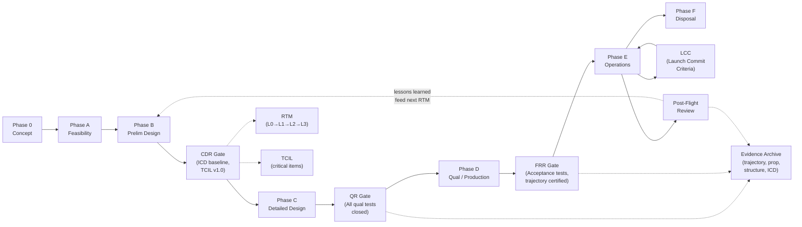

# STA 180-189 · 182-090 — Traceability Evidence and Lifecycle Governance

## 1. Purpose

This document defines the traceability framework, evidence types, lifecycle gate criteria, and change governance rules for all space transport elements within subsection `182` of the **ATLAS-1000** register[^baseline][^archtable]. It establishes the Requirements Traceability Matrix (RTM) structure, specifies mandatory evidence types for each lifecycle phase, and defines the authority structure for transport-critical change management.

This document is the capstone governance subsubject for subsection `182`; all other subsubjects (`001`–`009`) reference this document for their CCB escalation path and evidence obligations. The `no_aaa_rule` applies to all lifecycle gate identifiers, requirement identifiers, and evidence record identifiers.

## 2. Scope

- **RTM structure**: traceability flows from mission transport requirement (Level 0) → vehicle-level specification (Level 1) → subsystem requirement (Level 2) → component requirement (Level 3); each requirement node carries an owner Q-Division, verification method (analysis/test/inspection/demonstration), and evidence reference.
- **Trajectory analysis evidence**: Monte Carlo trajectory dispersion analysis (minimum 1000 runs); outputs: probability of orbit insertion within ±3σ tolerances; stored as a certified trajectory authority product; updated at each mission design review milestone.
- **Propulsion test evidence**: acceptance test for each engine/thruster (hot-fire, thrust measurement, Isp verification); qualification test for engine type (duty-cycle, endurance, thermal vacuum); test reports archived in transport critical item list (TCIL).
- **Structural analysis and test evidence**: finite element analysis (FEA) for LVA and docking interfaces per ECSS-E-ST-32C; structural qualification test (static load, vibration, shock per ECSS-E-ST-10-03C); test report closure required before CDR.
- **Interface verification evidence**: ICD acceptance testing for all transport vehicle interfaces (mechanical mate/demate, electrical continuity/isolation, data link verification, fluid system leak test); conducted at module level and system level; results in TCIL.
- **Human-rating review evidence** (CTV only): NASA-STD-8729.1 Human Rating Certification Package (HRCP) — includes abort system authority analysis, crew compartment environmental analysis, emergency egress test, independent safety review board (ISRB) report.
- **Flight operations procedures approval**: all nominal and contingency procedures reviewed and signed off by trajectory authority, vehicle flight director, and (for crewed missions) flight surgeon; procedures baselined at FRR minus 21 days.
- **Lifecycle phases per ECSS-M-ST-10C**: Phase 0 (concept), Phase A (feasibility), Phase B (preliminary design), Phase C (detailed design), Phase D (qualification/production), Phase E (operations), Phase F (disposal).
- **Gate criteria — CDR**: structural analysis closure, interface ICD baseline, propulsion design analysis closure, trajectory design baseline, TCIL version 1.0 released; CDR exit requires all Level 1 requirements traced and all open actions classified.
- **Gate criteria — Qualification Review (QR)**: all qualification test reports closed; all deviations and waivers from qualification scope resolved or formally accepted; TCIL updated with qualification evidence references.
- **Gate criteria — Flight Readiness Review (FRR)**: all flight hardware acceptance tests closed; trajectory products certified by trajectory authority; flight procedures approved; hazard reports closed or accepted; TCIL at FRR configuration baseline.
- **Gate criteria — Launch Commit Criteria (LCC)**: real-time vehicle state check against LCC parameter list (propellant loading, range weather, TM link budget, crew health for crewed missions); LCC cleared by launch director.
- **Post-Flight Review (PFR)**: within 30 days of mission completion; review of flight telemetry vs. predictions; anomaly report closure; TCIL updated with as-flown evidence; inputs fed to next-mission RTM.
- **Transport critical item list (TCIL)**: master controlled document listing all safety-critical and mission-critical transport elements; each item has owner, criticality level, verification status, and evidence reference; CCB authority over TCIL changes.
- **Change authority — CCB**: Configuration Control Board has authority over all TCIL changes, requirement deviations, and waivers; quorum includes Q-SPACE lead, ORB-PMO representative, and (for crewed missions) human factors safety lead; all CCB decisions recorded in change log.

## 3. Diagram — Lifecycle Gate Diagram with Traceability Evidence Links

## 4. Footprint

| Metric | Value |
|---|---|
| Architecture | `STA` — Space Technology Architecture |
| Master range | `100–199` |
| Code range | `180-189` |
| Section | `08` — Infraestructura y Logística Espacial |
| Subsection | `182` — Transporte Espacial |
| Subsubject | `010` — Traceability, Evidence and Lifecycle Governance |
| Primary Q-Division | Q-SPACE[^qdiv] |
| Support Q-Divisions | Q-DATAGOV, Q-HPC, Q-HORIZON, Q-GREENTECH, Q-STRUCTURES, Q-INDUSTRY |
| ORB support | ORB-PMO, ORB-LEG |
| Governance class | `baseline`[^gov] |
| Document | `182-090-Traceability-Evidence-and-Lifecycle-Governance.md` (this file) |
| Parent subsection | [`README.md`](./README.md) · [`182-000-General.md`](./182-000-General.md) |
| Parent section | [`../README.md`](../README.md) |
| Parent architecture | [`../../README.md`](../../README.md) |
| Parent baseline | [`organization/Q+ATLANTIDE.md`](../../../../organization/Q+ATLANTIDE.md) |

## 5. References & Citations

| Standard | Body | Edition | Scope |
|---|---|---|---|
| ECSS-M-ST-10C | ESA/ECSS | 2009 | Project planning — Phase 0–F lifecycle |
| ECSS-E-ST-10-03C | ESA/ECSS | 2012 | Testing — qualification and acceptance |
| ECSS-E-ST-32C | ESA/ECSS | 2008 | Structural analysis — FEA requirements |
| NASA-STD-8729.1 | NASA | 2022 | Human-rating — HRCP requirements |
| NASA-STD-5019 | NASA | 2016 | Fracture control — TCIL criticality |

[^baseline]: **Q+ATLANTIDE controlled baseline (v1.0.0)** — [`organization/Q+ATLANTIDE.md`](../../../../organization/Q+ATLANTIDE.md). Defines the controlled `000-999` architecture-band taxonomy and the ATLAS-1000 register subpart.

[^archtable]: **STA §3 Architecture Table** — [`../../README.md` §3](../../README.md#3-architecture-table). Authoritative source for the `180-189` row.

[^qdiv]: **Q-Division authority** — Q-Divisions provide technical authority over an architecture row (Q+ATLANTIDE Note N-002). See [`organization/Q+ATLANTIDE.md` §4](../../../../organization/Q+ATLANTIDE.md#4-notes).

[^gov]: **Governance class** — `baseline` denotes documents under controlled change management within the Q+ATLANTIDE baseline.
