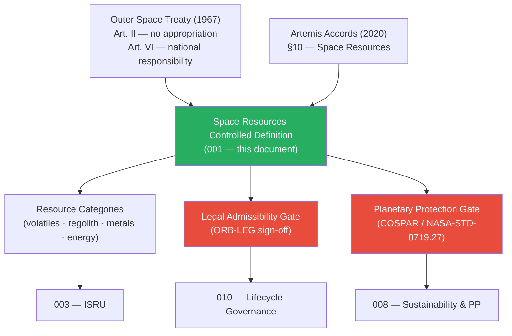

# STA 180-189 · Section 08 · Subsection 183 · Subsubject 001 — Space Resources Controlled Definition

## 1. Purpose

Establishes the **normative definition and controlled scope of space resources** for the Q+ATLANTIDE STA band, defining key terms, applicability limits, legal admissibility conditions, and regulatory references per the Outer Space Treaty[^ost], the Artemis Accords[^artemis], and applicable national legislation frameworks.

## 2. Scope

- Covers the *Space Resources Controlled Definition* subsubject (`001`) of subsection `183`.
- Inherits Q-Division authority and ORB support from the parent row in [`../../README.md` §3](../../README.md#3-architecture-table)[^archtable].
- Concepts in scope:
  - **Controlled definition** — Space Resources as all naturally occurring materials found on celestial bodies (Moon, asteroids, Mars, other) that can be extracted, processed and utilised to support space missions or returned to Earth, subject to applicable legal frameworks.
  - **Resource categories** — volatiles (water ice, CO₂, methane, ammonia), regolith (bulk material, construction aggregate), metals and mineral concentrates (iron, aluminium, titanium, rare earths), energy sources (solar irradiance, nuclear fuel precursors).
  - **Applicability** — all STA `180-189` activities involving extraction, processing, transfer or use of in-situ materials; excludes atmospheric gases of Earth or resources already in Earth orbit.
  - **Controlled vocabulary** — *ISRU*, *beneficiation*, *propellant production*, *regolith*, *volatile*, *planetary protection*, *feedstock*, *resource chain*, *legal admissibility*, *mission-enabling resource*.
  - **Legal admissibility conditions** — resource-extraction activities require (a) compliance with the Outer Space Treaty Art. II (no national appropriation of celestial bodies), (b) consistency with Artemis Accords §10 (space resources), (c) national space-law authorisation where applicable (e.g., US Commercial Space Launch Competitiveness Act, Luxembourg Space Resources Law), and (d) ORB-LEG sign-off per Q+ATLANTIDE governance.
  - **Planetary-protection gate** — prior to any resource extraction on a body with COSPAR Category II–V designation, a planetary-protection assessment per NASA-STD-8719.27[^pp] is mandatory and must be approved before mission authorisation.
  - **No-AAA Rule** — no safety- or resource-critical module within this subsection shall use "AAA" as an identifier per Q+ATLANTIDE Note N-004.

## 3. Diagram — Space Resources Definition Framework

## 4. Footprint

| Metric | Value |
|---|---|
| Architecture | `STA` — Space Technology Architecture |
| Master range | `100–199` |
| Code range | `180-189` |
| Section | `08` — Infraestructura y Logística Espacial |
| Subsection | `183` — Recursos Espaciales |
| Subsubject | `001` — Space Resources Controlled Definition |
| Primary Q-Division | Q-SPACE[^qdiv] |
| Support Q-Divisions | Q-DATAGOV, Q-HPC, Q-HORIZON, Q-GREENTECH, Q-STRUCTURES, Q-INDUSTRY |
| ORB support | ORB-PMO, ORB-LEG |
| Governance class | `baseline`[^gov] |
| Folder path | `Q+ATLANTIDE/100-199_STA/180-189_Infraestructura-y-Logistica-Espacial/183_Recursos-Espaciales/` |
| Document | `001_Space-Resources-Controlled-Definition.md` (this file) |
| Parent subsection | [`README.md`](./README.md) · [`000_Overview.md`](./000_Overview.md) |
| Parent architecture | [`../../README.md`](../../README.md) |
| Parent baseline | [`organization/Q+ATLANTIDE.md`](../../../../organization/Q+ATLANTIDE.md) |

## 5. References & Citations

[^baseline]: **Q+ATLANTIDE controlled baseline (v1.0.0)** — [`organization/Q+ATLANTIDE.md`](../../../../organization/Q+ATLANTIDE.md). Defines the controlled `000-999` architecture-band taxonomy and the ATLAS-1000 register subpart.

[^archtable]: **STA §3 Architecture Table** — [`../../README.md` §3](../../README.md#3-architecture-table). Authoritative source for the `180-189` row.

[^qdiv]: **Q-Division authority** — Q-Divisions provide technical authority over an architecture row (Q+ATLANTIDE Note N-002). See [`organization/Q+ATLANTIDE.md` §4](../../../../organization/Q+ATLANTIDE.md#4-notes).

[^gov]: **Governance class** — `baseline` denotes documents under controlled change management within the Q+ATLANTIDE baseline.

[^ost]: **Outer Space Treaty (1967)** — Treaty on Principles Governing the Activities of States in the Exploration and Use of Outer Space. Art. II prohibits national appropriation; Art. VI assigns national responsibility for non-governmental activities.

[^artemis]: **Artemis Accords (2020)** — Bilateral civil space exploration agreements. §10 provides that extraction and utilisation of space resources is not inherently prohibited by international law.

[^pp]: **NASA-STD-8719.27 — Planetary Protection Provisions for Robotic Extraterrestrial Missions** — Defines planetary-protection requirements by COSPAR category for all extraterrestrial missions.

### Applicable industry standards

- Outer Space Treaty (1967)[^ost]
- Artemis Accords (2020)[^artemis]
- NASA-STD-8719.27 — Planetary Protection Provisions[^pp]
- COSPAR Planetary Protection Policy (2017 rev.)
- US Commercial Space Launch Competitiveness Act (2015) — §402 Space Resource Commercial Exploration and Utilisation
- Luxembourg Law on Space Resources (2017)
