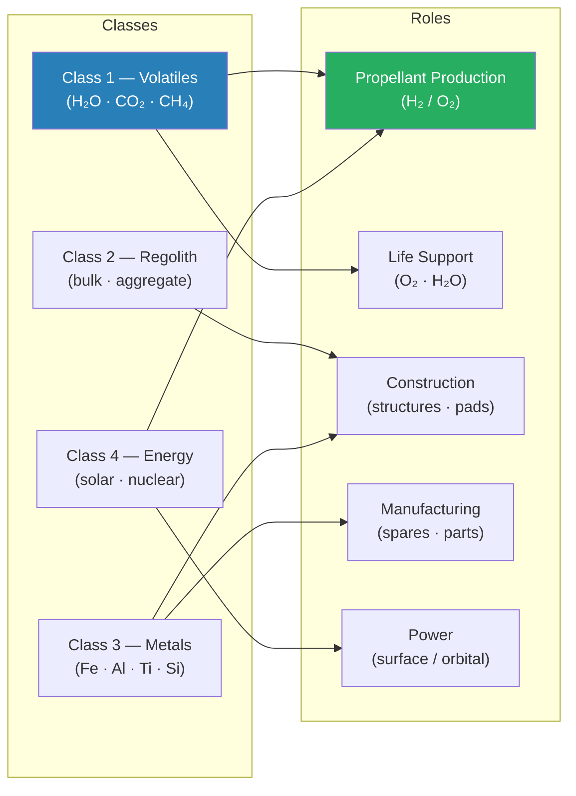

# STA 180-189 · Section 08 · Subsection 183 · Subsubject 002 — Resource Classes and Mission Roles

## 1. Purpose

Defines the **taxonomy of space resource classes** and maps each class to its mission-enabling roles within the Q+ATLANTIDE STA programme, establishing the functional hierarchy that drives ISRU system design, logistics planning, and traceability requirements.

## 2. Scope

- Covers the *Resource Classes and Mission Roles* subsubject (`002`) of subsection `183`.
- Inherits Q-Division authority and ORB support from the parent row in [`../../README.md` §3](../../README.md#3-architecture-table)[^archtable].
- Concepts in scope:
  - **Class 1 — Volatiles**: water ice (H₂O), carbon dioxide (CO₂), methane (CH₄), ammonia (NH₃), hydrogen sulfide (H₂S). Mission roles: propellant production (H₂/O₂), life support consumables (O₂, potable water), thermal working fluids, radiation shielding mass.
  - **Class 2 — Regolith and bulk material**: unconsolidated surface material. Mission roles: construction aggregate, additive manufacturing feedstock, radiation shielding, landing-pad stabilisation, thermal mass.
  - **Class 3 — Metals and mineral concentrates**: iron (Fe), aluminium (Al), titanium (Ti), silicon (Si), rare-earth elements (REE). Mission roles: structural components, solar-cell substrates, electronics, spare parts via on-site manufacturing.
  - **Class 4 — Energy resources**: solar irradiance (surface and orbital), potential nuclear fuel precursors (Helium-3 on lunar surface, uranium concentrations). Mission roles: primary and backup electrical power, propellant production energy, habitat power.
  - **Mission-enabling role hierarchy** — propellant production is the highest-leverage role (mass-leverage ratio > 50:1 for cis-lunar operations); life-support consumables rank second; construction materials rank third.
  - **Source body mapping** — lunar south pole (Class 1 volatiles, Class 2 regolith, Class 3 metals), near-Earth asteroids (Class 1 volatiles, Class 3 metals), Mars regolith/atmosphere (Class 1, Class 2, Class 4).
  - **Mission-phase applicability** — Class 1 volatiles are mission-critical from initial lunar surface operations; Class 3 metals become relevant in sustained base build-out phase (>5 years post-initial-landing).

## 3. Diagram — Resource Classes and Mission Role Hierarchy

## 4. Footprint

| Metric | Value |
|---|---|
| Architecture | `STA` — Space Technology Architecture |
| Master range | `100–199` |
| Code range | `180-189` |
| Section | `08` — Infraestructura y Logística Espacial |
| Subsection | `183` — Recursos Espaciales |
| Subsubject | `002` — Resource Classes and Mission Roles |
| Primary Q-Division | Q-SPACE[^qdiv] |
| Support Q-Divisions | Q-DATAGOV, Q-HPC, Q-HORIZON, Q-GREENTECH, Q-STRUCTURES, Q-INDUSTRY |
| ORB support | ORB-PMO, ORB-LEG |
| Governance class | `baseline`[^gov] |
| Folder path | `Q+ATLANTIDE/100-199_STA/180-189_Infraestructura-y-Logistica-Espacial/183_Recursos-Espaciales/` |
| Document | `002_Resource-Classes-and-Mission-Roles.md` (this file) |
| Parent subsection | [`README.md`](./README.md) · [`000_Overview.md`](./000_Overview.md) |
| Parent architecture | [`../../README.md`](../../README.md) |
| Parent baseline | [`organization/Q+ATLANTIDE.md`](../../../../organization/Q+ATLANTIDE.md) |

## 5. References & Citations

[^baseline]: **Q+ATLANTIDE controlled baseline (v1.0.0)** — [`organization/Q+ATLANTIDE.md`](../../../../organization/Q+ATLANTIDE.md). Defines the controlled `000-999` architecture-band taxonomy and the ATLAS-1000 register subpart.

[^archtable]: **STA §3 Architecture Table** — [`../../README.md` §3](../../README.md#3-architecture-table). Authoritative source for the `180-189` row.

[^qdiv]: **Q-Division authority** — Q-Divisions provide technical authority over an architecture row (Q+ATLANTIDE Note N-002). See [`organization/Q+ATLANTIDE.md` §4](../../../../organization/Q+ATLANTIDE.md#4-notes).

[^gov]: **Governance class** — `baseline` denotes documents under controlled change management within the Q+ATLANTIDE baseline.

[^isecg]: **ISECG Global Exploration Roadmap (2018)** — International Space Exploration Coordination Group framework defining resource utilisation phases and mission-enabling priorities for the Moon, Mars and asteroids.

[^nss]: **NASA Space Resources Strategy** — NASA resource utilisation strategic framework defining propellant production as the primary mission-enabling ISRU application for Artemis and beyond.

### Applicable industry standards

- ISECG Global Exploration Roadmap (2018)[^isecg]
- NASA Space Resources Strategy[^nss]
- ECSS-E-ST-10-04C — Space Environment (resource environment characterisation)
- COSPAR Planetary Protection Policy (2017 rev.) — body classification and resource-extraction constraints
