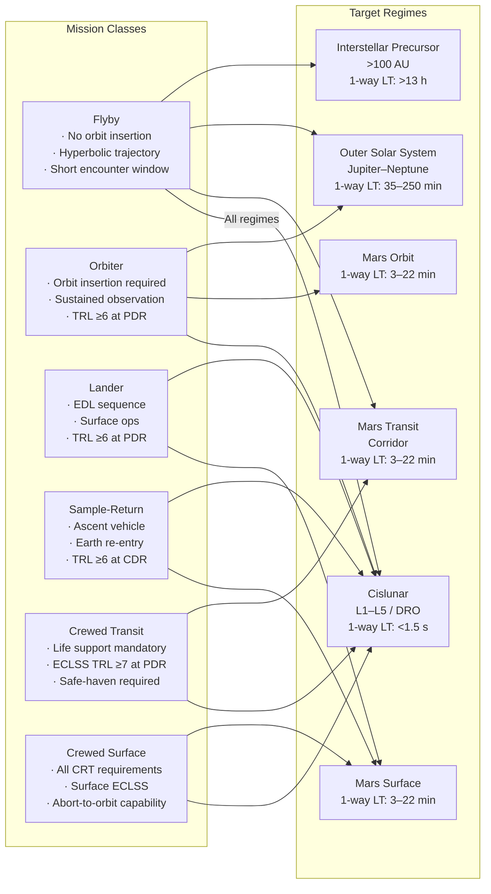

# STA 190-199 · 09.190.002 — Mission Classes and Interplanetary Regimes

## §1 Purpose

This document defines the formal Q+ATLANTIDE mission-class taxonomy and the complete set of interplanetary regime definitions used throughout subsection `190`.[^baseline] The classification is authoritative: every interplanetary mission document within the Q+ATLANTIDE register must declare its mission class and target regime in conformance with the taxonomy established here.[^n001]

The mission-class taxonomy provides the primary dimension for requirement derivation: each class carries distinct boundary conditions for trajectory design (subsubject `003`), propulsion interfaces (`004`), communication and navigation (`005`), infrastructure interfaces (`006`), autonomy (`007`), and human factors (`008`). The regime definitions provide the environmental context — radiation, thermal, communications, and orbital mechanics constraints — that flow down into the physical design of each mission element.[^qdiv]

## §2 Scope

**In scope:**

- Formal Q+ATLANTIDE mission-class taxonomy: Flyby, Orbiter, Lander, Sample-Return, Crewed Transit, Crewed Surface — with normative definitions, distinguishing characteristics, and inter-class boundary conditions.
- Regime definitions and boundary conditions: Cislunar (Earth-Moon system, including Earth-Moon Lagrange points L1–L5), Mars transit corridor, Mars orbit, Mars surface, outer solar system (Jupiter and beyond), and interstellar precursor (>~100 AU).
- Technology Readiness Level (TRL) baseline requirements per mission class: minimum TRL at PDR and CDR for each mission-class critical function.
- Environmental parameters per regime: heliocentric distance, solar flux (W/m²), one-way light time (minutes), galactic cosmic ray (GCR) flux, solar energetic particle (SEP) event frequency, thermal environment range.
- Mission-class applicability matrix: mapping each mission class to its permissible target regimes.

**Out of scope:**

- Specific mission design and spacecraft configuration (governed by subsubjects `003`–`006`).
- Launch vehicle classification and launch-site interfaces.
- Planetary protection category assignment (governed by COSPAR Policy, referenced in subsubject `001`).

## §3 Diagram

## §4 Footprint

| Attribute | Value |
|-----------|-------|
| Architecture | Space Technology Architecture (STA) |
| Master range | 100–199 |
| Code range | 190-199 |
| Section | 09 |
| Subsection | 190 |
| Subsubject | 002 |
| Primary Q-Division | Q-SPACE[^qdiv] |
| Support Q-Divisions | Q-HORIZON, Q-DATAGOV, Q-HPC, Q-GREENTECH, Q-STRUCTURES, Q-INDUSTRY |
| ORB support | ORB-PMO, ORB-LEG |
| Governance class | baseline[^gov] |
| Folder path | `Q+ATLANTIDE/100-199_STA/190-199_Sistemas-Avanzados-Conceptos-y-Futuro-Espacial/190_Arquitecturas-Interplanetarias/` |
| Document | `002_Mission-Classes-and-Interplanetary-Regimes.md` |
| Parent subsection | [README.md](../README.md) · [000_Overview.md](./000_Overview.md) |
| Parent architecture | [../../README.md](../../README.md) |
| Parent baseline | [organization/Q+ATLANTIDE.md](../../../../organization/Q+ATLANTIDE.md) |

## §5 References & Citations

[^baseline]: Q+ATLANTIDE controlled baseline — the authoritative taxonomy and traceability ecosystem governing all Space Technology Architecture documents.
[^archtable]: §3 Architecture Table (parent) — see [../../README.md](../../README.md) for the master architecture index.
[^qdiv]: Q-Division authority — Q-SPACE is the primary authority for all interplanetary architecture standards within Q+ATLANTIDE; Q-HORIZON, Q-DATAGOV, Q-HPC, Q-GREENTECH, Q-STRUCTURES, and Q-INDUSTRY provide supporting governance.
[^gov]: Governance class `baseline` — documents in this class are subject to formal change control under ORB-PMO and ORB-LEG review gates.
[^n001]: Note N-001: Q+ATLANTIDE is a taxonomy and traceability ecosystem; definitions herein are normative within the Q+ATLANTIDE register only.
[^ecss1002]: ECSS-E-ST-10-02C — *Space engineering: Verification*, European Cooperation for Space Standardization, 6 March 2009.
[^nasa7009]: NASA/SP-2016-6105 — *NASA Systems Engineering Handbook*, Rev. 2, National Aeronautics and Space Administration, 2016.
[^nasastd3001]: NASA-STD-3001 — *NASA Space Flight Human System Standard*, Vol. 1–2, National Aeronautics and Space Administration.
[^cospar]: COSPAR Policy on Planetary Protection — Committee on Space Research, current edition.

### Applicable industry standards

| Standard | Title | Body |
|----------|-------|------|
| ECSS-E-ST-10-02C | Space engineering: Verification | ECSS |
| ECSS-M-ST-10C | Space project management: Project planning and implementation | ECSS |
| NASA/SP-2016-6105 | NASA Systems Engineering Handbook | NASA |
| NASA-STD-3001 | NASA Space Flight Human System Standard | NASA |
| COSPAR Planetary Protection Policy | Planetary Protection Policy | COSPAR |
