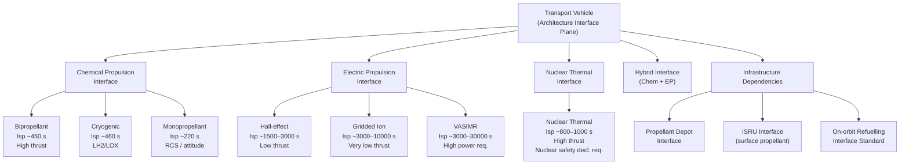

# STA 190-199 · 09.190.004 — Deep-Space Transport and Propulsion Interfaces

## §1 Purpose

This document defines architecture-level interface requirements between an interplanetary transport vehicle and its propulsion system across all applicable propulsion classes.[^baseline] It establishes the interface control requirements, propellant budget conventions, and infrastructure dependency declarations that must be documented and baselined before any interplanetary mission design claiming compliance with subsection `190` proceeds to PDR.[^n001]

The scope is intentionally architecture-level: this document does not specify propulsion subsystem design (governed by STA `120-129`), but defines the functional interfaces, performance envelopes, and dependency declarations that the transport vehicle architecture must accommodate. The key interface domains are: propellant supply and storage, thermal management, power interfaces, structural load path, and in-space refuelling/ISRU interfaces.[^qdiv]

## §2 Scope

**In scope:**

- Propulsion class taxonomy for deep-space applications: chemical (monopropellant, bipropellant, cryogenic), electric (Hall-effect, gridded-ion, VASIMR), nuclear thermal (NTP), and hybrid (chemical + electric) — with Q+ATLANTIDE classification identifiers and TRL requirements per mission class.
- Interface control requirements for each propulsion class: propellant mass flow interface, pressurant interface, thermal conditioning interface, electrical power interface (for electric propulsion), and structural mounting interface.
- Propellant budget conventions: usable propellant, residual, loading error margin, thermal expansion allowance, and reserve margin — with minimum documentation requirements per mission review gate.
- Infrastructure dependency declarations: propellant depot compatibility requirements, in-situ resource utilisation (ISRU) interface declarations, and on-orbit refuelling interface standards.
- Performance envelope boundary conditions: specific impulse (Isp) ranges, thrust levels, and thrust-to-weight ratio constraints per propulsion class and mission regime.
- Exclusion boundary with STA `120-129`: propulsion subsystem internal design is out of scope; the interface plane is the propulsion module mechanical/fluid/electrical connector.

**Out of scope:**

- Propulsion subsystem internal design, component selection, and qualification (STA `120-129`).
- Launch vehicle propulsion and first/second-stage interfaces.
- Nuclear safety and regulatory approval processes beyond the interface boundary declaration requirement.

## §3 Diagram

## §4 Footprint

| Attribute | Value |
|-----------|-------|
| Architecture | Space Technology Architecture (STA) |
| Master range | 100–199 |
| Code range | 190-199 |
| Section | 09 |
| Subsection | 190 |
| Subsubject | 004 |
| Primary Q-Division | Q-SPACE[^qdiv] |
| Support Q-Divisions | Q-HORIZON, Q-DATAGOV, Q-HPC, Q-GREENTECH, Q-STRUCTURES, Q-INDUSTRY |
| ORB support | ORB-PMO, ORB-LEG |
| Governance class | baseline[^gov] |
| Folder path | `Q+ATLANTIDE/100-199_STA/190-199_Sistemas-Avanzados-Conceptos-y-Futuro-Espacial/190_Arquitecturas-Interplanetarias/` |
| Document | `004_Deep-Space-Transport-and-Propulsion-Interfaces.md` |
| Parent subsection | [README.md](../README.md) · [000_Overview.md](./000_Overview.md) |
| Parent architecture | [../../README.md](../../README.md) |
| Parent baseline | [organization/Q+ATLANTIDE.md](../../../../organization/Q+ATLANTIDE.md) |

## §5 References & Citations

[^baseline]: Q+ATLANTIDE controlled baseline — the authoritative taxonomy and traceability ecosystem governing all Space Technology Architecture documents.
[^archtable]: §3 Architecture Table (parent) — see [../../README.md](../../README.md) for the master architecture index.
[^qdiv]: Q-Division authority — Q-SPACE is the primary authority for all interplanetary architecture standards within Q+ATLANTIDE; Q-HORIZON, Q-DATAGOV, Q-HPC, Q-GREENTECH, Q-STRUCTURES, and Q-INDUSTRY provide supporting governance.
[^gov]: Governance class `baseline` — documents in this class are subject to formal change control under ORB-PMO and ORB-LEG review gates.
[^n001]: Note N-001: Q+ATLANTIDE is a taxonomy and traceability ecosystem; definitions herein are normative within the Q+ATLANTIDE register only.
[^ecss1002]: ECSS-E-ST-10-02C — *Space engineering: Verification*, European Cooperation for Space Standardization, 6 March 2009.
[^ecss1003]: ECSS-E-ST-10-03C — *Space engineering: Testing*, European Cooperation for Space Standardization, 1 June 2012.
[^nasa7009]: NASA/SP-2016-6105 — *NASA Systems Engineering Handbook*, Rev. 2, National Aeronautics and Space Administration, 2016.

### Applicable industry standards

| Standard | Title | Body |
|----------|-------|------|
| ECSS-E-ST-10-02C | Space engineering: Verification | ECSS |
| ECSS-E-ST-10-03C | Space engineering: Testing | ECSS |
| ECSS-M-ST-10C | Space project management: Project planning and implementation | ECSS |
| NASA/SP-2016-6105 | NASA Systems Engineering Handbook | NASA |
