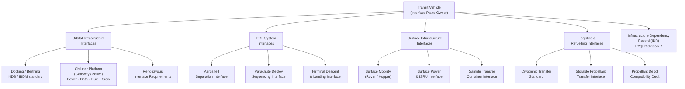

# STA 190-199 · 09.190.006 — Surface, Orbital and Transit Infrastructure Interfaces

## §1 Purpose

This document defines the architecture-level interface requirements between an interplanetary transit vehicle and the full range of infrastructure elements it may interact with: orbital platforms, in-space staging nodes, entry-descent-landing (EDL) systems, surface infrastructure, and refuelling/logistics facilities.[^baseline] Every interplanetary mission in subsection `190` that relies on infrastructure beyond the transit vehicle itself must declare its infrastructure dependencies and interface standards at SRR and baseline them at PDR.[^n001]

Infrastructure interface declarations are a mandatory element of interplanetary architecture governance because undeclared dependencies create lifecycle risk, cost growth, and schedule uncertainty. The architecture boundary defined here is the mechanical, electrical, fluid, and data interface plane between the transit vehicle and each external infrastructure element.[^qdiv]

## §2 Scope

**In scope:**

- Docking and berthing interface standards: NASA Docking System (NDS), International Berthing and Docking Mechanism (IBDM), and passive/active soft-dock adapter requirements for deep-space platforms.
- Orbital platform interfaces: Gateway or equivalent cislunar/deep-space station interfaces (power, data, fluid, pressurised crew transfer), and free-flyer rendezvous requirements.
- EDL system interfaces: aeroshell separation interface, parachute deployment sequencing interface, and terminal descent/landing system interface control requirements.
- Surface access interfaces: surface mobility system interfaces (rover, hopper), surface power interface (ISRU power draw declaration), and sample transfer container interface.
- Refuelling and propellant logistics interfaces: cryogenic fluid transfer standards, storable propellant transfer interface, and propellant depot compatibility declaration.
- Infrastructure dependency declaration format: mandatory Infrastructure Dependency Record (IDR) required at SRR; updated at PDR, CDR, and MRR.
- Lifecycle interface: interface control document (ICD) registration requirement and change-control obligations under ORB-PMO.

**Out of scope:**

- Design of orbital platforms, surface habitats, or propellant depots (separate programme elements).
- Launch vehicle payload fairing and launch interface (governed by launch vehicle ICD, not this subsection).
- Ground support equipment (GSE) interfaces at launch site.

## §3 Diagram

## §4 Footprint

| Attribute | Value |
|-----------|-------|
| Architecture | Space Technology Architecture (STA) |
| Master range | 100–199 |
| Code range | 190-199 |
| Section | 09 |
| Subsection | 190 |
| Subsubject | 006 |
| Primary Q-Division | Q-SPACE[^qdiv] |
| Support Q-Divisions | Q-HORIZON, Q-DATAGOV, Q-HPC, Q-GREENTECH, Q-STRUCTURES, Q-INDUSTRY |
| ORB support | ORB-PMO, ORB-LEG |
| Governance class | baseline[^gov] |
| Folder path | `Q+ATLANTIDE/100-199_STA/190-199_Sistemas-Avanzados-Conceptos-y-Futuro-Espacial/190_Arquitecturas-Interplanetarias/` |
| Document | `006_Surface-Orbital-and-Transit-Infrastructure-Interfaces.md` |
| Parent subsection | [README.md](../README.md) · [000_Overview.md](./000_Overview.md) |
| Parent architecture | [../../README.md](../../README.md) |
| Parent baseline | [organization/Q+ATLANTIDE.md](../../../../organization/Q+ATLANTIDE.md) |

## §5 References & Citations

[^baseline]: Q+ATLANTIDE controlled baseline — the authoritative taxonomy and traceability ecosystem governing all Space Technology Architecture documents.
[^archtable]: §3 Architecture Table (parent) — see [../../README.md](../../README.md) for the master architecture index.
[^qdiv]: Q-Division authority — Q-SPACE is the primary authority for all interplanetary architecture standards within Q+ATLANTIDE; Q-HORIZON, Q-DATAGOV, Q-HPC, Q-GREENTECH, Q-STRUCTURES, and Q-INDUSTRY provide supporting governance.
[^gov]: Governance class `baseline` — documents in this class are subject to formal change control under ORB-PMO and ORB-LEG review gates.
[^n001]: Note N-001: Q+ATLANTIDE is a taxonomy and traceability ecosystem; definitions herein are normative within the Q+ATLANTIDE register only.
[^ecss1002]: ECSS-E-ST-10-02C — *Space engineering: Verification*, European Cooperation for Space Standardization, 6 March 2009.
[^nasa7009]: NASA/SP-2016-6105 — *NASA Systems Engineering Handbook*, Rev. 2, National Aeronautics and Space Administration, 2016.
[^ecssm10]: ECSS-M-ST-10C — *Space project management: Project planning and implementation*, ECSS, 6 March 2009.

### Applicable industry standards

| Standard | Title | Body |
|----------|-------|------|
| ECSS-E-ST-10-02C | Space engineering: Verification | ECSS |
| ECSS-M-ST-10C | Space project management: Project planning and implementation | ECSS |
| NASA/SP-2016-6105 | NASA Systems Engineering Handbook | NASA |
