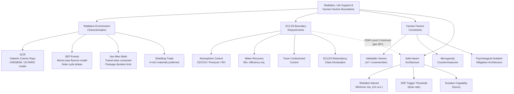

# STA 190-199 · 09.190.008 — Radiation, Life Support and Human Factors Boundaries

## §1 Purpose

This document defines the Q+ATLANTIDE architecture-level boundary requirements for radiation environment characterisation, Environmental Control and Life Support System (ECLSS) interfaces, and human factors constraints applicable to crewed interplanetary missions (Mission Classes CRT and CRS from subsubject `002`).[^baseline] Robotic missions must satisfy the radiation environment characterisation requirements; the ECLSS and human factors requirements apply exclusively to crewed mission classes.[^n001]

This subsubject establishes the safety boundary conditions that flow into structural shielding design (Q-STRUCTURES), ECLSS system design, vehicle architecture trades, and mission duration constraints. The requirements are architecture-level obligations: each crewed mission must demonstrate compliance through analysis and test evidence at CDR, and through flight rule and crew health records maintained through end of mission.[^qdiv]

## §2 Scope

**In scope:**

- Radiation environment characterisation per interplanetary regime:
  - Galactic Cosmic Rays (GCR): flux models (CREME96, OLTARIS), energy spectrum characterisation, dose-equivalent rates by shielding thickness and trajectory.
  - Solar Energetic Particle (SEP) events: worst-case fluence models (August 1972, October 1989 reference events), probabilistic SEP occurrence rates by mission duration and solar cycle phase.
  - Trapped radiation belts (Van Allen): transit dose during Earth departure and Earth return; belt passage duration constraints.
  - Secondary radiation from shielding material (hydrogen-rich materials preferred).
- Dose limits for crewed missions: NASA-STD-3001 REID (Risk of Exposure-Induced Death) limit of 3% at 95% confidence interval; career effective dose limits; organ dose limits.
- ECLSS boundary requirements for transit vehicles: O2/CO2 partial pressure ranges, total pressure, temperature and humidity ranges, water recovery system minimum efficiency, trace contaminant control requirements, and minimum ECLSS redundancy class.
- Human factors constraints: minimum habitable volume per crewmember (transit vs. surface), microgravity countermeasures (exercise requirements, g-loading events), crew sleep/wake cycle accommodation, and psychological isolation mitigation architecture.
- Safe-haven architecture: minimum shielded volume requirements for SPE storm shelter, radiation dose rate threshold triggering safe-haven entry, and safe-haven duration capability.
- Autonomy interactions: ECLSS FDIR minimum autonomy level declaration (minimum Level 2 per subsubject `007`).

**Out of scope:**

- Robotic mission radiation effects on electronics (governed by STA `140-149` avionica section).
- Medical treatment protocols and crew health standards beyond the architecture-level boundary.
- Surface habitat design for long-duration surface stays (mission-specific programme element).

## §3 Diagram

## §4 Footprint

| Attribute | Value |
|-----------|-------|
| Architecture | Space Technology Architecture (STA) |
| Master range | 100–199 |
| Code range | 190-199 |
| Section | 09 |
| Subsection | 190 |
| Subsubject | 008 |
| Primary Q-Division | Q-SPACE[^qdiv] |
| Support Q-Divisions | Q-HORIZON, Q-DATAGOV, Q-HPC, Q-GREENTECH, Q-STRUCTURES, Q-INDUSTRY |
| ORB support | ORB-PMO, ORB-LEG |
| Governance class | baseline[^gov] |
| Folder path | `Q+ATLANTIDE/100-199_STA/190-199_Sistemas-Avanzados-Conceptos-y-Futuro-Espacial/190_Arquitecturas-Interplanetarias/` |
| Document | `008_Radiation-Life-Support-and-Human-Factors-Boundaries.md` |
| Parent subsection | [README.md](../README.md) · [000_Overview.md](./000_Overview.md) |
| Parent architecture | [../../README.md](../../README.md) |
| Parent baseline | [organization/Q+ATLANTIDE.md](../../../../organization/Q+ATLANTIDE.md) |

## §5 References & Citations

[^baseline]: Q+ATLANTIDE controlled baseline — the authoritative taxonomy and traceability ecosystem governing all Space Technology Architecture documents.
[^archtable]: §3 Architecture Table (parent) — see [../../README.md](../../README.md) for the master architecture index.
[^qdiv]: Q-Division authority — Q-SPACE is the primary authority for all interplanetary architecture standards within Q+ATLANTIDE; Q-HORIZON, Q-DATAGOV, Q-HPC, Q-GREENTECH, Q-STRUCTURES, and Q-INDUSTRY provide supporting governance.
[^gov]: Governance class `baseline` — documents in this class are subject to formal change control under ORB-PMO and ORB-LEG review gates.
[^n001]: Note N-001: Q+ATLANTIDE is a taxonomy and traceability ecosystem; definitions herein are normative within the Q+ATLANTIDE register only.
[^nasastd3001]: NASA-STD-3001 — *NASA Space Flight Human System Standard*, Vol. 1 (Crew Health) and Vol. 2 (Human Factors, Habitability, and Environmental Health), National Aeronautics and Space Administration.
[^ecss1002]: ECSS-E-ST-10-02C — *Space engineering: Verification*, European Cooperation for Space Standardization, 6 March 2009.
[^nasa7009]: NASA/SP-2016-6105 — *NASA Systems Engineering Handbook*, Rev. 2, National Aeronautics and Space Administration, 2016.

### Applicable industry standards

| Standard | Title | Body |
|----------|-------|------|
| NASA-STD-3001 Vol. 1 | NASA Space Flight Human System Standard: Crew Health | NASA |
| NASA-STD-3001 Vol. 2 | NASA Space Flight Human System Standard: Human Factors | NASA |
| ECSS-E-ST-10-02C | Space engineering: Verification | ECSS |
| ECSS-M-ST-10C | Space project management: Project planning and implementation | ECSS |
| NASA/SP-2016-6105 | NASA Systems Engineering Handbook | NASA |
