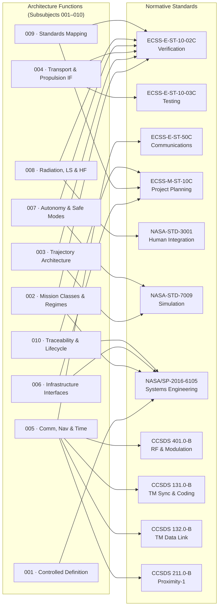

# STA 190-199 · 09.190.009 — ECSS, NASA, CCSDS Deep-Space Standards Mapping

## §1 Purpose

This document provides the Q+ATLANTIDE function-to-standard mapping for all architecture functions defined in subsection `190` (Arquitecturas Interplanetarias).[^baseline] It identifies the normative ECSS, NASA, and CCSDS standards applicable to each interplanetary architecture function, enabling traceability from Q+ATLANTIDE requirements to industry standards and ensuring that compliance claims are unambiguous.[^n001]

The mapping table is the definitive reference for programme compliance matrices. Any interplanetary mission programme within the Q+ATLANTIDE register must demonstrate traceability from its mission-specific requirements to the standards identified in this document. Conflicts between standards bodies are resolved in favour of the standard cited in this mapping for the specific function domain.[^qdiv]

## §2 Scope

**In scope:**

- Complete function-to-standard mapping table for all ten architecture functions defined in subsubjects `001`–`010`.
- Standards covered: ECSS-E-ST-10-02C (Verification), ECSS-E-ST-10-03C (Testing), ECSS-E-ST-50C (Communications), ECSS-M-ST-10C (Project Planning), NASA-STD-3001 (Human Integration), NASA-STD-7009 (Simulation), NASA/SP-2016-6105 (Systems Engineering), CCSDS 401.0-B (RF and Modulation), CCSDS 131.0-B (TM Synchronization and Channel Coding), CCSDS 132.0-B (TM Space Data Link Protocol), CCSDS 211.0-B (Proximity-1).
- Applicability annotation: each mapping entry identifies whether the standard applies to all mission classes, crewed-only, robotic-only, or specific regimes.
- Version locking: the edition/issue of each standard is recorded to support configuration management.

**Out of scope:**

- National regulatory requirements (launch licensing, spectrum licensing) — these are mission-specific and jurisdiction-dependent.
- Proprietary industrial standards and company design standards.
- Standards applicable to launch vehicles and launch site operations.

## §3 Diagram

## §4 Function-to-Standard Mapping Table

| Function | Subsubject ref | Standard | Body | Applicability |
|----------|---------------|----------|------|---------------|
| Interplanetary regime taxonomy and controlled definitions | [001](./001_Interplanetary-Architecture-Controlled-Definition.md) | NASA/SP-2016-6105 | NASA | All mission classes |
| Mission-class taxonomy and TRL requirements | [002](./002_Mission-Classes-and-Interplanetary-Regimes.md) | ECSS-E-ST-10-02C | ECSS | All mission classes |
| Mission-class taxonomy and TRL requirements | [002](./002_Mission-Classes-and-Interplanetary-Regimes.md) | NASA/SP-2016-6105 | NASA | All mission classes |
| Mission-class taxonomy (crewed) | [002](./002_Mission-Classes-and-Interplanetary-Regimes.md) | NASA-STD-3001 | NASA | Crewed missions only (CRT, CRS) |
| Trajectory validation and delta-V budget | [003](./003_Trajectory-Architecture-and-Transfer-Windows.md) | ECSS-E-ST-10-02C | ECSS | All mission classes |
| Trajectory Monte Carlo analysis | [003](./003_Trajectory-Architecture-and-Transfer-Windows.md) | NASA-STD-7009 | NASA | All mission classes |
| Propulsion interface verification | [004](./004_Deep-Space-Transport-and-Propulsion-Interfaces.md) | ECSS-E-ST-10-02C | ECSS | All mission classes |
| Propulsion interface testing | [004](./004_Deep-Space-Transport-and-Propulsion-Interfaces.md) | ECSS-E-ST-10-03C | ECSS | All mission classes |
| Deep-space communication link (RF) | [005](./005_Communication-Navigation-and-Time-Reference-Boundaries.md) | ECSS-E-ST-50C | ECSS | All mission classes |
| RF and modulation standards | [005](./005_Communication-Navigation-and-Time-Reference-Boundaries.md) | CCSDS 401.0-B | CCSDS | All mission classes |
| TM synchronisation and channel coding | [005](./005_Communication-Navigation-and-Time-Reference-Boundaries.md) | CCSDS 131.0-B | CCSDS | All mission classes |
| TM space data link protocol | [005](./005_Communication-Navigation-and-Time-Reference-Boundaries.md) | CCSDS 132.0-B | CCSDS | All mission classes |
| Proximity-1 relay link | [005](./005_Communication-Navigation-and-Time-Reference-Boundaries.md) | CCSDS 211.0-B | CCSDS | Lander, sample-return, crewed surface |
| Infrastructure interface ICD management | [006](./006_Surface-Orbital-and-Transit-Infrastructure-Interfaces.md) | ECSS-M-ST-10C | ECSS | All mission classes |
| Infrastructure interface ICD management | [006](./006_Surface-Orbital-and-Transit-Infrastructure-Interfaces.md) | NASA/SP-2016-6105 | NASA | All mission classes |
| FDIR architecture and safe-mode verification | [007](./007_Autonomy-Safe-Modes-and-Long-Duration-Operations.md) | ECSS-E-ST-10-02C | ECSS | All mission classes |
| Autonomy simulation and validation | [007](./007_Autonomy-Safe-Modes-and-Long-Duration-Operations.md) | NASA-STD-7009 | NASA | All mission classes |
| Human system integration (crewed) | [008](./008_Radiation-Life-Support-and-Human-Factors-Boundaries.md) | NASA-STD-3001 | NASA | Crewed missions only (CRT, CRS) |
| Radiation environment verification | [008](./008_Radiation-Life-Support-and-Human-Factors-Boundaries.md) | ECSS-E-ST-10-02C | ECSS | All mission classes |
| Standards compliance and mapping | [009](./009_ECSS-NASA-CCSDS-Deep-Space-Standards-Mapping.md) | ECSS-E-ST-10-02C | ECSS | All mission classes |
| Standards compliance and mapping | [009](./009_ECSS-NASA-CCSDS-Deep-Space-Standards-Mapping.md) | ECSS-M-ST-10C | ECSS | All mission classes |
| Lifecycle records and review gates | [010](./010_Traceability-Evidence-and-Lifecycle-Governance.md) | ECSS-M-ST-10C | ECSS | All mission classes |
| Lifecycle records and review gates | [010](./010_Traceability-Evidence-and-Lifecycle-Governance.md) | NASA/SP-2016-6105 | NASA | All mission classes |

## §5 Footprint

| Attribute | Value |
|-----------|-------|
| Architecture | Space Technology Architecture (STA) |
| Master range | 100–199 |
| Code range | 190-199 |
| Section | 09 |
| Subsection | 190 |
| Subsubject | 009 |
| Primary Q-Division | Q-SPACE[^qdiv] |
| Support Q-Divisions | Q-HORIZON, Q-DATAGOV, Q-HPC, Q-GREENTECH, Q-STRUCTURES, Q-INDUSTRY |
| ORB support | ORB-PMO, ORB-LEG |
| Governance class | baseline[^gov] |
| Folder path | `Q+ATLANTIDE/100-199_STA/190-199_Sistemas-Avanzados-Conceptos-y-Futuro-Espacial/190_Arquitecturas-Interplanetarias/` |
| Document | `009_ECSS-NASA-CCSDS-Deep-Space-Standards-Mapping.md` |
| Parent subsection | [README.md](../README.md) · [000_Overview.md](./000_Overview.md) |
| Parent architecture | [../../README.md](../../README.md) |
| Parent baseline | [organization/Q+ATLANTIDE.md](../../../../organization/Q+ATLANTIDE.md) |

## §6 References & Citations

[^baseline]: Q+ATLANTIDE controlled baseline — the authoritative taxonomy and traceability ecosystem governing all Space Technology Architecture documents.
[^archtable]: §3 Architecture Table (parent) — see [../../README.md](../../README.md) for the master architecture index.
[^qdiv]: Q-Division authority — Q-SPACE is the primary authority for all interplanetary architecture standards within Q+ATLANTIDE; Q-HORIZON, Q-DATAGOV, Q-HPC, Q-GREENTECH, Q-STRUCTURES, and Q-INDUSTRY provide supporting governance.
[^gov]: Governance class `baseline` — documents in this class are subject to formal change control under ORB-PMO and ORB-LEG review gates.
[^n001]: Note N-001: Q+ATLANTIDE is a taxonomy and traceability ecosystem; definitions herein are normative within the Q+ATLANTIDE register only.
[^ecss1002]: ECSS-E-ST-10-02C — *Space engineering: Verification*, European Cooperation for Space Standardization, 6 March 2009.
[^ecss1003]: ECSS-E-ST-10-03C — *Space engineering: Testing*, European Cooperation for Space Standardization, 1 June 2012.
[^ecss50]: ECSS-E-ST-50C — *Space engineering: Communications*, European Cooperation for Space Standardization, 31 July 2008.
[^ecssm10]: ECSS-M-ST-10C — *Space project management: Project planning and implementation*, ECSS, 6 March 2009.
[^nasastd3001]: NASA-STD-3001 — *NASA Space Flight Human System Standard*, National Aeronautics and Space Administration.
[^nasastd7009]: NASA-STD-7009 — *Standard for Models and Simulations*, National Aeronautics and Space Administration, 2016.
[^nasa7009]: NASA/SP-2016-6105 — *NASA Systems Engineering Handbook*, Rev. 2, National Aeronautics and Space Administration, 2016.
[^ccsds401]: CCSDS 401.0-B — *Radio Frequency and Modulation Systems*, Consultative Committee for Space Data Systems, Blue Book.
[^ccsds131]: CCSDS 131.0-B — *TM Synchronization and Channel Coding*, Consultative Committee for Space Data Systems, Blue Book.
[^ccsds132]: CCSDS 132.0-B — *TM Space Data Link Protocol*, Consultative Committee for Space Data Systems, Blue Book.
[^ccsds211]: CCSDS 211.0-B — *Proximity-1 Space Link Protocol*, Consultative Committee for Space Data Systems, Blue Book.

### Applicable industry standards

| Standard | Title | Body |
|----------|-------|------|
| ECSS-E-ST-10-02C | Space engineering: Verification | ECSS |
| ECSS-E-ST-10-03C | Space engineering: Testing | ECSS |
| ECSS-E-ST-50C | Space engineering: Communications | ECSS |
| ECSS-M-ST-10C | Space project management: Project planning and implementation | ECSS |
| NASA-STD-3001 | NASA Space Flight Human System Standard | NASA |
| NASA-STD-7009 | Standard for Models and Simulations | NASA |
| NASA/SP-2016-6105 | NASA Systems Engineering Handbook | NASA |
| CCSDS 401.0-B | Radio Frequency and Modulation Systems | CCSDS |
| CCSDS 131.0-B | TM Synchronization and Channel Coding | CCSDS |
| CCSDS 132.0-B | TM Space Data Link Protocol | CCSDS |
| CCSDS 211.0-B | Proximity-1 Space Link Protocol | CCSDS |
