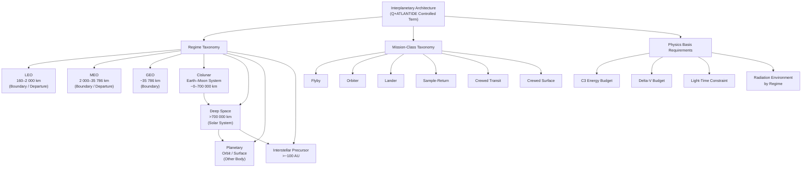

# STA 190-199 · 190-010 — Interplanetary Architecture Controlled Definition

## §1 Purpose

This document establishes the controlled Q+ATLANTIDE definition of the term **Interplanetary Architecture** as used across all documents within the Space Technology Architecture (STA) register.[^baseline] It aligns the internal taxonomy with ITU, COSPAR, and IAU reference definitions, establishes the Q+ATLANTIDE regime taxonomy, and declares explicit disambiguation and exclusion rules that separate interplanetary architecture from neighbouring domains such as Earth-orbit satellite architecture, GNSS, and Earth-observation systems.[^n001]

The controlled definition is authoritative within the Q+ATLANTIDE register. Any mission, system, or trade study that references subsection `190` must demonstrate traceability to the mission class, regime identifier, and physics basis requirements defined here before claiming compliance. The safety boundary applies: all interplanetary-architecture documents require explicit mission-class definition and regime assignment before proceeding to detailed design.[^qdiv]

## §2 Scope

**In scope:**

- ITU, COSPAR, and IAU reference definitions of interplanetary space and their Q+ATLANTIDE normative extensions.
- Q+ATLANTIDE interplanetary regime taxonomy: LEO (160–2 000 km), MEO (2 000–35 786 km), GEO (~35 786 km), Cislunar (Earth-Moon system, ~0–700 000 km from Earth), Deep Space (>700 000 km from Earth, within the solar system), Planetary (in orbit or on the surface of another solar-system body), and Interstellar Precursor (>~100 AU, heliospheric boundary transition).[^ecss1002]
- Mission-class taxonomy and normative mapping: Flyby, Orbiter, Lander, Sample-Return, Crewed Transit, and Crewed Surface missions.
- Physics basis requirements: minimum C3 energies, delta-V budget conventions, communications light-time constraints, and radiation environment characterisation by regime.
- Disambiguation from orbital architecture: Earth-orbit missions (LEO/MEO/GEO) are classified under STA subsection `180-189`; only missions explicitly targeting cislunar space or beyond fall within subsection `190`.
- Exclusion rules: Earth-observation missions operating in LEO/MEO, GNSS constellations, and geostationary communication platforms are explicitly out of scope.
- Safe boundary declaration: the scope boundary of "interplanetary" at the 700 000 km cislunar threshold is a Q+ATLANTIDE convention consistent with COSPAR and NASA Deep Space Network operational definitions.

**Out of scope:**

- Specific mission design, trajectory optimisation, and detailed propulsion subsystem design (governed by subsubjects `003` and `004`).
- GNSS and navigation-satellite services.
- Earth-observation and remote-sensing missions operating within the Earth's sphere of influence below the cislunar boundary.
- Extra-solar (true interstellar) mission architecture beyond the heliospheric boundary (deferred to future STA extensions).

## §3 Diagram

## §4 Footprint

| Attribute | Value |
|-----------|-------|
| Architecture | Space Technology Architecture (STA) |
| Master range | 100–199 |
| Code range | 190-199 |
| Section | 09 |
| Subsection | 190 |
| Subsubject | 001 |
| Primary Q-Division | Q-SPACE[^qdiv] |
| Support Q-Divisions | Q-HORIZON, Q-DATAGOV, Q-HPC, Q-GREENTECH, Q-STRUCTURES, Q-INDUSTRY |
| ORB support | ORB-PMO, ORB-LEG |
| Governance class | baseline[^gov] |
| Folder path | `Q+ATLANTIDE/100-199_STA/190-199_Sistemas-Avanzados-Conceptos-y-Futuro-Espacial/190_Arquitecturas-Interplanetarias/` |
| Document | `190-010-Interplanetary-Architecture-Controlled-Definition.md` |
| Parent subsection | [README.md](../README.md) · [`190-000-General.md`](./190-000-General.md) |
| Parent architecture | [../../README.md](../../README.md) |
| Parent baseline | [organization/Q+ATLANTIDE.md](../../../../organization/Q+ATLANTIDE.md) |

## §5 References & Citations

[^baseline]: Q+ATLANTIDE controlled baseline — the authoritative taxonomy and traceability ecosystem governing all Space Technology Architecture documents.
[^archtable]: §3 Architecture Table (parent) — see [../../README.md](../../README.md) for the master architecture index.
[^qdiv]: Q-Division authority — Q-SPACE is the primary authority for all interplanetary architecture standards within Q+ATLANTIDE; Q-HORIZON, Q-DATAGOV, Q-HPC, Q-GREENTECH, Q-STRUCTURES, and Q-INDUSTRY provide supporting governance.
[^gov]: Governance class `baseline` — documents in this class are subject to formal change control under ORB-PMO and ORB-LEG review gates.
[^n001]: Note N-001: Q+ATLANTIDE is a taxonomy and traceability ecosystem; definitions herein are normative within the Q+ATLANTIDE register only.
[^ecss1002]: ECSS-E-ST-10-02C — *Space engineering: Verification*, European Cooperation for Space Standardization, 6 March 2009.
[^nasa7009]: NASA/SP-2016-6105 — *NASA Systems Engineering Handbook*, Rev. 2, National Aeronautics and Space Administration, 2016.
[^cospar]: COSPAR Policy on Planetary Protection — Committee on Space Research, current edition.
[^iau]: IAU Working Group on Cartographic Coordinates and Rotational Elements — reference frame definitions, current edition.

### Applicable industry standards

| Standard | Title | Body |
|----------|-------|------|
| ECSS-E-ST-10-02C | Space engineering: Verification | ECSS |
| NASA/SP-2016-6105 | NASA Systems Engineering Handbook | NASA |
| COSPAR Planetary Protection Policy | Planetary Protection Policy | COSPAR |
| IAU WGCCRE | Cartographic Coordinates and Rotational Elements | IAU |
