# STA 190-199 · 190-030 — Trajectory Architecture and Transfer Windows

## §1 Purpose

This document defines the architecture-level requirements for interplanetary trajectory design within the Q+ATLANTIDE framework.[^baseline] It establishes the mandatory trajectory types, delta-V budgeting conventions, launch window periodicity requirements, mission design drivers, and trajectory validation gates that must be satisfied for any interplanetary mission claiming compliance with subsection `190`.[^n001]

Trajectory architecture is the foundational design dimension from which propulsion interfaces (subsubject `004`), launch vehicle selection, communication blackout periods (subsubject `005`), and mission timeline constraints are all derived. The requirements in this document are architecture-level constraints — they define the design space and validation obligations, not the specific numerical solution for any given mission.[^qdiv]

## §2 Scope

**In scope:**

- Hohmann transfer trajectory requirements: phasing angle constraints, departure C3 (characteristic energy) budgeting conventions, and periapsis/apoapsis conditions.
- Gravity-assist (flyby) trajectory requirements: sphere-of-influence entry/exit conditions, B-plane targeting conventions, ΔV cost and navigation accuracy requirements.
- Low-energy transfer trajectories (invariant manifolds, ballistic lunar transfers, weak-stability boundary transfers): applicability conditions and computational validation requirements.
- Launch window periodicity: synodic period conventions for Earth-Mars (≈26 months), Earth-Venus (≈19 months), Earth-Jupiter (≈13 months), and cislunar continuous-access windows.
- Mission design drivers: C3 budget, total delta-V budget (including margins), propellant mass fraction, time of flight constraints, and arrival declination bounds.
- Trajectory validation gates: required trajectory analysis deliverables at MDR, SRR, PDR, and CDR; Monte Carlo dispersion analysis requirements; navigation error budget.
- Delta-V margin conventions: deterministic vs. statistical delta-V, navigation correction margin, and attitude-control propellant allocation.

**Out of scope:**

- Specific trajectory numerical solutions for any mission (mission-specific analysis).
- Atmospheric entry, descent, and landing (EDL) trajectory design, governed by subsubject `006`.
- Propulsion system sizing and interface control, governed by subsubject `004`.

## §3 Diagram

```mermaid
flowchart TD
    TRJ["Trajectory Architecture\nRequirements"]

    TRJ --> TYPES["Transfer Types"]
    TRJ --> DRIVERS["Mission Design Drivers"]
    TRJ --> WINDOWS["Launch Windows"]
    TRJ --> GATES["Validation Gates"]

    TYPES --> HOH["Hohmann Transfer\n· Min-energy path\n· Two-impulse manoeuvre\n· Applicable: inner/outer planets"]
    TYPES --> GA["Gravity Assist\n· B-plane targeting\n· ΔV reduction\n· Nav accuracy req."]
    TYPES --> LET["Low-Energy Transfer\n· Invariant manifolds\n· Ballistic lunar transfer\n· Extended TOF accepted"]

    DRIVERS --> C3["C3 Budget\n(km²/s²)"]
    DRIVERS --> DV["Total ΔV Budget\n+ margins"]
    DRIVERS --> TOF["Time of Flight\nconstraint"]
    DRIVERS --> DECL["Arrival Declination\nbounds"]

    WINDOWS --> EM["Earth–Mars\n~26 month synodic"]
    WINDOWS --> EV["Earth–Venus\n~19 month synodic"]
    WINDOWS --> EJ["Earth–Jupiter\n~13 month synodic"]
    WINDOWS --> CIS["Cislunar\nContinuous access"]

    GATES --> MDR["MDR: Trajectory trade space"]
    GATES --> SRR["SRR: Baseline trajectory & ΔV budget"]
    GATES --> PDR["PDR: Monte Carlo dispersions"]
    GATES --> CDR["CDR: Navigation error budget"]
```

## §4 Footprint

| Attribute | Value |
|-----------|-------|
| Architecture | Space Technology Architecture (STA) |
| Master range | 100–199 |
| Code range | 190-199 |
| Section | 09 |
| Subsection | 190 |
| Subsubject | 003 |
| Primary Q-Division | Q-SPACE[^qdiv] |
| Support Q-Divisions | Q-HORIZON, Q-DATAGOV, Q-HPC, Q-GREENTECH, Q-STRUCTURES, Q-INDUSTRY |
| ORB support | ORB-PMO, ORB-LEG |
| Governance class | baseline[^gov] |
| Folder path | `Q+ATLANTIDE/100-199_STA/190-199_Sistemas-Avanzados-Conceptos-y-Futuro-Espacial/190_Arquitecturas-Interplanetarias/` |
| Document | `190-030-Trajectory-Architecture-and-Transfer-Windows.md` |
| Parent subsection | [README.md](../README.md) · [`190-000-General.md`](./190-000-General.md) |
| Parent architecture | [../../README.md](../../README.md) |
| Parent baseline | [organization/Q+ATLANTIDE.md](../../../../organization/Q+ATLANTIDE.md) |

## §5 References & Citations

[^baseline]: Q+ATLANTIDE controlled baseline — the authoritative taxonomy and traceability ecosystem governing all Space Technology Architecture documents.
[^archtable]: §3 Architecture Table (parent) — see [../../README.md](../../README.md) for the master architecture index.
[^qdiv]: Q-Division authority — Q-SPACE is the primary authority for all interplanetary architecture standards within Q+ATLANTIDE; Q-HORIZON, Q-DATAGOV, Q-HPC, Q-GREENTECH, Q-STRUCTURES, and Q-INDUSTRY provide supporting governance.
[^gov]: Governance class `baseline` — documents in this class are subject to formal change control under ORB-PMO and ORB-LEG review gates.
[^n001]: Note N-001: Q+ATLANTIDE is a taxonomy and traceability ecosystem; definitions herein are normative within the Q+ATLANTIDE register only.
[^ecss1002]: ECSS-E-ST-10-02C — *Space engineering: Verification*, European Cooperation for Space Standardization, 6 March 2009.
[^ecssm10]: ECSS-M-ST-10C — *Space project management: Project planning and implementation*, European Cooperation for Space Standardization, 6 March 2009.
[^nasa7009]: NASA/SP-2016-6105 — *NASA Systems Engineering Handbook*, Rev. 2, National Aeronautics and Space Administration, 2016.
[^ccsds500]: CCSDS 500.0-G — *Navigation Data — Definitions and Conventions*, Consultative Committee for Space Data Systems, Green Book.

### Applicable industry standards

| Standard | Title | Body |
|----------|-------|------|
| ECSS-E-ST-10-02C | Space engineering: Verification | ECSS |
| ECSS-M-ST-10C | Space project management: Project planning and implementation | ECSS |
| NASA/SP-2016-6105 | NASA Systems Engineering Handbook | NASA |
| CCSDS 500.0-G | Navigation Data — Definitions and Conventions | CCSDS |
