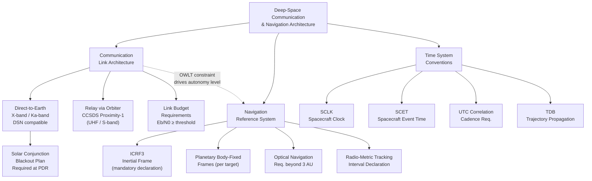

# STA 190-199 · 190-050 — Communication Navigation and Time Reference Boundaries

## §1 Purpose

This document defines the architecture-level boundary requirements for deep-space communication link design, navigation reference frames, light-time delay constraints, autonomous navigation obligations, and time-system conventions within the Q+ATLANTIDE interplanetary architecture framework.[^baseline] All interplanetary missions within subsection `190` must declare their communication link architecture, navigation reference frame, and time-system choices in conformance with the boundaries established here before PDR.[^n001]

The communication and navigation architecture is critical to mission success and autonomy strategy (subsubject `007`). Light-time delays from 3 minutes (near-Mars opposition) to 83 minutes (Pluto) fundamentally change the operational paradigm: real-time commanding becomes impossible beyond ~1–2 minutes one-way light time, and autonomous fault response is required for all missions beyond the cislunar boundary.[^qdiv]

## §2 Scope

**In scope:**

- Deep-space communication link architecture: uplink/downlink frequency allocation (X-band, Ka-band for deep space), Deep Space Network (DSN) compatibility requirements, CCSDS Proximity-1 link for relay scenarios, and CCSDS deep-space link protocol stack.
- Link budget boundary conditions: minimum received power (Eb/N0) requirements, antenna gain classes, data rate classes per mission regime, and solar conjunction blackout period planning requirements.
- Navigation reference frames: J2000.0 inertial reference frame, ICRF3, and planetary body-fixed frames — with mandatory frame declaration requirements per mission.
- Light-time delay constraints: one-way light time (OWLT) by regime, round-trip light time (RTLT) implications for command/telemetry loops, and DSN scheduling constraints.
- Autonomous navigation requirements: minimum onboard ephemeris accuracy, optical navigation capability requirements for missions beyond 3 AU, and radio-metric tracking intervals.
- Time-system conventions: Spacecraft Clock (SCLK), Spacecraft Event Time (SCET), UTC correlation requirements, barycentric dynamical time (TDB) for trajectory propagation, and SCLK correlation cadence requirements.
- Boundary declarations: the communication architecture boundary is at the antenna feed; the navigation boundary is at the trajectory state vector delivered to the flight system.

**Out of scope:**

- Ground station facility design and Deep Space Network operations scheduling.
- Onboard clock hardware design and qualification.
- Communication security and encryption (deferred to mission-specific security analysis).

## §3 Diagram

## §4 Footprint

| Attribute | Value |
|-----------|-------|
| Architecture | Space Technology Architecture (STA) |
| Master range | 100–199 |
| Code range | 190-199 |
| Section | 09 |
| Subsection | 190 |
| Subsubject | 005 |
| Primary Q-Division | Q-SPACE[^qdiv] |
| Support Q-Divisions | Q-HORIZON, Q-DATAGOV, Q-HPC, Q-GREENTECH, Q-STRUCTURES, Q-INDUSTRY |
| ORB support | ORB-PMO, ORB-LEG |
| Governance class | baseline[^gov] |
| Folder path | `Q+ATLANTIDE/100-199_STA/190-199_Sistemas-Avanzados-Conceptos-y-Futuro-Espacial/190_Arquitecturas-Interplanetarias/` |
| Document | `190-050-Communication-Navigation-and-Time-Reference-Boundaries.md` |
| Parent subsection | [README.md](../README.md) · [`190-000-General.md`](./190-000-General.md) |
| Parent architecture | [../../README.md](../../README.md) |
| Parent baseline | [organization/Q+ATLANTIDE.md](../../../../organization/Q+ATLANTIDE.md) |

## §5 References & Citations

[^baseline]: Q+ATLANTIDE controlled baseline — the authoritative taxonomy and traceability ecosystem governing all Space Technology Architecture documents.
[^archtable]: §3 Architecture Table (parent) — see [../../README.md](../../README.md) for the master architecture index.
[^qdiv]: Q-Division authority — Q-SPACE is the primary authority for all interplanetary architecture standards within Q+ATLANTIDE; Q-HORIZON, Q-DATAGOV, Q-HPC, Q-GREENTECH, Q-STRUCTURES, and Q-INDUSTRY provide supporting governance.
[^gov]: Governance class `baseline` — documents in this class are subject to formal change control under ORB-PMO and ORB-LEG review gates.
[^n001]: Note N-001: Q+ATLANTIDE is a taxonomy and traceability ecosystem; definitions herein are normative within the Q+ATLANTIDE register only.
[^ccsds401]: CCSDS 401.0-B — *Radio Frequency and Modulation Systems*, Consultative Committee for Space Data Systems, Blue Book.
[^ccsds131]: CCSDS 131.0-B — *TM Synchronization and Channel Coding*, Consultative Committee for Space Data Systems, Blue Book.
[^ccsds132]: CCSDS 132.0-B — *TM Space Data Link Protocol*, Consultative Committee for Space Data Systems, Blue Book.
[^ccsds211]: CCSDS 211.0-B — *Proximity-1 Space Link Protocol*, Consultative Committee for Space Data Systems, Blue Book.
[^ecss50]: ECSS-E-ST-50C — *Space engineering: Communications*, European Cooperation for Space Standardization, 31 July 2008.

### Applicable industry standards

| Standard | Title | Body |
|----------|-------|------|
| ECSS-E-ST-50C | Space engineering: Communications | ECSS |
| CCSDS 401.0-B | Radio Frequency and Modulation Systems | CCSDS |
| CCSDS 131.0-B | TM Synchronization and Channel Coding | CCSDS |
| CCSDS 132.0-B | TM Space Data Link Protocol | CCSDS |
| CCSDS 211.0-B | Proximity-1 Space Link Protocol | CCSDS |
