# STA 190-199 · 190-070 — Autonomy Safe Modes and Long Duration Operations

## §1 Purpose

This document defines the Q+ATLANTIDE autonomy tier classification, safe-mode hierarchy, fault-detection isolation-and-recovery (FDIR) architecture requirements, ground-contact blackout survivability requirements, and long-duration operations protocols applicable to all interplanetary missions in subsection `190`.[^baseline] The architecture-level requirements here derive from the fundamental constraint that deep-space communication delays (subsubject `005`) make real-time ground intervention impossible for fault response beyond the cislunar boundary, requiring progressively higher levels of onboard autonomy.[^n001]

Every interplanetary mission must declare its autonomy tier assignment, safe-mode architecture, and FDIR implementation strategy at SRR, and demonstrate compliance through analysis and test evidence at CDR. The safe boundary of this subsection is critical: undeclared or under-specified FDIR architectures for deep-space missions represent a primary mission failure risk.[^qdiv]

## §2 Scope

**In scope:**

- Autonomy tier classification (Level 0–4):
  - Level 0: fully ground-commanded (cislunar, OWLT < 1.5 s);
  - Level 1: time-tagged command sequences, ground-based fault response (OWLT < 10 min);
  - Level 2: onboard rule-based FDIR, automatic safe mode (OWLT 10–30 min, inner solar system);
  - Level 3: onboard planning and re-planning capability, autonomous science sequencing (OWLT 30–90 min, outer inner solar system);
  - Level 4: fully autonomous operations, adaptive mission re-planning (OWLT > 90 min, outer solar system, interstellar precursor).
- Safe-mode hierarchy: Emergency Mode → Safe Mode → Standby Mode → Normal Ops — with mandatory onboard transition logic requirements, power-positive guarantee, and thermal survival guarantee per mode.
- FDIR architecture requirements: fault detection thresholds, isolation logic, recovery action tables, watchdog timer requirements, and reset hierarchy (warm reset, cold reset, safe-mode entry).
- Ground-contact blackout survivability: minimum autonomous survivability duration (≥ 2× maximum expected blackout period), and blackout planning analysis required at PDR.
- Long-duration operations protocols: anomaly resolution timeline requirements (hours to weeks depending on OWLT), onboard storage requirements for deferred command sequences, and operations team staffing model implications.
- Conflict with crewed missions: for crewed missions (Mission Classes CRT and CRS from subsubject `002`), Level 2 minimum autonomy is required for all safety-critical systems regardless of OWLT.

**Out of scope:**

- Artificial intelligence and machine learning system design for autonomy (considered at mission-specific level).
- Ground operations centre software and scheduling tools.
- Human-machine interface design for crewed vehicles (governed by subsubject `008` and NASA-STD-3001).

## §3 Diagram

```mermaid
flowchart TD
    AUTO["Autonomy Architecture\nRequirements"]

    AUTO --> TIERS["Autonomy Tier\nClassification"]
    AUTO --> SAFEMODE["Safe-Mode\nHierarchy"]
    AUTO --> FDIR["FDIR Architecture\nRequirements"]
    AUTO --> BLACKOUT["Blackout\nSurvivability"]

    TIERS --> L0["Level 0\nFully ground-commanded\nOWLT < 1.5 s · Cislunar"]
    TIERS --> L1["Level 1\nTime-tagged sequences\nOWLT < 10 min"]
    TIERS --> L2["Level 2\nOnboard FDIR · Auto Safe Mode\nOWLT 10–30 min"]
    TIERS --> L3["Level 3\nOnboard planning\nOWLT 30–90 min"]
    TIERS --> L4["Level 4\nFully autonomous\nOWLT > 90 min"]

    SAFEMODE --> EMRG["Emergency Mode\nPower-positive · Thermal survive"]
    SAFEMODE --> SAFE["Safe Mode\nMin. function · Ground recover"]
    SAFEMODE --> STBY["Standby Mode\nReduced science · Health downlink"]
    SAFEMODE --> NORM["Normal Operations"]

    FDIR --> DETECT["Fault Detection\nThresholds"]
    FDIR --> ISOLATE["Fault Isolation\nLogic Tables"]
    FDIR --> RECOVER["Recovery Actions\n& Reset Hierarchy"]
    FDIR --> WDT["Watchdog Timer\nRequirements"]

    BLACKOUT --> DUR["Survivability Duration\n≥ 2× max blackout"]
    BLACKOUT --> PLAN["Blackout Analysis\nRequired at PDR"]
```

## §4 Footprint

| Attribute | Value |
|-----------|-------|
| Architecture | Space Technology Architecture (STA) |
| Master range | 100–199 |
| Code range | 190-199 |
| Section | 09 |
| Subsection | 190 |
| Subsubject | 007 |
| Primary Q-Division | Q-SPACE[^qdiv] |
| Support Q-Divisions | Q-HORIZON, Q-DATAGOV, Q-HPC, Q-GREENTECH, Q-STRUCTURES, Q-INDUSTRY |
| ORB support | ORB-PMO, ORB-LEG |
| Governance class | baseline[^gov] |
| Folder path | `Q+ATLANTIDE/100-199_STA/190-199_Sistemas-Avanzados-Conceptos-y-Futuro-Espacial/190_Arquitecturas-Interplanetarias/` |
| Document | `190-070-Autonomy-Safe-Modes-and-Long-Duration-Operations.md` |
| Parent subsection | [README.md](../README.md) · [`190-000-General.md`](./190-000-General.md) |
| Parent architecture | [../../README.md](../../README.md) |
| Parent baseline | [organization/Q+ATLANTIDE.md](../../../../organization/Q+ATLANTIDE.md) |

## §5 References & Citations

[^baseline]: Q+ATLANTIDE controlled baseline — the authoritative taxonomy and traceability ecosystem governing all Space Technology Architecture documents.
[^archtable]: §3 Architecture Table (parent) — see [../../README.md](../../README.md) for the master architecture index.
[^qdiv]: Q-Division authority — Q-SPACE is the primary authority for all interplanetary architecture standards within Q+ATLANTIDE; Q-HORIZON, Q-DATAGOV, Q-HPC, Q-GREENTECH, Q-STRUCTURES, and Q-INDUSTRY provide supporting governance.
[^gov]: Governance class `baseline` — documents in this class are subject to formal change control under ORB-PMO and ORB-LEG review gates.
[^n001]: Note N-001: Q+ATLANTIDE is a taxonomy and traceability ecosystem; definitions herein are normative within the Q+ATLANTIDE register only.
[^ecss1002]: ECSS-E-ST-10-02C — *Space engineering: Verification*, European Cooperation for Space Standardization, 6 March 2009.
[^nasa7009]: NASA/SP-2016-6105 — *NASA Systems Engineering Handbook*, Rev. 2, National Aeronautics and Space Administration, 2016.
[^nasastd3001]: NASA-STD-3001 — *NASA Space Flight Human System Standard*, Vol. 1–2, National Aeronautics and Space Administration.
[^nasastd7009]: NASA-STD-7009 — *Standard for Models and Simulations*, National Aeronautics and Space Administration, 2016.

### Applicable industry standards

| Standard | Title | Body |
|----------|-------|------|
| ECSS-E-ST-10-02C | Space engineering: Verification | ECSS |
| ECSS-M-ST-10C | Space project management: Project planning and implementation | ECSS |
| NASA/SP-2016-6105 | NASA Systems Engineering Handbook | NASA |
| NASA-STD-3001 | NASA Space Flight Human System Standard | NASA |
| NASA-STD-7009 | Standard for Models and Simulations | NASA |
