# STA 190-199 · 190-090 — Traceability Evidence and Lifecycle Governance

## §1 Purpose

This document defines the evidence package requirements, formal review gate structure, and lifecycle records obligations for all interplanetary architecture activities within subsection `190`.[^baseline] Traceability and evidence governance are the mechanisms by which the Q+ATLANTIDE register converts architecture definitions into verifiable, mission-ready engineering baselines.[^n001]

Every interplanetary mission programme within Q+ATLANTIDE must accumulate and maintain the evidence packages described in this document across the full lifecycle, from Mission Definition Review (MDR) through mission archive closure. The governance framework ensures continuity of traceability as mission requirements evolve, interfaces are renegotiated, and as-built configurations diverge from the PDR baseline.[^qdiv]

## §2 Scope

**In scope:**

- Evidence package taxonomy for interplanetary architecture, comprising six mandatory package types:
  1. **Trajectory Evidence Package (TEP)**: trajectory analysis reports, delta-V budget with margins, Monte Carlo dispersion analysis, launch window analysis, and trajectory validation gate sign-off records.
  2. **Propulsion Interface Evidence Package (PIEP)**: propulsion class declaration, interface control documents (ICD), propellant budget records, and infrastructure dependency records (IDR).
  3. **Communication/Navigation Evidence Package (CNEP)**: link budget analyses, navigation error budget, SCLK correlation records, DSN scheduling confirmations, and blackout survivability analysis.
  4. **Radiation Analysis Evidence Package (RAEP)**: radiation environment specification, dose analysis (GCR, SEP, trapped belts), shielding trade records, and (for crewed) REID calculation with uncertainties.
  5. **ECLSS Evidence Package (ECLSS-EP)**: ECLSS boundary compliance matrix (crewed missions only), FDIR analysis records, and safe-haven sizing analysis.
  6. **Lifecycle Governance Record (LGR)**: baseline change request log, ORB-PMO review records, ORB-LEG compliance declarations, and standards mapping compliance matrix (cross-reference to subsubject `009`).

- Review gate structure and mandatory evidence deliverables:
  - **MDR** (Mission Definition Review): mission class declaration, regime assignment, preliminary trajectory trade.
  - **SRR** (System Requirements Review): baseline trajectory and delta-V budget, Infrastructure Dependency Record, autonomy tier declaration.
  - **PDR** (Preliminary Design Review): all six evidence packages at preliminary level; radiation environment specification finalised; Monte Carlo analysis complete.
  - **CDR** (Critical Design Review): all six evidence packages at final level; as-designed ICD set; full FDIR verification matrix.
  - **MRR** (Mission Readiness Review): flight-ready evidence packages; operations procedures referenced; crew health baselines (crewed).
  - **ORR** (Operations Readiness Review): mission operations plan; anomaly response procedures; evidence package archive location declared.

- Mission archive closure: definition of the post-mission evidence record, data archiving obligations under Q-DATAGOV, and end-of-mission lifecycle record closure.
- Change control: all changes to baselined evidence packages require a Baseline Change Request (BCR) reviewed by ORB-PMO and, for safety-significant changes, ORB-LEG.

**Out of scope:**

- Mission-specific data archiving formats and repository selection (governed by Q-DATAGOV policies).
- Programme financial records and procurement documentation.
- Launch vehicle and launch site lifecycle records.

## §3 Diagram

```mermaid
flowchart TD
    LCG["Lifecycle Governance\nFramework"]

    LCG --> EP["Evidence Package\nTaxonomy"]
    LCG --> GATES["Review Gate\nStructure"]
    LCG --> ARCHIVE["Mission Archive\nClosure"]
    LCG --> CHANGE["Change Control\nProcess"]

    EP --> TEP["TEP · Trajectory Evidence\n· Delta-V budget\n· Monte Carlo\n· Window analysis"]
    EP --> PIEP["PIEP · Propulsion Interface\n· ICD set\n· Propellant budget\n· IDR"]
    EP --> CNEP["CNEP · Comm/Nav\n· Link budget\n· Nav error budget\n· DSN confirmation"]
    EP --> RAEP["RAEP · Radiation Analysis\n· GCR/SEP/Belt dose\n· Shielding trade\n· REID (crewed)"]
    EP --> ECLSS_EP["ECLSS-EP · Life Support\n· Boundary compliance\n· FDIR records\n· Safe-haven sizing"]
    EP --> LGR["LGR · Lifecycle Record\n· BCR log\n· ORB-PMO records\n· Standards mapping"]

    GATES --> MDR["MDR\nMission class · Regime · Traj. trade"]
    GATES --> SRR["SRR\nBaseline traj. · IDR · Autonomy tier"]
    GATES --> PDR["PDR\nAll 6 packages preliminary\nRad. env. final · Monte Carlo done"]
    GATES --> CDR["CDR\nAll 6 packages final\nAs-designed ICD · FDIR matrix"]
    GATES --> MRR["MRR\nFlight-ready packages\nOps procedures · Crew health baseline"]
    GATES --> ORR["ORR\nOps plan · Anomaly procedures\nArchive location declared"]

    CHANGE --> BCR["Baseline Change Request\n(BCR)"]
    BCR --> ORBPMO["ORB-PMO Review"]
    BCR --> ORBLEG["ORB-LEG Review\n(safety-significant changes)"]

    ARCHIVE --> POSTM["Post-Mission Record\nData archive under Q-DATAGOV"]
    ARCHIVE --> CLOSE["Lifecycle Record\nClosure"]
```

## §4 Footprint

| Attribute | Value |
|-----------|-------|
| Architecture | Space Technology Architecture (STA) |
| Master range | 100–199 |
| Code range | 190-199 |
| Section | 09 |
| Subsection | 190 |
| Subsubject | 010 |
| Primary Q-Division | Q-SPACE[^qdiv] |
| Support Q-Divisions | Q-HORIZON, Q-DATAGOV, Q-HPC, Q-GREENTECH, Q-STRUCTURES, Q-INDUSTRY |
| ORB support | ORB-PMO, ORB-LEG |
| Governance class | baseline[^gov] |
| Folder path | `Q+ATLANTIDE/100-199_STA/190-199_Sistemas-Avanzados-Conceptos-y-Futuro-Espacial/190_Arquitecturas-Interplanetarias/` |
| Document | `190-090-Traceability-Evidence-and-Lifecycle-Governance.md` |
| Parent subsection | [README.md](../README.md) · [`190-000-General.md`](./190-000-General.md) |
| Parent architecture | [../../README.md](../../README.md) |
| Parent baseline | [organization/Q+ATLANTIDE.md](../../../../organization/Q+ATLANTIDE.md) |

## §5 References & Citations

[^baseline]: Q+ATLANTIDE controlled baseline — the authoritative taxonomy and traceability ecosystem governing all Space Technology Architecture documents.
[^archtable]: §3 Architecture Table (parent) — see [../../README.md](../../README.md) for the master architecture index.
[^qdiv]: Q-Division authority — Q-SPACE is the primary authority for all interplanetary architecture standards within Q+ATLANTIDE; Q-HORIZON, Q-DATAGOV, Q-HPC, Q-GREENTECH, Q-STRUCTURES, and Q-INDUSTRY provide supporting governance.
[^gov]: Governance class `baseline` — documents in this class are subject to formal change control under ORB-PMO and ORB-LEG review gates.
[^n001]: Note N-001: Q+ATLANTIDE is a taxonomy and traceability ecosystem; definitions herein are normative within the Q+ATLANTIDE register only.
[^ecss1002]: ECSS-E-ST-10-02C — *Space engineering: Verification*, European Cooperation for Space Standardization, 6 March 2009.
[^ecssm10]: ECSS-M-ST-10C — *Space project management: Project planning and implementation*, European Cooperation for Space Standardization, 6 March 2009.
[^nasa7009]: NASA/SP-2016-6105 — *NASA Systems Engineering Handbook*, Rev. 2, National Aeronautics and Space Administration, 2016.
[^nasastd3001]: NASA-STD-3001 — *NASA Space Flight Human System Standard*, National Aeronautics and Space Administration.

### Applicable industry standards

| Standard | Title | Body |
|----------|-------|------|
| ECSS-E-ST-10-02C | Space engineering: Verification | ECSS |
| ECSS-M-ST-10C | Space project management: Project planning and implementation | ECSS |
| NASA/SP-2016-6105 | NASA Systems Engineering Handbook | NASA |
| NASA-STD-3001 | NASA Space Flight Human System Standard | NASA |
