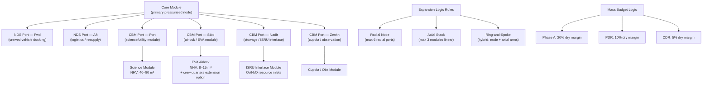

# STA 190-199 · 09.191.003 — Modular Habitat Architecture and Expansion Logic

## §1 Purpose

This document defines the **modular architecture principles** and **expansion logic rules** for advanced habitats within the Q+ATLANTIDE STA 191 baseline.[^baseline] It establishes the normative requirements for pressurised-module interface standards, structural coupling, pressurisation and leak-check protocols, configurability constraints, and mass/volume budget logic that governs modular growth scenarios.[^qdiv]

Modular architecture is the primary growth strategy for all Class A–F habitats in subsection 191. This document ensures that expansion phases preserve interface compatibility, structural load paths, and ECLSS loop topology continuity, and that mass-budget headroom is declared as a formal design parameter at each phase gate.[^gov]

## §2 Scope

**In scope:**

- Pressurised module interface standards: NASA Docking System (NDS), International Berthing and Docking Mechanism (IBDM), Common Berthing Mechanism (CBM), and hatch aperture standards (800 mm × 800 mm minimum clear opening)
- Expansion logic rules: radial node topology, axial stack topology, ring-and-spoke topology — discriminating criteria for each and permissible combinations
- Structural coupling requirements: primary load path certification, module-to-module interface loads (axial, shear, moment, torsion envelopes), micro-vibration isolation targets
- Pressurisation and leak-check protocol: fill-to-MEOP sequence, hold-duration requirements (≥24 h at 103% MEOP), acceptable leak-rate thresholds (<0.05% volume/day for crew habitation modules)
- Configurability constraints: minimum number of hard-mated interfaces required for structural closure, maximum unsupported cantilever mass, boom/truss integration rules
- Mass/volume budget logic: dry mass margin (20% at Phase A, 10% at PDR, 5% at CDR), net habitable volume (NHV) budget per crew, stowage-to-NHV ratio limits

**Out of scope:** Detailed structural finite-element analysis methods (referenced in 007); internal outfitting layout (referenced in 006); ECLSS routing within modules (referenced in 004); launch vehicle fairing constraints (mission-specific, not in this baseline).

## §3 Diagram

## §4 Footprint

| Attribute | Value |
|-----------|-------|
| Architecture | Space Technology Architecture (STA) |
| Master range | 100–199 |
| Code range | 190-199 |
| Section | 09 — Sistemas Avanzados, Conceptos y Futuro Espacial |
| Subsection | 191 — Hábitats Avanzados |
| Subsubject | 003 — Modular Habitat Architecture and Expansion Logic |
| Primary Q-Division | Q-SPACE[^qdiv] |
| Support Q-Divisions | Q-HORIZON, Q-DATAGOV, Q-HPC, Q-GREENTECH, Q-STRUCTURES, Q-INDUSTRY |
| ORB support | ORB-PMO, ORB-LEG |
| Governance class | baseline[^gov] |
| Folder path | `Q+ATLANTIDE/100-199_STA/190-199_Sistemas-Avanzados-Conceptos-y-Futuro-Espacial/191_Habitats-Avanzados/` |
| Document | `003_Modular-Habitat-Architecture-and-Expansion-Logic.md` |
| Parent subsection | [README.md](./README.md) · [000_Overview.md](./000_Overview.md) |
| Parent architecture | [../../README.md](../../README.md) |
| Parent baseline | [organization/Q+ATLANTIDE.md](../../../../organization/Q+ATLANTIDE.md) |

## §5 References & Citations

[^baseline]: Q+ATLANTIDE controlled baseline (v1.0.0).[^n001]
[^archtable]: §3 Architecture Table (parent) — see [../../README.md](../../README.md).
[^qdiv]: Q-Division authority — Q-SPACE is the primary division authority; Q-STRUCTURES provides load-path and interface-loads governance.
[^gov]: Governance class — baseline. Interface standard changes require ORB-PMO change control and ORB-LEG review.
[^ecss32]: ECSS-E-ST-32C — *Space engineering: Structural general requirements* (ESA, 2008).
[^nds]: NASA-TM-2012-217428 — *NASA Docking System (NDS) Interface Definition Document* (NASA, 2012).
[^ibdm]: ESA-IBDM-SPEC-001 — *International Berthing and Docking Mechanism Interface Control Document* (ESA/Boeing, 2015).
[^nastd3001v2]: NASA-STD-3001 Vol.2 — *NASA Space Flight Human-System Standard: Human Factors* (NASA, 2011).
[^n001]: Note N-001: Q+ATLANTIDE is a taxonomy and traceability ecosystem, not a mission or programme.

### Applicable industry standards

- ECSS-E-ST-32C — Space engineering: Structural general requirements (ESA, 2008)[^ecss32]
- ECSS-E-ST-10-03C — Space engineering: Testing (ESA, 2012)
- NASA-TM-2012-217428 — NASA Docking System (NDS) Interface Definition Document (NASA, 2012)[^nds]
- NASA-STD-3001 Vol.2 — NASA Space Flight Human-System Standard: Human Factors (NASA, 2011)[^nastd3001v2]
- JSC 65829 — International Space Station Interface Requirements Document (NASA JSC, current revision)
- ECSS-M-ST-10C Rev.1 — Space project management: Project planning and implementation (ESA, 2009)
