# STA 190-199 · 09.191.005 — Radiation Protection, Safe Haven and Shielding Concepts

## §1 Purpose

This document defines the **radiation environment characterisation**, **shielding architecture**, and **safe-haven design requirements** for advanced habitats within Q+ATLANTIDE STA 191.[^baseline] It establishes the dose-constraint compliance pathway per NASA-STD-3001, the safe-haven areal-density threshold, Solar Particle Event (SPE) shelter trigger criteria, and the shielding mass trade methodology for each habitat class.[^qdiv]

Radiation protection is a hard constraint — not a design option — for all Class A–F habitats. Any habitat concept seeking admission to the 191 register must declare its radiation analysis, shielding approach, safe-haven geometry, and dose compliance evidence as a precondition for entry, per the `no_aaa_rule` and the safety boundary declared in this subsection.[^gov]

## §2 Scope

**In scope:**

- Radiation environment characterisation per habitat class: LEO (ISS-equivalent, ~10 mSv/yr shielded), cislunar NRHO (~400 mSv/yr unshielded), lunar surface (~220 mSv/yr unshielded), Mars surface (~233 mSv/yr unshielded), deep-space transit (~700 mSv/yr unshielded in solar minimum)
- Galactic Cosmic Ray (GCR) dose modeling: Z≥3 HZE particle contribution, dose-equivalent vs. absorbed dose distinction, quality factor Q application per ICRP-60/103
- Solar Particle Event (SPE) characterisation: August 1972 and October 1989 reference events, proton fluence spectra, shelter trigger threshold (10 MeV proton flux > 10 pfu)
- Passive shielding concepts: aluminium-equivalent areal density trade (g/cm²), polyethylene high-density shielding, water-wall concepts, regolith overburden for surface habitats
- Active shielding concepts: magnetic field generation trade (mass vs. dose reduction), plasma shielding — assessed as TRL 3 for architectural reference only
- Safe-haven design requirements: minimum areal density ≥ 30 g/cm² aluminium-equivalent, volume ≥ 0.5 m³ per crewmember, radiation-hardened ECLSS backup operable within safe haven, crew access time ≤ 30 min from any module
- Dose-constraint compliance: career limits per NASA-STD-3001 (age/sex-specific REID ≤ 3% fatal cancer risk), 30-day acute limit (250 mGy-Eq BFO), annual limit (500 mGy-Eq BFO)
- Shielding mass trade outputs: mass penalty in kg per mSv dose reduction, per habitat class and duration

**Out of scope:** Detailed Monte Carlo radiation transport analysis methods; pharmaceutical countermeasures (addressed in 006); MMOD shielding (addressed in 007); planetary-protection contamination control.

## §3 Diagram

```mermaid
flowchart TD
    RAD["Radiation Environment\nper Habitat Class"]

    RAD --> LEO["Class A — LEO\n~10 mSv/yr shielded\nGCR + trapped belts"]
    RAD --> CLG["Class B — Cislunar\n~400 mSv/yr unshielded\nGCR + SPE exposure"]
    RAD --> LNR["Class C — Lunar Surface\n~220 mSv/yr unshielded\nGCR + SPE, no magnetosphere"]
    RAD --> MRS["Class D — Mars Surface\n~233 mSv/yr unshielded\n+ transit dose (Class E)"]
    RAD --> TRN["Class E — Deep-Space Transit\n~700 mSv/yr unshielded\n(solar minimum GCR peak)"]

    RAD --> SHIELD["Shielding Strategies"]
    SHIELD --> PASS["Passive Shielding\nAl-equiv. areal density\n(g/cm²) trade"]
    SHIELD --> POLY["Polyethylene / Water Wall\n(H-rich materials, higher\nneutron moderation)"]
    SHIELD --> REGOLITH["Regolith Overburden\n(surface habitats only\n≥2 m = ~300 g/cm² Al-equiv.)"]
    SHIELD --> ACTIVE["Active Shielding\n(magnetic / plasma)\nTRL 3 — reference only"]

    RAD --> SAFEHAVEN["Safe Haven\nRequirements"]
    SAFEHAVEN --> SH1["Areal density ≥ 30 g/cm² Al-equiv."]
    SAFEHAVEN --> SH2["Volume ≥ 0.5 m³/crewmember"]
    SAFEHAVEN --> SH3["Crew access ≤ 30 min\nfrom any module"]
    SAFEHAVEN --> SH4["SPE trigger: 10 MeV proton\nflux > 10 pfu"]
    SAFEHAVEN --> SH5["ECLSS autonomous ≥ 72 h\nwithin safe haven"]

    RAD --> DOSE["Dose Compliance\n(NASA-STD-3001)"]
    DOSE --> D1["Career REID ≤ 3% fatal cancer risk\n(age/sex-specific)"]
    DOSE --> D2["30-day acute: ≤ 250 mGy-Eq BFO"]
    DOSE --> D3["Annual: ≤ 500 mGy-Eq BFO"]
```

## §4 Footprint

| Attribute | Value |
|-----------|-------|
| Architecture | Space Technology Architecture (STA) |
| Master range | 100–199 |
| Code range | 190-199 |
| Section | 09 — Sistemas Avanzados, Conceptos y Futuro Espacial |
| Subsection | 191 — Hábitats Avanzados |
| Subsubject | 005 — Radiation Protection, Safe Haven and Shielding Concepts |
| Primary Q-Division | Q-SPACE[^qdiv] |
| Support Q-Divisions | Q-HORIZON, Q-DATAGOV, Q-HPC, Q-GREENTECH, Q-STRUCTURES, Q-INDUSTRY |
| ORB support | ORB-PMO, ORB-LEG |
| Governance class | baseline[^gov] |
| Folder path | `Q+ATLANTIDE/100-199_STA/190-199_Sistemas-Avanzados-Conceptos-y-Futuro-Espacial/191_Habitats-Avanzados/` |
| Document | `005_Radiation-Protection-Safe-Haven-and-Shielding-Concepts.md` |
| Parent subsection | [README.md](./README.md) · [000_Overview.md](./000_Overview.md) |
| Parent architecture | [../../README.md](../../README.md) |
| Parent baseline | [organization/Q+ATLANTIDE.md](../../../../organization/Q+ATLANTIDE.md) |

## §5 References & Citations

[^baseline]: Q+ATLANTIDE controlled baseline (v1.0.0).[^n001]
[^archtable]: §3 Architecture Table (parent) — see [../../README.md](../../README.md).
[^qdiv]: Q-Division authority — Q-SPACE is the primary division authority; Q-HPC provides radiation transport modeling support governance.
[^gov]: Governance class — baseline. Dose-limit changes require ORB-PMO change control and ORB-LEG human-rating review.
[^nastd3001v1]: NASA-STD-3001 Vol.1 — *NASA Space Flight Human-System Standard: Crew Health* (NASA, 2015).
[^icrp60]: ICRP Publication 60 — *1990 Recommendations of the International Commission on Radiological Protection* (ICRP, 1991).
[^icrp103]: ICRP Publication 103 — *The 2007 Recommendations of the International Commission on Radiological Protection* (ICRP, 2007).
[^nasaradiation]: NASA-TM-2014-217519 — *Space Radiation and Human Exploration: A White Paper* (NASA, 2014).
[^n001]: Note N-001: Q+ATLANTIDE is a taxonomy and traceability ecosystem, not a mission or programme.

### Applicable industry standards

- NASA-STD-3001 Vol.1 — NASA Space Flight Human-System Standard: Crew Health (NASA, 2015)[^nastd3001v1]
- ICRP Publication 60 — 1990 Recommendations of the ICRP (ICRP, 1991)[^icrp60]
- ICRP Publication 103 — 2007 Recommendations of the ICRP (ICRP, 2007)[^icrp103]
- ECSS-E-ST-10-04C — Space engineering: Space environment (ESA, 2008)
- NASA-TM-2014-217519 — Space Radiation and Human Exploration (NASA, 2014)[^nasaradiation]
- NCRP Report No. 132 — *Radiation Protection Guidance for Activities in Low-Earth Orbit* (NCRP, 2000)
- NASA/SP-2010-3407 — Human Integration Design Handbook (HIDH) (NASA, 2010)
