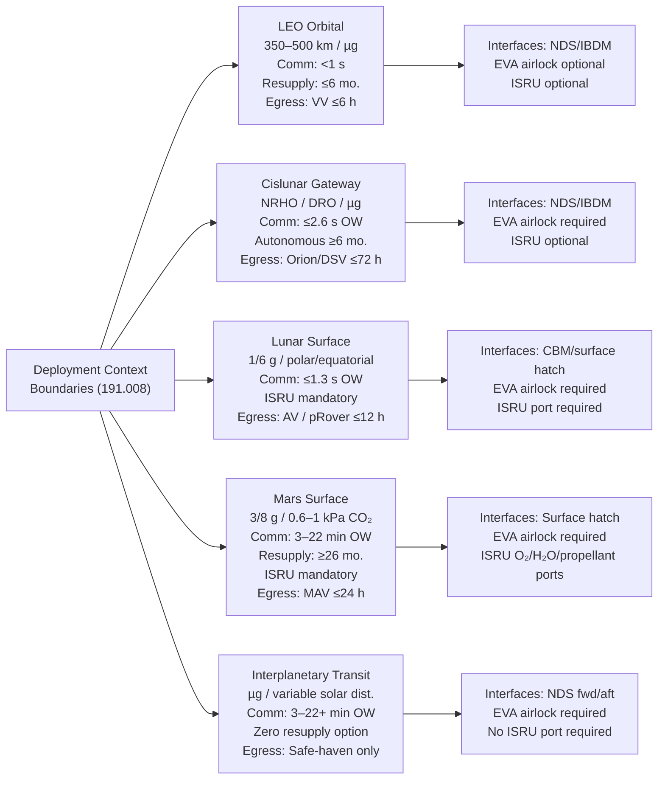

# STA 190-199 · 09.191.008 — Surface, Orbital and Interplanetary Habitat Boundaries

## §1 Purpose

This document declares the **environmental and operational boundaries** for each advanced habitat deployment context within Q+ATLANTIDE STA 191.[^baseline] For each deployment context, it specifies the governing gravity vector, radiation environment, communication delay window, nominal and emergency resupply interval, emergency egress provisions, and interface node constraints that a habitat concept must satisfy when assigned to that context.[^qdiv]

Boundary declarations are normative. A habitat concept submitted for architectural admission must declare its deployment context, demonstrate boundary compliance for each parameter in this document, and record any deviations as formal waivers subject to ORB-LEG review.[^gov]

## §2 Scope

**In scope:**

- Five deployment context boundaries:
  1. **LEO Orbital** (ISS-derived, free-flyer, altitude 350–500 km): gravity 9×10⁻⁶ g (microgravity), drag perturbation, 90-min orbital period, radiation environment (see 005), comm latency <1 s, resupply interval ≤ 6 months nominal / ≤ 90 days emergency, emergency egress via visiting vehicle within 6 h
  2. **Cislunar Gateway** (NRHO / lunar-DRO): microgravity, lunar distance (≈385,000 km), comm latency ≤ 2.6 s one-way, no frequent visiting vehicle resupply (design for ≥6 month autonomous ECLSS), emergency egress via Orion/Deep Space Vehicle within 72 h
  3. **Lunar Surface** (polar / equatorial, regolith-founded): 1/6 g (0.166 g), dust ingestion and adhesion risk, extreme thermal cycling (−170°C to +120°C equatorial day/night), comm latency ≤ 1.3 s one-way, ISRU integration mandatory for Class C, resupply interval ≥ 6 months, emergency egress via ascent vehicle or pressurised rover within 12 h
  4. **Mars Surface** (pre-deployed or transit-derived): 3/8 g (0.378 g), atmospheric pressure 0.6–1.0 kPa CO₂ (non-breathable), global dust storm risk (opacity τ > 2), comm latency 3–22 min one-way (range-dependent), resupply interval ≥ 26 months (synodic period), emergency egress via Mars Ascent Vehicle (MAV) within 24 h, ISRU mandatory
  5. **Interplanetary Transit** (Earth–Mars or Earth–Asteroid): microgravity, variable solar distance and solar wind flux, GCR and SPE peak exposure period (Class E), comm latency 3–22 min (Mars) or 3–30 min (asteroid belt), resupply interval = zero (closed-loop only), emergency egress = safe-haven mode only (no external egress option beyond 1 AU from Earth)

- Per-boundary: gravity level, radiation environment reference (cross-reference to 005), comm delay window, resupply interval, emergency egress requirement, and interface node constraints (docking port standard, EVA airlock provision, ISRU port requirement)

**Out of scope:** Specific mission trajectory design; planetary-protection Category I–V protocols (mission-specific); launch vehicle ascent environments (mission-specific); surface mobility systems beyond airlock interface.

## §3 Diagram

## §4 Footprint

| Attribute | Value |
|-----------|-------|
| Architecture | Space Technology Architecture (STA) |
| Master range | 100–199 |
| Code range | 190-199 |
| Section | 09 — Sistemas Avanzados, Conceptos y Futuro Espacial |
| Subsection | 191 — Hábitats Avanzados |
| Subsubject | 008 — Surface, Orbital and Interplanetary Habitat Boundaries |
| Primary Q-Division | Q-SPACE[^qdiv] |
| Support Q-Divisions | Q-HORIZON, Q-DATAGOV, Q-HPC, Q-GREENTECH, Q-STRUCTURES, Q-INDUSTRY |
| ORB support | ORB-PMO, ORB-LEG |
| Governance class | baseline[^gov] |
| Folder path | `Q+ATLANTIDE/100-199_STA/190-199_Sistemas-Avanzados-Conceptos-y-Futuro-Espacial/191_Habitats-Avanzados/` |
| Document | `008_Surface-Orbital-and-Interplanetary-Habitat-Boundaries.md` |
| Parent subsection | [README.md](./README.md) · [000_Overview.md](./000_Overview.md) |
| Parent architecture | [../../README.md](../../README.md) |
| Parent baseline | [organization/Q+ATLANTIDE.md](../../../../organization/Q+ATLANTIDE.md) |

## §5 References & Citations

[^baseline]: Q+ATLANTIDE controlled baseline (v1.0.0).[^n001]
[^archtable]: §3 Architecture Table (parent) — see [../../README.md](../../README.md).
[^qdiv]: Q-Division authority — Q-SPACE is the primary division authority for habitat deployment context definitions.
[^gov]: Governance class — baseline. Boundary parameter changes require ORB-PMO change control and ORB-LEG review.
[^nastd3001v1]: NASA-STD-3001 Vol.1 — *NASA Space Flight Human-System Standard: Crew Health* (NASA, 2015).
[^ecssenv]: ECSS-E-ST-10-04C — *Space engineering: Space environment* (ESA, 2008).
[^marsenv]: NASA-TM-2014-218548 — *NASA's Evolvable Mars Campaign* (NASA, 2014).
[^hidh]: NASA/SP-2010-3407 — *Human Integration Design Handbook (HIDH)* (NASA, 2010).
[^n001]: Note N-001: Q+ATLANTIDE is a taxonomy and traceability ecosystem, not a mission or programme.

### Applicable industry standards

- NASA-STD-3001 Vol.1 — NASA Space Flight Human-System Standard: Crew Health (NASA, 2015)[^nastd3001v1]
- ECSS-E-ST-10-04C — Space engineering: Space environment (ESA, 2008)[^ecssenv]
- NASA/SP-2010-3407 — Human Integration Design Handbook (HIDH) (NASA, 2010)[^hidh]
- NASA-TM-2014-218548 — NASA's Evolvable Mars Campaign (NASA, 2014)[^marsenv]
- ECSS-E-ST-34C — Space engineering: Environmental control and life support (ESA, 2008)
- ECSS-M-ST-10C Rev.1 — Space project management: Project planning and implementation (ESA, 2009)
- COSPAR Planetary Protection Policy — Committee on Space Research (current revision)
