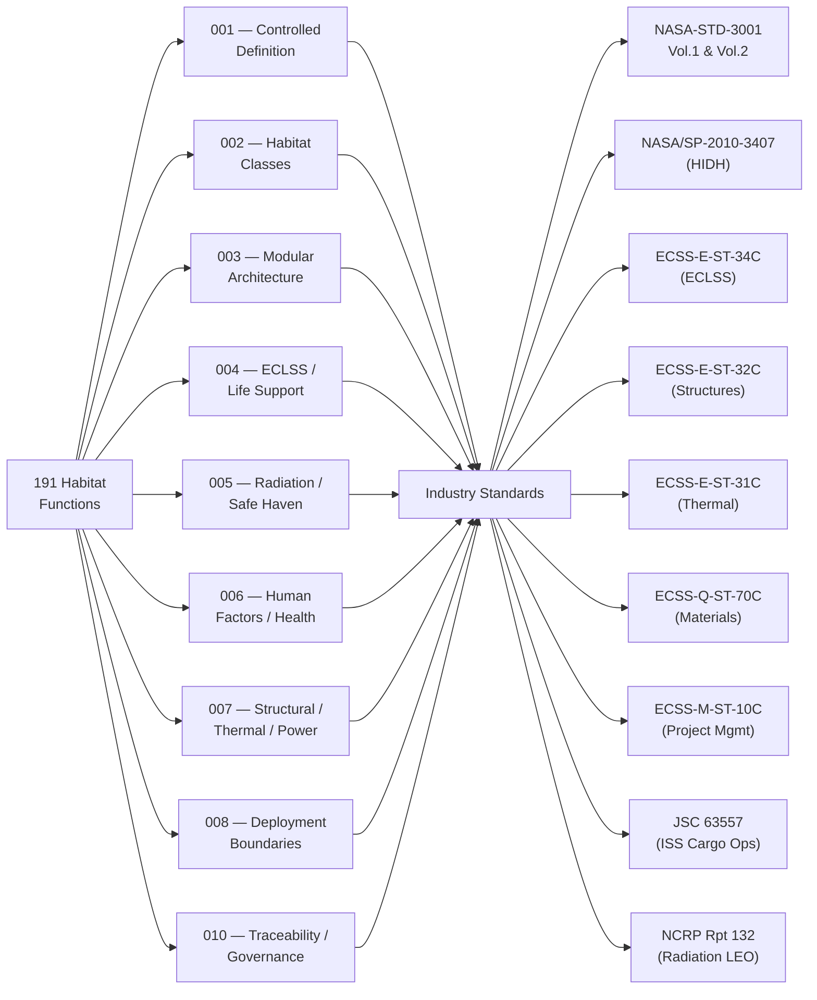

# STA 190-199 · 09.191.009 — ECSS, NASA Habitat and Human Spaceflight Standards Mapping

## §1 Purpose

This document provides the **function-to-standard mapping** for all advanced habitat functions covered by Q+ATLANTIDE STA 191 subsubjects 001–008 and 010.[^baseline] It cross-references each habitat discipline function to the applicable industry standard, standards body, and applicability scope, enabling verifiers and reviewers to identify the normative source for each design or analysis requirement.[^qdiv]

The mapping is normative for all 191 documents: when a subsubject references a standard without full citation, the citation shall be resolved by consulting the mapping table in this document. The mapping table is governed by ORB-PMO change control — additions, deletions, and version updates to listed standards require a formal baseline change notice.[^gov]

## §2 Scope

**In scope:**

- Function-to-standard mapping table covering all habitat functions in subsubjects 001–008 and 010
- Standards bodies represented: NASA (JPL/JSC/LaRC), ESA/ECSS, ISO, IEC, NCRP, ICRP, COSPAR, DoD (MIL)
- Standards list: NASA-STD-3001 Vol.1, NASA-STD-3001 Vol.2, NASA/SP-2010-3407 (HIDH), ECSS-E-ST-34C, ECSS-Q-ST-70C, ECSS-E-ST-10-03C, ECSS-M-ST-10C, ECSS-E-ST-32C, ECSS-E-ST-31C, ECSS-E-ST-10-04C, JSC 63557, SSP-30312, NCRP Report 132, ICRP 60/103, MIL-STD-810H
- Applicability levels: Mandatory (M), Recommended (R), Reference (Ref)

**Out of scope:** Mission-specific interface control documents (ICDs); programme-level design verification matrices (DVMs); standard supersedure tracking (standards are cited at revision declared; updates are subject to change control).

## §3 Diagram

## §4 Function-to-Standard Mapping Table

| Function | Subsubject ref | Standard | Body | Applicability |
|----------|---------------|----------|------|--------------|
| Advanced habitat controlled definition | 001 | NASA-STD-3001 Vol.1 | NASA | M |
| Advanced habitat controlled definition | 001 | ECSS-E-ST-34C | ESA | M |
| Habitat class assignment | 002 | NASA/SP-2010-3407 (HIDH) | NASA | R |
| Habitat class assignment | 002 | NASA-TM-2014-218548 | NASA | Ref |
| Modular interface — NDS/IBDM | 003 | NASA-TM-2012-217428 | NASA | M |
| Modular interface — structural loads | 003 | ECSS-E-ST-32C | ESA | M |
| Modular pressurisation and leak-check | 003 | ECSS-E-ST-10-03C | ESA | M |
| Mass budget logic and margins | 003 | ECSS-M-ST-10C Rev.1 | ESA | M |
| Atmospheric control (O₂/N₂/pressure) | 004 | NASA-STD-3001 Vol.1 §4 | NASA | M |
| CO₂ removal architecture | 004 | ECSS-E-ST-34C §5 | ESA | M |
| Water recovery and potability | 004 | NASA-STD-3001 Vol.1 §4 | NASA | M |
| ECLSS materials and compatibility | 004 | ECSS-Q-ST-70C | ESA | M |
| Radiation dose limits (career/acute) | 005 | NASA-STD-3001 Vol.1 §5 | NASA | M |
| Radiation dose limits (ICRP basis) | 005 | ICRP Publication 103 | ICRP | M |
| GCR/SPE environment characterisation | 005 | ECSS-E-ST-10-04C | ESA | M |
| Safe-haven dose-constraint verification | 005 | NCRP Report No. 132 | NCRP | M |
| Net habitable volume (NHV) | 006 | NASA-STD-3001 Vol.2 §8 | NASA | M |
| Acoustics requirements | 006 | NASA-STD-3001 Vol.2 §7 | NASA | M |
| Lighting requirements | 006 | NASA-STD-3001 Vol.2 §9 | NASA | M |
| Thermal comfort requirements | 006 | NASA-STD-3001 Vol.2 §6 | NASA | M |
| Exercise equipment minimums | 006 | NASA-STD-3001 Vol.2 §11 | NASA | M |
| Medical capability tiers | 006 | NASA/SP-2010-3407 (HIDH) Ch. 10 | NASA | M |
| Crew quarters and privacy | 006 | NASA-STD-3001 Vol.2 §8 | NASA | M |
| Structural interface and load factors | 007 | ECSS-E-ST-32C | ESA | M |
| MMOD protection | 007 | NASA-JSC-65829 (ISS heritage) | NASA | R |
| Thermal control architecture | 007 | ECSS-E-ST-31C | ESA | M |
| Power bus standards | 007 | SSP-30312 | NASA JSC | M |
| ISS cargo operations interface | 007 | JSC 63557 | NASA JSC | R |
| Materials and processes compliance | 007 | ECSS-Q-ST-70C | ESA | M |
| Environmental testing | 007 | ECSS-E-ST-10-03C | ESA | M |
| Environmental testing | 007 | MIL-STD-810H | DoD | R |
| LEO orbital boundary parameters | 008 | ECSS-E-ST-10-04C | ESA | M |
| Cislunar / deep-space boundary | 008 | NASA/SP-2010-3407 (HIDH) | NASA | R |
| Planetary surface boundary (Mars) | 008 | COSPAR Planetary Protection Policy | COSPAR | Ref |
| Lifecycle governance and review gates | 010 | ECSS-M-ST-10C Rev.1 | ESA | M |
| Evidence package requirements | 010 | NASA-STD-3001 Vol.1 | NASA | M |

## §5 Footprint

| Attribute | Value |
|-----------|-------|
| Architecture | Space Technology Architecture (STA) |
| Master range | 100–199 |
| Code range | 190-199 |
| Section | 09 — Sistemas Avanzados, Conceptos y Futuro Espacial |
| Subsection | 191 — Hábitats Avanzados |
| Subsubject | 009 — ECSS, NASA Habitat and Human Spaceflight Standards Mapping |
| Primary Q-Division | Q-SPACE[^qdiv] |
| Support Q-Divisions | Q-HORIZON, Q-DATAGOV, Q-HPC, Q-GREENTECH, Q-STRUCTURES, Q-INDUSTRY |
| ORB support | ORB-PMO, ORB-LEG |
| Governance class | baseline[^gov] |
| Folder path | `Q+ATLANTIDE/100-199_STA/190-199_Sistemas-Avanzados-Conceptos-y-Futuro-Espacial/191_Habitats-Avanzados/` |
| Document | `009_ECSS-NASA-Habitat-and-Human-Spaceflight-Standards-Mapping.md` |
| Parent subsection | [README.md](./README.md) · [000_Overview.md](./000_Overview.md) |
| Parent architecture | [../../README.md](../../README.md) |
| Parent baseline | [organization/Q+ATLANTIDE.md](../../../../organization/Q+ATLANTIDE.md) |

## §6 References & Citations

[^baseline]: Q+ATLANTIDE controlled baseline (v1.0.0).[^n001]
[^archtable]: §3 Architecture Table (parent) — see [../../README.md](../../README.md).
[^qdiv]: Q-Division authority — Q-SPACE is the primary division authority for standards mapping; Q-DATAGOV governs standards registry maintenance.
[^gov]: Governance class — baseline. Standards table changes require formal ORB-PMO change notice.
[^nastd3001v1]: NASA-STD-3001 Vol.1 — *NASA Space Flight Human-System Standard: Crew Health* (NASA, 2015).
[^nastd3001v2]: NASA-STD-3001 Vol.2 — *NASA Space Flight Human-System Standard: Human Factors* (NASA, 2011).
[^hidh]: NASA/SP-2010-3407 — *Human Integration Design Handbook (HIDH)* (NASA, 2010).
[^ecss34]: ECSS-E-ST-34C — *Space engineering: Environmental control and life support* (ESA, 2008).
[^ecssq70]: ECSS-Q-ST-70C — *Space product assurance: Materials, mechanical parts and processes* (ESA, 2014).
[^ecss1003]: ECSS-E-ST-10-03C — *Space engineering: Testing* (ESA, 2012).
[^ecssmst10]: ECSS-M-ST-10C Rev.1 — *Space project management: Project planning and implementation* (ESA, 2009).
[^jsc63557]: JSC 63557 — *ISS Cargo Operations* (NASA JSC, current revision).
[^n001]: Note N-001: Q+ATLANTIDE is a taxonomy and traceability ecosystem, not a mission or programme.

### Applicable industry standards

- NASA-STD-3001 Vol.1 — NASA Space Flight Human-System Standard: Crew Health (NASA, 2015)[^nastd3001v1]
- NASA-STD-3001 Vol.2 — NASA Space Flight Human-System Standard: Human Factors (NASA, 2011)[^nastd3001v2]
- NASA/SP-2010-3407 — Human Integration Design Handbook (HIDH) (NASA, 2010)[^hidh]
- ECSS-E-ST-34C — Space engineering: Environmental control and life support (ESA, 2008)[^ecss34]
- ECSS-Q-ST-70C — Space product assurance: Materials, mechanical parts and processes (ESA, 2014)[^ecssq70]
- ECSS-E-ST-10-03C — Space engineering: Testing (ESA, 2012)[^ecss1003]
- ECSS-M-ST-10C Rev.1 — Space project management: Project planning and implementation (ESA, 2009)[^ecssmst10]
- JSC 63557 — ISS Cargo Operations (NASA JSC, current revision)[^jsc63557]
- NCRP Report No. 132 — Radiation Protection Guidance for Activities in Low-Earth Orbit (NCRP, 2000)
- ICRP Publication 103 — 2007 Recommendations of the ICRP (ICRP, 2007)
- MIL-STD-810H — Environmental Engineering Considerations and Laboratory Tests (DoD, 2019)
- SSP-30312 — ISS Electrical Power System Interface Requirements Document (NASA JSC, current revision)
