# STA 190-199 · 191-010 — Advanced Habitats Controlled Definition

## §1 Purpose

This document establishes the **Q+ATLANTIDE controlled definition** of an *Advanced Habitat* within the Space Technology Architecture (STA) register.[^baseline] It canonises the terminology, taxonomy, classification hierarchy, physics-basis obligations, human-rating requirements, and the TRL threshold that any candidate entry must satisfy for architectural admission into subsection 191.[^qdiv]

The controlled definition is binding for all Q+ATLANTIDE STA artefacts in code range 190-199, Section 09, Subsection 191, and for any interfacing document that references advanced human-rated habitats.[^gov] No concept, component, or system shall be admitted to the 191 register without satisfying each clause herein. This rule implements the `no_aaa_rule` flag declared in the frontmatter.[^n001]

## §2 Scope

**In scope:**

- Normative Q+ATLANTIDE definition of "Advanced Habitat" as a pressurised human-occupied volume designed for long-duration space operations of ≥30 days continuous crew habitation, operating beyond ISS baseline functional capability or in a new deployment environment
- Habitat taxonomy: surface habitat, orbital habitat, transit/transport habitat, hybrid habitat — with discriminating criteria for each class
- Minimum physics-basis requirements that must be declared in any habitat concept seeking admission to the 191 baseline register
- Human-rating obligations derived from NASA-STD-8739.8 and NASA-STD-3001 that are necessary for architectural admission
- TRL threshold criteria (TRL ≥ 4 for all constituent life-critical subsystems at PDR) required for baseline inclusion
- Exclusion list identifying concepts that fall outside the Advanced Habitats definition

**Out of scope:** ISS utilisation operations as-built; EVA suit pressurised volumes; unpressurised or shirt-sleeve rover cabs; short-duration capsules (<30 days); habitat concepts at TRL < 2 with no declared physics basis; planetary-protection containment structures not intended for continuous crew habitation.

## §3 Diagram

```mermaid
flowchart TD
    AH["Advanced Habitat\n(Q+ATLANTIDE STA 191)"]
    AH --> CRIT["Admission Criteria"]
    CRIT --> C1["≥30 days crew habitation\ncontinuous design life"]
    CRIT --> C2["Beyond ISS baseline capability\nOR new deployment environment"]
    CRIT --> C3["Physics basis declared\n(pressure, ECLSS, radiation, thermal)"]
    CRIT --> C4["Human-rating compliance\nNASA-STD-3001 / ECSS-E-ST-34C"]
    CRIT --> C5["TRL ≥ 4 all life-critical\nsubsystems at PDR"]

    AH --> TAX["Habitat Taxonomy"]
    TAX --> T1["Surface Habitat\n(lunar / Mars / asteroid)"]
    TAX --> T2["Orbital Habitat\n(LEO free-flyer / cislunar gateway)"]
    TAX --> T3["Transit / Transport Habitat\n(interplanetary transit stack)"]
    TAX --> T4["Hybrid Habitat\n(combined transit + surface capability)"]

    AH --> EXC["Exclusions"]
    EXC --> E1["Short-duration capsules\n(<30 days)"]
    EXC --> E2["EVA suit volumes"]
    EXC --> E3["Unpressurised rover cabs"]
    EXC --> E4["TRL < 2 / no physics basis"]
```

## §4 Footprint

| Attribute | Value |
|-----------|-------|
| Architecture | Space Technology Architecture (STA) |
| Master range | 100–199 |
| Code range | 190-199 |
| Section | 09 — Sistemas Avanzados, Conceptos y Futuro Espacial |
| Subsection | 191 — Hábitats Avanzados |
| Subsubject | 001 — Advanced Habitats Controlled Definition |
| Primary Q-Division | Q-SPACE[^qdiv] |
| Support Q-Divisions | Q-HORIZON, Q-DATAGOV, Q-HPC, Q-GREENTECH, Q-STRUCTURES, Q-INDUSTRY |
| ORB support | ORB-PMO, ORB-LEG |
| Governance class | baseline[^gov] |
| Folder path | `Q+ATLANTIDE/100-199_STA/190-199_Sistemas-Avanzados-Conceptos-y-Futuro-Espacial/191_Habitats-Avanzados/` |
| Document | `191-010-Advanced-Habitats-Controlled-Definition.md` |
| Parent subsection | [README.md](./README.md) · [`191-000-General.md`](./191-000-General.md) |
| Parent architecture | [../../README.md](../../README.md) |
| Parent baseline | [organization/Q+ATLANTIDE.md](../../../../organization/Q+ATLANTIDE.md) |

## §5 References & Citations

[^baseline]: Q+ATLANTIDE controlled baseline (v1.0.0).[^n001]
[^archtable]: §3 Architecture Table (parent) — see [../../README.md](../../README.md).
[^qdiv]: Q-Division authority — Q-SPACE is the primary division authority for STA 191 advanced habitat definitions.
[^gov]: Governance class — baseline. Changes to controlled definitions require formal ORB-PMO change request.
[^nastd3001v1]: NASA-STD-3001 Vol.1 — *NASA Space Flight Human-System Standard: Crew Health* (NASA, 2015).
[^nastd3001v2]: NASA-STD-3001 Vol.2 — *NASA Space Flight Human-System Standard: Human Factors, Habitability and Environmental Health* (NASA, 2011).
[^ecss34]: ECSS-E-ST-34C — *Space engineering: Environmental control and life support* (ESA, 2008).
[^nasahrp]: NASA-STD-8739.8 — *Software Assurance and Safety Standard* (NASA, 2012) — cited for human-rating heritage clause.
[^hidh]: NASA/SP-2010-3407 — *Human Integration Design Handbook (HIDH)* (NASA, 2010).
[^n001]: Note N-001: Q+ATLANTIDE is a taxonomy and traceability ecosystem, not a mission or programme.

### Applicable industry standards

- NASA-STD-3001 Vol.1 — NASA Space Flight Human-System Standard: Crew Health (NASA, 2015)[^nastd3001v1]
- NASA-STD-3001 Vol.2 — NASA Space Flight Human-System Standard: Human Factors, Habitability and Environmental Health (NASA, 2011)[^nastd3001v2]
- NASA/SP-2010-3407 — Human Integration Design Handbook (HIDH) (NASA, 2010)[^hidh]
- ECSS-E-ST-34C — Space engineering: Environmental control and life support (ESA, 2008)[^ecss34]
- ECSS-Q-ST-70C — Space product assurance: Materials, mechanical parts and processes (ESA, 2014)
- ECSS-E-ST-10-03C — Space engineering: Testing (ESA, 2012)
- JSC-65829 — International Space Station Interface Requirements Document (NASA JSC, current revision)
