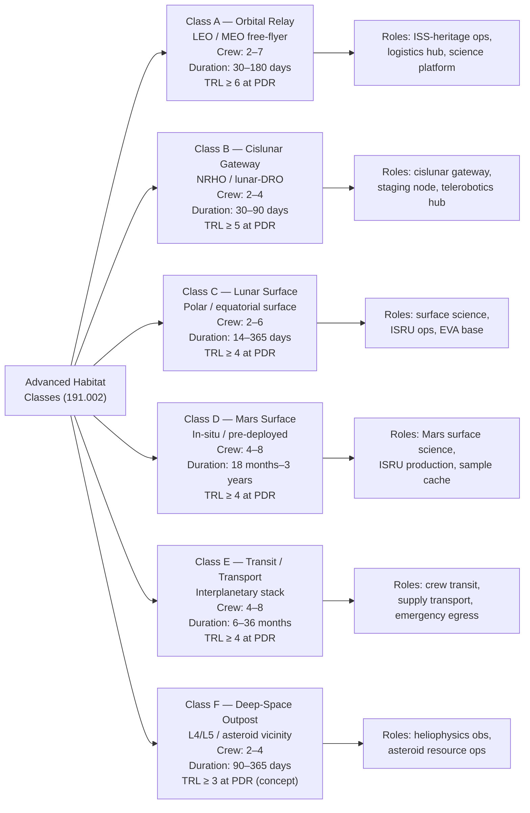

# STA 190-199 · 191-020 — Habitat Classes and Mission Roles

## §1 Purpose

This document provides the **formal classification** of advanced habitat classes within the Q+ATLANTIDE STA 191 baseline.[^baseline] It establishes the mission-role definition for each class, the discriminating characteristics that govern class assignment, and the minimum crew complement, mission-duration envelope, and TRL requirements that each class-instance must declare for architectural admission.[^qdiv]

The classification hierarchy defined herein is the normative reference for all downstream 191 subsubject documents (003–010) when referencing habitat type. Any habitat concept admitted to the Q+ATLANTIDE register shall be assigned exactly one primary class and may declare secondary hybrid roles, subject to the constraints of this document.[^gov]

## §2 Scope

**In scope:**

- Six habitat classes: orbital relay, cislunar gateway, lunar surface, Mars surface, transit/transport, and deep-space outpost
- Mission-role definition per class: scientific research platform, logistics hub, exploration base, transit stack, emergency safe haven
- Crew complement ranges and mission-duration envelopes per class
- Interface constraints specific to each deployment environment (docking port standards, EVA airlock requirements, ISRU integration)
- TRL thresholds per class at architectural admission and at PDR gate
- Cross-class compatibility constraints (e.g., transit habitat convertibility to surface habitat)

**Out of scope:** Specific mission architectures and programme-level trade studies; cost and mass budgets (addressed in 007); radiation environment details (addressed in 005); ECLSS loop design (addressed in 004).

## §3 Diagram

## §4 Footprint

| Attribute | Value |
|-----------|-------|
| Architecture | Space Technology Architecture (STA) |
| Master range | 100–199 |
| Code range | 190-199 |
| Section | 09 — Sistemas Avanzados, Conceptos y Futuro Espacial |
| Subsection | 191 — Hábitats Avanzados |
| Subsubject | 002 — Habitat Classes and Mission Roles |
| Primary Q-Division | Q-SPACE[^qdiv] |
| Support Q-Divisions | Q-HORIZON, Q-DATAGOV, Q-HPC, Q-GREENTECH, Q-STRUCTURES, Q-INDUSTRY |
| ORB support | ORB-PMO, ORB-LEG |
| Governance class | baseline[^gov] |
| Folder path | `Q+ATLANTIDE/100-199_STA/190-199_Sistemas-Avanzados-Conceptos-y-Futuro-Espacial/191_Habitats-Avanzados/` |
| Document | `191-020-Habitat-Classes-and-Mission-Roles.md` |
| Parent subsection | [README.md](./README.md) · [`191-000-General.md`](./191-000-General.md) |
| Parent architecture | [../../README.md](../../README.md) |
| Parent baseline | [organization/Q+ATLANTIDE.md](../../../../organization/Q+ATLANTIDE.md) |

## §5 References & Citations

[^baseline]: Q+ATLANTIDE controlled baseline (v1.0.0).[^n001]
[^archtable]: §3 Architecture Table (parent) — see [../../README.md](../../README.md).
[^qdiv]: Q-Division authority — Q-SPACE is the primary division authority for STA 191 habitat class definitions.
[^gov]: Governance class — baseline. Changes to class definitions require formal ORB-PMO change request.
[^nastd3001v1]: NASA-STD-3001 Vol.1 — *NASA Space Flight Human-System Standard: Crew Health* (NASA, 2015).
[^hidh]: NASA/SP-2010-3407 — *Human Integration Design Handbook (HIDH)* (NASA, 2010).
[^ecss34]: ECSS-E-ST-34C — *Space engineering: Environmental control and life support* (ESA, 2008).
[^nasaarch]: NASA-TM-2014-218548 — *NASA's Evolvable Mars Campaign* (NASA, 2014).
[^n001]: Note N-001: Q+ATLANTIDE is a taxonomy and traceability ecosystem, not a mission or programme.

### Applicable industry standards

- NASA-STD-3001 Vol.1 — NASA Space Flight Human-System Standard: Crew Health (NASA, 2015)[^nastd3001v1]
- NASA/SP-2010-3407 — Human Integration Design Handbook (HIDH) (NASA, 2010)[^hidh]
- ECSS-E-ST-34C — Space engineering: Environmental control and life support (ESA, 2008)[^ecss34]
- ECSS-E-ST-10-03C — Space engineering: Testing (ESA, 2012)
- NASA-TM-2014-218548 — NASA's Evolvable Mars Campaign (NASA, 2014)[^nasaarch]
- JSC 63557 — ISS Cargo Operations (NASA JSC, current revision)
