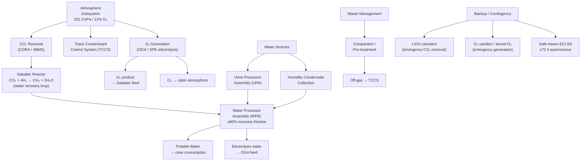

# STA 190-199 · 191-040 — Closed Loop ECLSS and Regenerative Life Support

## §1 Purpose

This document defines the **closed-loop Environmental Control and Life Support System (ECLSS)** architecture and the **regenerative life-support** requirements for advanced habitats within Q+ATLANTIDE STA 191.[^baseline] It establishes the atmospheric subsystem stack, CO₂ removal and reduction pathways, O₂ generation methods, water recovery architecture, waste management, loop-closure metrics, backup/contingency modes, and the resupply minimisation targets that govern mission sustainability.[^qdiv]

For long-duration missions (≥30 days, Classes C–F), a closed-loop ECLSS is not optional: it is a necessary condition for architectural admission under the `no_aaa_rule`. The ECLSS closure fraction — defined as the fraction of consumables regenerated in-situ versus resupplied — must be declared at every phase gate and must meet minimum thresholds per mission class.[^gov]

## §2 Scope

**In scope:**

- Atmospheric control: total pressure (101.3 kPa nominal; 70.3 kPa contingency), O₂ partial pressure (19.5–23.1 kPa per NASA-STD-3001), N₂/inert gas make-up strategy, trace contaminant control (TCCS)
- CO₂ removal architecture: Carbon Dioxide Removal Assembly (CDRA) / 4-Bed Molecular Sieve (4BMS) primary; Lithium Hydroxide (LiOH) emergency backup; Sabatier Reaction System (SRS) for CO₂ reduction to CH₄/H₂O
- O₂ generation: Oxygen Generation Assembly (OGA) — Solid Polymer Electrolysis (SPE) primary; stored-O₂ or O₂ candles (SFOG) emergency backup
- Water Recovery System (WRS): urine processor assembly (UPA), water processor assembly (WPA), humidity condensate processing — target water recovery fraction ≥ 90% for Class C–F habitats
- Waste management: pre-treat and compact solid waste, off-gas management, potential bio-reactor integration for advanced concepts
- ECLSS closure fraction metric: defined as (mass regenerated in-situ) / (total mass required) per year, expressed as percentage; minimum required values by class: Class A ≥ 40%, Class B ≥ 55%, Class C ≥ 70%, Class D ≥ 85%, Class E ≥ 75%, Class F ≥ 80%
- Backup and contingency modes: emergency O₂ supply sizing, CO₂ scrubber emergency mode duration, safe-haven ECLSS autonomy requirement (≥72 h without primary ECLSS)
- Resupply minimisation targets: consumable mass per crew-day target ≤ 3 kg/crew-day (Class D/E) and ≤ 5 kg/crew-day (Class A/B)

**Out of scope:** ECLSS physical layout within modules (referenced in 003); structural and thermal integration of ECLSS hardware (referenced in 007); ISRU-fed O₂/H₂O resource interfaces (referenced in 007 and 008); radiation effects on ECLSS consumables (referenced in 005).

## §3 Diagram

## §4 Footprint

| Attribute | Value |
|-----------|-------|
| Architecture | Space Technology Architecture (STA) |
| Master range | 100–199 |
| Code range | 190-199 |
| Section | 09 — Sistemas Avanzados, Conceptos y Futuro Espacial |
| Subsection | 191 — Hábitats Avanzados |
| Subsubject | 004 — Closed-Loop ECLSS and Regenerative Life Support |
| Primary Q-Division | Q-SPACE[^qdiv] |
| Support Q-Divisions | Q-HORIZON, Q-DATAGOV, Q-HPC, Q-GREENTECH, Q-STRUCTURES, Q-INDUSTRY |
| ORB support | ORB-PMO, ORB-LEG |
| Governance class | baseline[^gov] |
| Folder path | `Q+ATLANTIDE/100-199_STA/190-199_Sistemas-Avanzados-Conceptos-y-Futuro-Espacial/191_Habitats-Avanzados/` |
| Document | `191-040-Closed-Loop-ECLSS-and-Regenerative-Life-Support.md` |
| Parent subsection | [README.md](./README.md) · [`191-000-General.md`](./191-000-General.md) |
| Parent architecture | [../../README.md](../../README.md) |
| Parent baseline | [organization/Q+ATLANTIDE.md](../../../../organization/Q+ATLANTIDE.md) |

## §5 References & Citations

[^baseline]: Q+ATLANTIDE controlled baseline (v1.0.0).[^n001]
[^archtable]: §3 Architecture Table (parent) — see [../../README.md](../../README.md).
[^qdiv]: Q-Division authority — Q-SPACE is the primary division authority for ECLSS; Q-GREENTECH provides sustainability and loop-closure methodology governance.
[^gov]: Governance class — baseline. ECLSS closure-fraction threshold changes require ORB-PMO change control.
[^ecss34]: ECSS-E-ST-34C — *Space engineering: Environmental control and life support* (ESA, 2008).
[^nastd3001v1]: NASA-STD-3001 Vol.1 — *NASA Space Flight Human-System Standard: Crew Health* (NASA, 2015).
[^jscelss]: JSC-65829 — *ISS ECLSS Design and Operations* (NASA JSC, current revision).
[^eclsshandbook]: NASA-TM-2015-218570 — *Advanced Life Support Baseline Values and Assumptions Document* (NASA, 2015).
[^n001]: Note N-001: Q+ATLANTIDE is a taxonomy and traceability ecosystem, not a mission or programme.

### Applicable industry standards

- ECSS-E-ST-34C — Space engineering: Environmental control and life support (ESA, 2008)[^ecss34]
- NASA-STD-3001 Vol.1 — NASA Space Flight Human-System Standard: Crew Health (NASA, 2015)[^nastd3001v1]
- NASA-TM-2015-218570 — Advanced Life Support Baseline Values and Assumptions Document (NASA, 2015)[^eclsshandbook]
- ECSS-Q-ST-70C — Space product assurance: Materials, mechanical parts and processes (ESA, 2014)
- ECSS-E-ST-10-03C — Space engineering: Testing (ESA, 2012)
- NASA/SP-2010-3407 — Human Integration Design Handbook (HIDH) (NASA, 2010)
