# STA 190-199 · 191-060 — Human Factors Crew Health and Long Duration Habitability

## §1 Purpose

This document establishes the **human factors requirements**, **crew health standards**, and **long-duration habitability assessment methodology** for advanced habitats within Q+ATLANTIDE STA 191.[^baseline] It codifies the minimum net habitable volume (NHV) per crewmember, acoustic and lighting environment requirements, exercise equipment minimums, private crew-quarter provisions, medical capability tiers, microgravity countermeasure obligations, and behavioural health provisions — all anchored to NASA-STD-3001 and the Human Integration Design Handbook (HIDH).[^qdiv]

Long-duration habitability is treated as a human-rating requirement, not a design preference. Any habitat concept in the 191 register that fails to demonstrate NHV compliance and crew-health support capacity per this document shall not pass PDR.[^gov]

## §2 Scope

**In scope:**

- Net Habitable Volume (NHV) requirements per NASA-STD-3001 Vol.2: minimum 2.3 m³/crew for 1–180 day missions; 5.7 m³/crew for 181–360 day missions; 11.3 m³/crew for >360 day missions (desirable); distinction between NHV (usable pressurised volume) and total pressurised volume
- Acoustic environment: continuous noise limit ≤ 60 dB(A) in crew quarters and sleep areas; ≤ 72 dB(A) in workspaces; NC-50 limit for speech intelligibility; ≤ 85 dB(A) peak occupational exposure with hearing protection provision
- Lighting: minimum 300 lux task lighting, 150 lux general illumination; LED-based circadian-rhythm lighting (blue-enriched for alertness, blue-depleted for pre-sleep); emergency lighting ≥ 10 lux survivable on battery for ≥ 2 h
- Thermal comfort: operative temperature 18–27°C (crew quarters/sleep), 19–26°C (work areas), relative humidity 25–75%, airflow velocity 0.05–0.2 m/s
- Exercise equipment minimums per NASA-STD-3001: treadmill (COLBERT/TVIS heritage), advanced resistive exercise device (ARED), cycle ergometer (CEVIS heritage) — minimum 2 exercise modalities for missions >60 days; dedicated exercise volume ≥ 5 m³
- Private crew quarters: one private crew quarter per crewmember for missions >14 days; minimum volume 2.1 m³/quarter; acoustic isolation ≤ NC-40; adjustable lighting; personal storage allocation ≥ 0.04 m³/crew
- Medical capability tiers: Tier 1 — EMT-level (all missions); Tier 2 — paramedic/minor surgery capability (missions >90 days); Tier 3 — advanced care including general anaesthesia and imaging (missions >1 year); autonomous medical system (AMS) for missions with comm delay >20 min round-trip
- Microgravity countermeasures: minimum 2.5 h/day structured exercise for missions >30 days; lower-body negative pressure (LBNP) device provision for missions >180 days; nutrition supplement program
- Behavioural health provisions: private video/audio communication capability, personal storage for psychological support items, work/rest schedule autonomy, task variety monitoring, crew autonomy index (CAI) tracking for missions >90 days

**Out of scope:** Radiation health effects (addressed in 005); pharmacological countermeasures inventory (mission-specific medical supply); ECLSS design (addressed in 004); EVA suit ergonomics.

## §3 Diagram

```mermaid
flowchart TD
    HF["Human Factors &\nCrew Health (191.006)"]

    HF --> NHV["Net Habitable Volume\n(NHV) per NASA-STD-3001"]
    NHV --> NHV1["≤180 days: 2.3 m³/crew min."]
    NHV --> NHV2["181–360 days: 5.7 m³/crew min."]
    NHV --> NHV3[">360 days: 11.3 m³/crew desired"]

    HF --> ENV["Environmental\nRequirements"]
    ENV --> ACS["Acoustics\n≤60 dB(A) crew quarters\n≤72 dB(A) workspaces"]
    ENV --> LGT["Lighting\n300 lux task / 150 lux general\nCircadian LED control"]
    ENV --> THERM["Thermal Comfort\n18–27°C / RH 25–75%\n0.05–0.2 m/s airflow"]

    HF --> EX["Exercise\nRequirements"]
    EX --> EX1["≥2 modalities (>60 day missions)"]
    EX --> EX2["2.5 h/day structured exercise\n(missions >30 days)"]
    EX --> EX3["Dedicated volume ≥ 5 m³"]

    HF --> MED["Medical Capability\nTiers"]
    MED --> T1["Tier 1: EMT-level (all missions)"]
    MED --> T2["Tier 2: Minor surgery\n(>90 days)"]
    MED --> T3["Tier 3: Advanced care + imaging\n(>1 year)"]
    MED --> AMS["Autonomous Medical System\n(comm delay >20 min RT)"]

    HF --> BH["Behavioural Health\nProvisions"]
    BH --> BH1["Private crew quarters\n(≥1 per crew, >14 days)"]
    BH --> BH2["Private comms capability"]
    BH --> BH3["Crew autonomy index (CAI)\n(>90 day missions)"]
```

## §4 Footprint

| Attribute | Value |
|-----------|-------|
| Architecture | Space Technology Architecture (STA) |
| Master range | 100–199 |
| Code range | 190-199 |
| Section | 09 — Sistemas Avanzados, Conceptos y Futuro Espacial |
| Subsection | 191 — Hábitats Avanzados |
| Subsubject | 006 — Human Factors, Crew Health and Long-Duration Habitability |
| Primary Q-Division | Q-SPACE[^qdiv] |
| Support Q-Divisions | Q-HORIZON, Q-DATAGOV, Q-HPC, Q-GREENTECH, Q-STRUCTURES, Q-INDUSTRY |
| ORB support | ORB-PMO, ORB-LEG |
| Governance class | baseline[^gov] |
| Folder path | `Q+ATLANTIDE/100-199_STA/190-199_Sistemas-Avanzados-Conceptos-y-Futuro-Espacial/191_Habitats-Avanzados/` |
| Document | `191-060-Human-Factors-Crew-Health-and-Long-Duration-Habitability.md` |
| Parent subsection | [README.md](./README.md) · [`191-000-General.md`](./191-000-General.md) |
| Parent architecture | [../../README.md](../../README.md) |
| Parent baseline | [organization/Q+ATLANTIDE.md](../../../../organization/Q+ATLANTIDE.md) |

## §5 References & Citations

[^baseline]: Q+ATLANTIDE controlled baseline (v1.0.0).[^n001]
[^archtable]: §3 Architecture Table (parent) — see [../../README.md](../../README.md).
[^qdiv]: Q-Division authority — Q-SPACE is the primary division authority; Q-HORIZON provides human-systems integration support governance.
[^gov]: Governance class — baseline. NHV and medical-tier threshold changes require ORB-PMO change control and ORB-LEG human-rating review.
[^nastd3001v1]: NASA-STD-3001 Vol.1 — *NASA Space Flight Human-System Standard: Crew Health* (NASA, 2015).
[^nastd3001v2]: NASA-STD-3001 Vol.2 — *NASA Space Flight Human-System Standard: Human Factors, Habitability and Environmental Health* (NASA, 2011).
[^hidh]: NASA/SP-2010-3407 — *Human Integration Design Handbook (HIDH)* (NASA, 2010).
[^iso11429]: ISO 11429 — *Ergonomics — System of auditory and visual danger and information signals* (ISO, 1996).
[^n001]: Note N-001: Q+ATLANTIDE is a taxonomy and traceability ecosystem, not a mission or programme.

### Applicable industry standards

- NASA-STD-3001 Vol.1 — NASA Space Flight Human-System Standard: Crew Health (NASA, 2015)[^nastd3001v1]
- NASA-STD-3001 Vol.2 — NASA Space Flight Human-System Standard: Human Factors, Habitability and Environmental Health (NASA, 2011)[^nastd3001v2]
- NASA/SP-2010-3407 — Human Integration Design Handbook (HIDH) (NASA, 2010)[^hidh]
- ECSS-E-ST-34C — Space engineering: Environmental control and life support (ESA, 2008)
- ISO 11429 — Ergonomics — Auditory and visual danger and information signals (ISO, 1996)[^iso11429]
- ECSS-E-HB-10-12A — Space engineering: Study and integration of biological systems (ESA, 2010)
- NASA-TM-2018-219802 — *Human Research Program Evidence Report: Risk of Adverse Health Outcomes and Decrements in Performance due to In-Flight Nutrition Deficiencies* (NASA, 2018)
