# STA 190-199 · 191-070 — Structure Thermal Power and Resource Interfaces

## §1 Purpose

This document defines the **structural interface requirements**, **thermal control architecture**, **power interface standards**, and **ISRU resource integration interfaces** for advanced habitats within Q+ATLANTIDE STA 191.[^baseline] It establishes the load envelopes, protection tiers, bus standards, connector specifications, and ISRU coupling interfaces that must be declared and verified for any habitat admitted to the 191 baseline register.[^qdiv]

These interfaces are the integration boundary between the habitat module and the external systems — launch vehicle, visiting vehicles, power generation arrays, thermal radiators, and in-situ resource production units. Interface non-compliance is an architectural deficiency and must be resolved before CDR.[^gov]

## §2 Scope

**In scope:**

- Primary structural interface requirements: axial and lateral loads at launch vehicle separation interface (module end-cone adapter); load factors per ECSS-E-ST-32C; proof and ultimate safety factors (1.25 / 1.40 for crew-rated structures); fatigue life ≥ 30 years (Class C/D surface habitats), ≥ 15 years (Class A/B orbital)
- MMOD (Micrometeoroid and Orbital Debris) protection tiers: Tier 1 — no detached spall (all modules); Tier 2 — no perforation at 0.1 cm Al sphere threat in LEO (Class A); Tier 3 — enhanced Whipple and multi-layer shield for Class B–E; stuffed Whipple shield options for long-duration cislunar/deep-space
- Microgravity mass properties: centre-of-gravity tracking requirements (CG offset ≤ 50 mm from nominal at all load cases), moment-of-inertia declaration for attitude control budgeting
- Thermal control architecture: internal Active Thermal Control System (ATCS) — fluid loop at 40°C cold plate temperature; external passive (Multi-Layer Insulation, MLI); External Thermal Control System (ETCS) — ammonia or water loop; radiator panel sizing (specific heat rejection capacity in W/m²)
- Power interface requirements: 28 VDC secondary bus (ISS-heritage equipment compatibility); 120 VDC primary distribution bus (ISS USOS heritage); IDA-compatible power connectors for visiting vehicle interface; solar array output 30–120 kW total depending on habitat class; battery backup ≥ 24 h essential loads in safe-haven mode
- ISRU resource integration interfaces: gaseous O₂ inlet (supply pressure 0.172 MPa ±10%, purity ≥ 99.5%); potable H₂O inlet (supply pressure 0.276 MPa ±5%, total dissolved solids ≤ 500 ppm); cryogenic H₂ or CH₄ propellant ports (for combined habitat/propulsion concepts); electrical power transfer port for ISRU plant (120 VDC, load up to 15 kW)

**Out of scope:** Launch vehicle structural analysis and coupled loads (mission-specific); ECLSS internal plumbing (addressed in 004); ISRU plant design (STA section boundary, not within 191 scope); radiation shielding mass (addressed in 005); habitat outfitting and crew stowage (addressed in 006).

## §3 Diagram

```mermaid
flowchart TD
    INTF["Structure / Thermal /\nPower / Resource\nInterfaces (191.007)"]

    INTF --> STRUCT["Structural Interfaces"]
    STRUCT --> LV["LV Separation Interface\nLoad envelope per ECSS-E-ST-32C\nSF proof 1.25 / ult. 1.40"]
    STRUCT --> MMOD["MMOD Protection Tiers\nTier 1–3 per habitat class\nWhipple / Stuffed-Whipple shields"]
    STRUCT --> FATIGUE["Fatigue Life\n≥30 yr surface / ≥15 yr orbital"]

    INTF --> THERMAL["Thermal Control"]
    THERMAL --> ATCS["ATCS — Internal fluid loop\n40°C cold plate temp.\nMLI external passive insulation"]
    THERMAL --> ETCS["ETCS — External NH₃/H₂O loop\nRadiator panel sizing\n(W/m² specific capacity)"]

    INTF --> POWER["Power Interfaces"]
    POWER --> P28["28 VDC secondary bus\n(ISS-heritage compat.)"]
    POWER --> P120["120 VDC primary bus\n(USOS heritage)"]
    POWER --> PBATT["Battery backup\n≥24 h essential loads\n(safe-haven mode)"]
    POWER --> PSOLAR["Solar array: 30–120 kW\nper habitat class"]

    INTF --> ISRU["ISRU Resource\nIntegration Interfaces"]
    ISRU --> O2IN["O₂ inlet\n0.172 MPa / purity ≥99.5%"]
    ISRU --> H2OIN["H₂O inlet\n0.276 MPa / TDS ≤500 ppm"]
    ISRU --> PROP["Cryo-H₂/CH₄ propellant port\n(combined concepts only)"]
    ISRU --> PWRISRU["120 VDC ISRU power port\n≤15 kW load"]
```

## §4 Footprint

| Attribute | Value |
|-----------|-------|
| Architecture | Space Technology Architecture (STA) |
| Master range | 100–199 |
| Code range | 190-199 |
| Section | 09 — Sistemas Avanzados, Conceptos y Futuro Espacial |
| Subsection | 191 — Hábitats Avanzados |
| Subsubject | 007 — Structure, Thermal, Power and Resource Interfaces |
| Primary Q-Division | Q-SPACE[^qdiv] |
| Support Q-Divisions | Q-HORIZON, Q-DATAGOV, Q-HPC, Q-GREENTECH, Q-STRUCTURES, Q-INDUSTRY |
| ORB support | ORB-PMO, ORB-LEG |
| Governance class | baseline[^gov] |
| Folder path | `Q+ATLANTIDE/100-199_STA/190-199_Sistemas-Avanzados-Conceptos-y-Futuro-Espacial/191_Habitats-Avanzados/` |
| Document | `191-070-Structure-Thermal-Power-and-Resource-Interfaces.md` |
| Parent subsection | [README.md](./README.md) · [`191-000-General.md`](./191-000-General.md) |
| Parent architecture | [../../README.md](../../README.md) |
| Parent baseline | [organization/Q+ATLANTIDE.md](../../../../organization/Q+ATLANTIDE.md) |

## §5 References & Citations

[^baseline]: Q+ATLANTIDE controlled baseline (v1.0.0).[^n001]
[^archtable]: §3 Architecture Table (parent) — see [../../README.md](../../README.md).
[^qdiv]: Q-Division authority — Q-SPACE is the primary division authority; Q-STRUCTURES governs load-path and MMOD protection standards; Q-GREENTECH governs ISRU resource integration.
[^gov]: Governance class — baseline. Interface standard changes require ORB-PMO change control and ORB-LEG review.
[^ecss32]: ECSS-E-ST-32C — *Space engineering: Structural general requirements* (ESA, 2008).
[^ecss31]: ECSS-E-ST-31C — *Space engineering: Thermal control general requirements* (ESA, 2008).
[^nastd3001v1]: NASA-STD-3001 Vol.1 — *NASA Space Flight Human-System Standard: Crew Health* (NASA, 2015).
[^isspower]: SSP-30312 — *International Space Station Electrical Power System Interface Requirements Document* (NASA JSC, current revision).
[^n001]: Note N-001: Q+ATLANTIDE is a taxonomy and traceability ecosystem, not a mission or programme.

### Applicable industry standards

- ECSS-E-ST-32C — Space engineering: Structural general requirements (ESA, 2008)[^ecss32]
- ECSS-E-ST-31C — Space engineering: Thermal control general requirements (ESA, 2008)[^ecss31]
- ECSS-E-ST-10-03C — Space engineering: Testing (ESA, 2012)
- ECSS-Q-ST-70C — Space product assurance: Materials, mechanical parts and processes (ESA, 2014)
- SSP-30312 — ISS Electrical Power System Interface Requirements Document (NASA JSC, current revision)[^isspower]
- NASA-STD-3001 Vol.1 — NASA Space Flight Human-System Standard: Crew Health (NASA, 2015)[^nastd3001v1]
- MIL-STD-810H — Environmental Engineering Considerations and Laboratory Tests (DoD, 2019)
