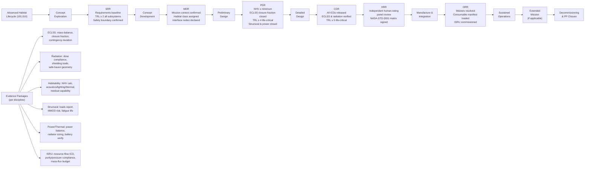

# STA 190-199 · 191-090 — Traceability Evidence and Lifecycle Governance

## §1 Purpose

This document establishes the **evidence package requirements**, **review gate criteria**, and **lifecycle governance framework** for advanced habitats within Q+ATLANTIDE STA 191.[^baseline] It defines the minimum evidence artefacts that must be produced for each discipline (ECLSS, radiation, habitability, structural, power/thermal, ISRU integration) at each lifecycle phase, and the review gates — SRR, MDR, PDR, CDR, HRR, and ORR — that govern advancement from one phase to the next.[^qdiv]

The lifecycle governance framework in this document is the capstone of the 191 baseline. Every habit concept in the 191 register is subject to this governance from the moment of architectural admission through to decommissioning and planetary-protection closure.[^gov]

## §2 Scope

**In scope:**

- Evidence package requirements per discipline, specifying minimum artefact type, content, and review-gate applicability:
  - ECLSS performance evidence: mass-balance analysis, ECLSS closure fraction calculation, contingency-mode duration analysis, consumable resupply plan
  - Radiation analysis and shielding evidence: dose-constraint compliance report, shielding mass trade, safe-haven geometry and areal-density verification, SPE shelter protocol
  - Habitability evidence: NHV compliance calculation (per NASA-STD-3001 Vol.2), acoustic/lighting/thermal environment analysis, exercise and medical capability declarations
  - Structural evidence: loads-analysis report (static and dynamic), MMOD risk assessment, fatigue life analysis, interface load envelopes
  - Power and thermal evidence: power balance spreadsheet (per habitat class), ETCS radiator sizing, ATCS cold-plate temperature verification, battery safe-haven capacity verification
  - ISRU integration evidence: resource-flow interface definition, purity and pressure compliance, mass-flux budget for O₂/H₂O production
- Review gate definitions and exit criteria:
  - **SRR** (System Requirements Review): requirements baseline established, safety boundary confirmed, TRL ≥ 2 for all subsystems; ECLSS and radiation requirements closed
  - **MDR** (Mission Definition Review): mission context and deployment boundary confirmed, habitat class assigned, interface nodes declared
  - **PDR** (Preliminary Design Review): NHV ≥ minimum, ECLSS closure fraction ≥ class minimum, shielding mass budget closed, TRL ≥ 4 for all life-critical subsystems, structural loads closed, power balance closed
  - **CDR** (Critical Design Review): all interface ICDs released, ECLSS performance analyses verified by independent review, radiation dose compliance verified, structural proof and margin analysis complete, TRL ≥ 5 for life-critical subsystems
  - **HRR** (Human Rating Review): independent human-rating panel review of NHV, ECLSS, radiation, and medical capability evidence; NASA-STD-3001 compliance matrix signed off; safe-haven protocol verified
  - **ORR** (Operational Readiness Review): all open waivers resolved or accepted, crew training complete, consumable manifest loaded, ISRU plant interface commissioned
- Lifecycle phases: Concept Exploration → Concept Development → Preliminary Design → Detailed Design → Manufacture & Integration → Verification & Validation → Launch & Early Operations → Sustained Operations → Extended Mission → Decommissioning & Planetary-Protection Closure
- Decommissioning obligations: atmospheric re-entry or controlled disposal plan for orbital classes; surface habitat end-of-life planetary-protection protocol per COSPAR policy for Class C/D/F

**Out of scope:** Programme management plans (mission-specific); cost and schedule baselines; crew training syllabi; launch vehicle integration plans.

## §3 Diagram

## §4 Footprint

| Attribute | Value |
|-----------|-------|
| Architecture | Space Technology Architecture (STA) |
| Master range | 100–199 |
| Code range | 190-199 |
| Section | 09 — Sistemas Avanzados, Conceptos y Futuro Espacial |
| Subsection | 191 — Hábitats Avanzados |
| Subsubject | 010 — Traceability, Evidence and Lifecycle Governance |
| Primary Q-Division | Q-SPACE[^qdiv] |
| Support Q-Divisions | Q-HORIZON, Q-DATAGOV, Q-HPC, Q-GREENTECH, Q-STRUCTURES, Q-INDUSTRY |
| ORB support | ORB-PMO, ORB-LEG |
| Governance class | baseline[^gov] |
| Folder path | `Q+ATLANTIDE/100-199_STA/190-199_Sistemas-Avanzados-Conceptos-y-Futuro-Espacial/191_Habitats-Avanzados/` |
| Document | `191-090-Traceability-Evidence-and-Lifecycle-Governance.md` |
| Parent subsection | [README.md](./README.md) · [`191-000-General.md`](./191-000-General.md) |
| Parent architecture | [../../README.md](../../README.md) |
| Parent baseline | [organization/Q+ATLANTIDE.md](../../../../organization/Q+ATLANTIDE.md) |

## §5 References & Citations

[^baseline]: Q+ATLANTIDE controlled baseline (v1.0.0).[^n001]
[^archtable]: §3 Architecture Table (parent) — see [../../README.md](../../README.md).
[^qdiv]: Q-Division authority — Q-SPACE is the primary division authority; Q-DATAGOV governs evidence registry and traceability infrastructure; ORB-PMO governs review gate process.
[^gov]: Governance class — baseline. Lifecycle gate criteria changes require ORB-PMO change control and ORB-LEG review.
[^nastd3001v1]: NASA-STD-3001 Vol.1 — *NASA Space Flight Human-System Standard: Crew Health* (NASA, 2015).
[^ecssmst10]: ECSS-M-ST-10C Rev.1 — *Space project management: Project planning and implementation* (ESA, 2009).
[^ecss1003]: ECSS-E-ST-10-03C — *Space engineering: Testing* (ESA, 2012).
[^nasahrp]: NASA-PR-8705.2B — *Human Rating Requirements for Space Systems* (NASA, 2017).
[^cospar]: COSPAR Planetary Protection Policy — Committee on Space Research (current revision).
[^n001]: Note N-001: Q+ATLANTIDE is a taxonomy and traceability ecosystem, not a mission or programme.

### Applicable industry standards

- NASA-STD-3001 Vol.1 — NASA Space Flight Human-System Standard: Crew Health (NASA, 2015)[^nastd3001v1]
- NASA/SP-2010-3407 — Human Integration Design Handbook (HIDH) (NASA, 2010)
- NASA-PR-8705.2B — Human Rating Requirements for Space Systems (NASA, 2017)[^nasahrp]
- ECSS-M-ST-10C Rev.1 — Space project management: Project planning and implementation (ESA, 2009)[^ecssmst10]
- ECSS-E-ST-10-03C — Space engineering: Testing (ESA, 2012)[^ecss1003]
- ECSS-E-ST-34C — Space engineering: Environmental control and life support (ESA, 2008)
- ECSS-Q-ST-70C — Space product assurance: Materials, mechanical parts and processes (ESA, 2014)
- COSPAR Planetary Protection Policy (COSPAR, current revision)[^cospar]
