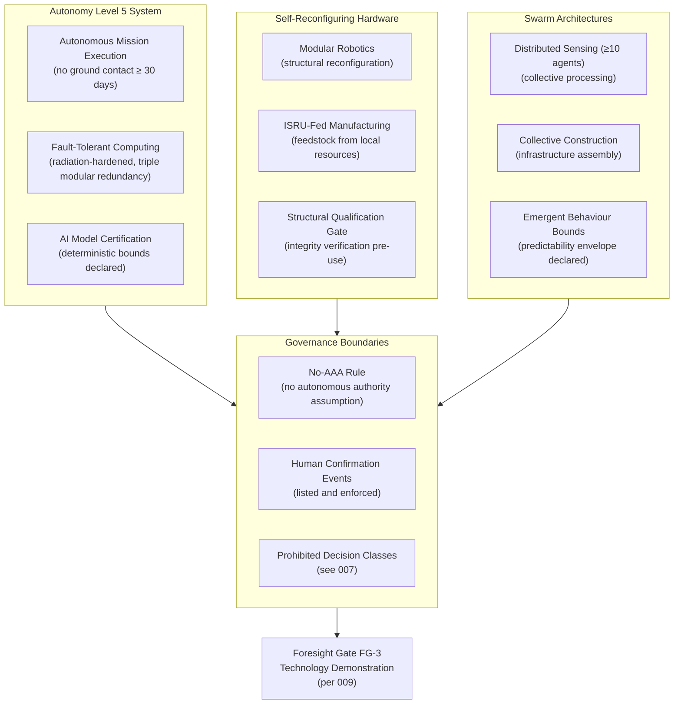

# STA 190-199 · 09.192.004 — Autonomous and Self-Reconfiguring Space Systems

## §1 Purpose

This document defines the Q+ATLANTIDE framework for post-2040 autonomous and self-reconfiguring space systems, establishing technical and governance boundaries for Autonomy Level 5 (AL-5) systems, self-reconfiguring hardware architectures, swarm configurations, and on-orbit manufacturing capabilities.[^baseline] The framework specifies physics basis requirements, computation prerequisites, fault-tolerance obligations, and the governance conditions that must be satisfied before any autonomous space system is admitted as an architecture candidate.[^gov]

The no-AAA rule is strictly enforced in this subsubject: no Autonomous Authority Assumption may be embedded in any post-2040 system architecture without explicit governance gate clearance. Human oversight retention requirements are normative, not advisory.[^qdiv]

## §2 Scope

**In scope:**

- Autonomy Level 5 (AL-5) definition: fully autonomous mission execution without real-time or stored-command ground contact for durations ≥ 30 days; inclusion criteria, boundary conditions, and mandatory fault-tolerance obligations
- Self-reconfiguring hardware: modular robotics for structural reconfiguration, in-situ manufacturing using feedstock from in-situ resource utilisation (ISRU), and module replacement/addition without ground authorisation constraints
- Swarm architectures: distributed sensing constellations of ≥ 10 co-operating agents, collective construction and infrastructure assembly, emergent behaviour bounds and predictability requirements
- On-orbit 3D printing and additive manufacturing using metallic and polymer feedstock, structural integrity verification, and manufacturing qualification gates
- Computation requirements: minimum fault-tolerant processor specifications for AL-5, radiation hardening requirements in deep-space environments, and AI model certification obligations
- Governance boundaries: mandatory events requiring deferred or real-time human confirmation, accountability attribution in the event of autonomous decision failure, and prohibited autonomous decision classes

**Out of scope:** ground-based autonomous systems; conventional satellite autonomy below AL-3 (covered under operational STA subsections); software engineering specifics for AI training pipelines.

## §3 Diagram

## §4 Footprint

| Attribute | Value |
|-----------|-------|
| Architecture | Space Technology Architecture (STA) |
| Master range | 100–199 |
| Code range | 190-199 |
| Section | 09 — Sistemas Avanzados, Conceptos y Futuro Espacial |
| Subsection | 192 — Conceptos Post-2040 |
| Subsubject | 004 — Autonomous and Self-Reconfiguring Space Systems |
| Primary Q-Division | Q-HORIZON[^qdiv] |
| Support Q-Divisions | Q-SPACE, Q-DATAGOV, Q-HPC, Q-GREENTECH, Q-STRUCTURES, Q-INDUSTRY |
| ORB support | ORB-PMO, ORB-LEG |
| Governance class | baseline[^gov] |
| Folder path | `Q+ATLANTIDE/100-199_STA/190-199_Sistemas-Avanzados-Conceptos-y-Futuro-Espacial/192_Conceptos-Post-2040/` |
| Document | `004_Autonomous-and-Self-Reconfiguring-Space-Systems.md` |
| Parent subsection | [README.md](../README.md) · [000_Overview.md](./000_Overview.md) |
| Parent architecture | [../../README.md](../../README.md) |
| Parent baseline | [organization/Q+ATLANTIDE.md](../../../../organization/Q+ATLANTIDE.md) |

## §5 References & Citations

[^baseline]: Q+ATLANTIDE controlled baseline (v1.0.0).[^n001]
[^archtable]: §3 Architecture Table (parent) — see [../../README.md](../../README.md).
[^qdiv]: Q-Division authority — Q-HORIZON is the primary division authority for STA 192 autonomous system governance.
[^gov]: Governance class — baseline. Changes require formal ORB-PMO change request and ORB-LEG review.
[^iso16290]: ISO 16290:2013 — *Space systems — Definition of the Technology Readiness Levels (TRLs) and their criteria of assessment* (ISO, 2013).
[^ecss70]: ECSS-E-ST-70C — *Space engineering: Ground systems and operations* (ESA, 2008).
[^ecss40]: ECSS-E-ST-40C — *Space engineering: Software* (ESA, 2009).
[^nasa7009]: NASA-STD-7009A — *Standard for Models and Simulations* (NASA, 2016).
[^n001]: Note N-001: Q+ATLANTIDE is a taxonomy and traceability ecosystem, not a mission or programme.

### Applicable industry standards

- ISO 16290:2013 — Space systems: Definition of the Technology Readiness Levels (TRLs) and their criteria of assessment[^iso16290]
- ECSS-E-ST-70C — Space engineering: Ground systems and operations (ESA, 2008)[^ecss70]
- ECSS-E-ST-40C — Space engineering: Software (ESA, 2009)[^ecss40]
- NASA-STD-7009A — Standard for Models and Simulations (NASA, 2016)[^nasa7009]
- ISO/IEC/IEEE 42010:2011 — Systems and software engineering: Architecture description
- IEEE Std 2089-2021 — Standard for Age-Appropriate Digital Services Framework
- ECSS-Q-ST-80C — Space product assurance: Software product assurance (ESA, 2014)
