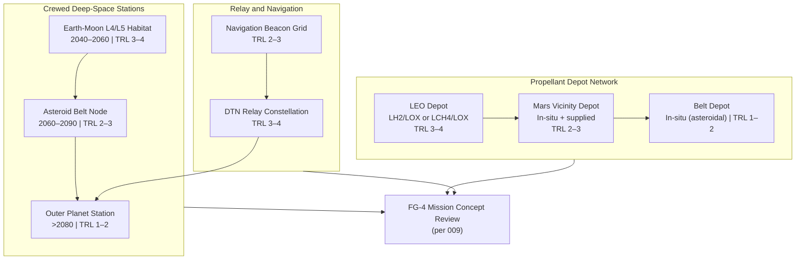

# STA 190-199 · 09.192.005 — Deep-Space Infrastructure and Distributed Architectures

## §1 Purpose

This document defines the Q+ATLANTIDE framework for post-2040 deep-space infrastructure concepts and distributed architectural patterns.[^baseline] It covers permanently crewed deep-space stations at gravitationally significant locations (Earth-Moon L4/L5, asteroid belt nodes, outer planet vicinities), distributed infrastructure networks (propellant depot chains, relay constellations, navigation beacons), infrastructure interdependency trees, resilience requirements, and the concept-maturity gates required before any infrastructure concept transitions from foresight register to architecture candidate.[^gov]

All infrastructure concepts listed are subject to the claim-discipline rules of subsubject 001 and the foresight gate requirements of subsubject 009. No infrastructure concept is admitted as an architecture candidate without an established technology dependency chain, a verified physics basis, and a safety case covering long-duration human habitation or autonomous operation as applicable.[^qdiv]

## §2 Scope

**In scope:**

- Permanently crewed deep-space stations: Earth-Moon L4/L5 habitats (projected 2040–2060), main-belt asteroid belt nodes (projected 2060–2090), outer planet orbital facilities (projected >2080); per station: crew capacity, mission duration, resupply cadence, power source, TRL classification
- Distributed propellant depot networks: staging architecture from low Earth orbit to outer solar system, depot spacing, propellant types (LH2/LOX, LCH4/LOX, in-situ produced), depot autonomous replenishment concepts
- Relay constellation infrastructure: deep-space relay nodes for communications beyond Mars, interplanetary network topology, delay-tolerant networking (DTN) protocol requirements, relay node autonomy
- Navigation beacon infrastructure: deep-space pulsar-based and artificial beacon navigation, accuracy requirements for trans-Martian missions, beacon constellation geometry
- Infrastructure interdependency trees: first-order and second-order dependencies between infrastructure classes, single-point-of-failure identification, resilience metrics
- Concept-maturity gates for infrastructure admission: minimum TRL, dependency chain completeness, safety case scope

**Out of scope:** cislunar infrastructure at current TRL ≥ 5; launch vehicle design; Earth-based ground station networks; near-Earth object monitoring.

## §3 Diagram

## §4 Footprint

| Attribute | Value |
|-----------|-------|
| Architecture | Space Technology Architecture (STA) |
| Master range | 100–199 |
| Code range | 190-199 |
| Section | 09 — Sistemas Avanzados, Conceptos y Futuro Espacial |
| Subsection | 192 — Conceptos Post-2040 |
| Subsubject | 005 — Deep-Space Infrastructure and Distributed Architectures |
| Primary Q-Division | Q-HORIZON[^qdiv] |
| Support Q-Divisions | Q-SPACE, Q-DATAGOV, Q-HPC, Q-GREENTECH, Q-STRUCTURES, Q-INDUSTRY |
| ORB support | ORB-PMO, ORB-LEG |
| Governance class | baseline[^gov] |
| Folder path | `Q+ATLANTIDE/100-199_STA/190-199_Sistemas-Avanzados-Conceptos-y-Futuro-Espacial/192_Conceptos-Post-2040/` |
| Document | `005_Deep-Space-Infrastructure-and-Distributed-Architectures.md` |
| Parent subsection | [README.md](../README.md) · [000_Overview.md](./000_Overview.md) |
| Parent architecture | [../../README.md](../../README.md) |
| Parent baseline | [organization/Q+ATLANTIDE.md](../../../../organization/Q+ATLANTIDE.md) |

## §5 References & Citations

[^baseline]: Q+ATLANTIDE controlled baseline (v1.0.0).[^n001]
[^archtable]: §3 Architecture Table (parent) — see [../../README.md](../../README.md).
[^qdiv]: Q-Division authority — Q-HORIZON is the primary division authority for STA 192 deep-space infrastructure.
[^gov]: Governance class — baseline. Changes require formal ORB-PMO change request and ORB-LEG review.
[^iso16290]: ISO 16290:2013 — *Space systems — Definition of the Technology Readiness Levels (TRLs) and their criteria of assessment* (ISO, 2013).
[^nasa6105]: NASA/SP-2016-6105 — *NASA Systems Engineering Handbook* (NASA, 2016).
[^ccsds730]: CCSDS 730.1-G — *Interoperable CCSDS File Delivery Protocol (CFDP) over DTN* (CCSDS, 2010).
[^copuos]: UN COPUOS Long-Term Sustainability of Outer Space Activities — Guidelines (UN, 2019).
[^n001]: Note N-001: Q+ATLANTIDE is a taxonomy and traceability ecosystem, not a mission or programme.

### Applicable industry standards

- ISO 16290:2013 — Space systems: Definition of the Technology Readiness Levels (TRLs) and their criteria of assessment[^iso16290]
- NASA/SP-2016-6105 — NASA Systems Engineering Handbook (NASA, 2016)[^nasa6105]
- CCSDS 730.1-G — Interoperable CFDP over DTN (CCSDS, 2010)[^ccsds730]
- UN COPUOS Long-Term Sustainability of Outer Space Activities — Guidelines (UN, 2019)[^copuos]
- ECSS-E-ST-10C — Space engineering: System engineering general requirements (ESA, 2009)
- NASA-STD-3001 Vol. 1 — Space Flight Human-System Standard (NASA, 2014)
- NASA-STD-3001 Vol. 2 — Space Flight Human-System Standard: Human Factors, Habitability, and Environmental Health (NASA, 2011)
