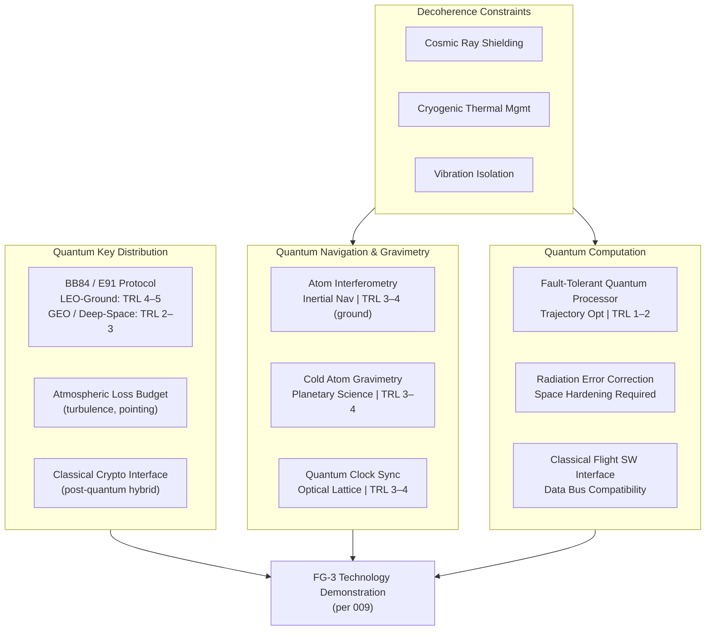

# STA 190-199 · 09.192.006 — Quantum Sensing, Communication and Computation Interfaces

## §1 Purpose

This document defines the Q+ATLANTIDE framework for post-2040 quantum technology interfaces applicable to space systems, covering quantum key distribution (QKD) via satellite, quantum-enhanced navigation and gravimetry, and quantum computation for on-board trajectory optimisation and fault-tolerant processing.[^baseline] For each technology, the document specifies the physics basis, the entanglement distribution constraints, the decoherence challenges introduced by the space environment, the interface requirements to classical space systems, the TRL classification, and the admission criteria into space architecture.[^gov]

All claims regarding quantum technologies must conform to the claim-discipline rules of subsubject 001. In particular, no claim of instantaneous communication, superluminal signalling, or quantum teleportation of matter is admissible under any foresight framing within Q+ATLANTIDE. Such claims contradict established quantum mechanics and are classified as inadmissible regardless of technological horizon.[^qdiv]

## §2 Scope

**In scope:**

- Quantum Key Distribution (QKD) via satellite: BB84 and E91 protocol classes, satellite-to-ground and inter-satellite QKD, photon transmission loss budget in space environment, atmospheric turbulence effects, TRL 4–5 for LEO-ground demonstrations, TRL 2–3 for GEO and deep-space applications; interface to classical encryption infrastructure
- Quantum-enhanced navigation and gravimetry: atom interferometry-based inertial navigation, cold atom gravimetry for planetary science, quantum clock synchronisation (optical lattice clocks), TRL 3–4 for ground demonstrations, TRL 2 for space qualification; comparison to classical GPS-denied navigation
- Quantum computation for space: fault-tolerant quantum processors for trajectory optimisation and system-of-systems simulation, error correction requirements in space radiation environment, required qubit counts and gate fidelities, interface to classical flight software architectures; TRL 1–2 for space-qualified quantum processors
- Decoherence in space environment: cosmic ray interference with qubit states, thermal management requirements, vibration isolation for atom traps, magnetic shielding requirements
- Interface requirements to classical space systems: data bus compatibility, latency requirements for quantum sensor data integration, classical post-processing pipeline specifications

**Out of scope:** classical cryptography systems; RF-based navigation systems below quantum-enhancement threshold; terrestrial quantum computing infrastructure; quantum gravity theories not reducible to testable predictions.

## §3 Diagram

## §4 Footprint

| Attribute | Value |
|-----------|-------|
| Architecture | Space Technology Architecture (STA) |
| Master range | 100–199 |
| Code range | 190-199 |
| Section | 09 — Sistemas Avanzados, Conceptos y Futuro Espacial |
| Subsection | 192 — Conceptos Post-2040 |
| Subsubject | 006 — Quantum Sensing, Communication and Computation Interfaces |
| Primary Q-Division | Q-HORIZON[^qdiv] |
| Support Q-Divisions | Q-SPACE, Q-DATAGOV, Q-HPC, Q-GREENTECH, Q-STRUCTURES, Q-INDUSTRY |
| ORB support | ORB-PMO, ORB-LEG |
| Governance class | baseline[^gov] |
| Folder path | `Q+ATLANTIDE/100-199_STA/190-199_Sistemas-Avanzados-Conceptos-y-Futuro-Espacial/192_Conceptos-Post-2040/` |
| Document | `006_Quantum-Sensing-Communication-and-Computation-Interfaces.md` |
| Parent subsection | [README.md](../README.md) · [000_Overview.md](./000_Overview.md) |
| Parent architecture | [../../README.md](../../README.md) |
| Parent baseline | [organization/Q+ATLANTIDE.md](../../../../organization/Q+ATLANTIDE.md) |

## §5 References & Citations

[^baseline]: Q+ATLANTIDE controlled baseline (v1.0.0).[^n001]
[^archtable]: §3 Architecture Table (parent) — see [../../README.md](../../README.md).
[^qdiv]: Q-Division authority — Q-HORIZON is the primary division authority for STA 192 quantum technology interfaces.
[^gov]: Governance class — baseline. Changes require formal ORB-PMO change request and ORB-LEG review.
[^iso16290]: ISO 16290:2013 — *Space systems — Definition of the Technology Readiness Levels (TRLs) and their criteria of assessment* (ISO, 2013).
[^etsi002]: ETSI GS QKD 002 — *Quantum Key Distribution; Use Cases* (ETSI, 2010).
[^etsi014]: ETSI GS QKD 014 — *Quantum Key Distribution; Protocol and data format of REST-based key delivery API* (ETSI, 2019).
[^mici2017]: Liao, S.-K. et al. — *Satellite-based entanglement distribution over 1200 kilometers* (Science, 2017).
[^nist800207]: NIST SP 800-207 — *Zero Trust Architecture* (NIST, 2020).
[^n001]: Note N-001: Q+ATLANTIDE is a taxonomy and traceability ecosystem, not a mission or programme.

### Applicable industry standards

- ISO 16290:2013 — Space systems: Definition of the Technology Readiness Levels (TRLs) and their criteria of assessment[^iso16290]
- ETSI GS QKD 002 — Quantum Key Distribution; Use Cases (ETSI, 2010)[^etsi002]
- ETSI GS QKD 014 — Quantum Key Distribution; REST-based key delivery API (ETSI, 2019)[^etsi014]
- NIST SP 800-207 — Zero Trust Architecture (NIST, 2020)[^nist800207]
- ECSS-E-ST-50C — Space engineering: Communications (ESA, 2008)
- ITU-R recommendations on space radiocommunications
- ESA/ESTEC CDF Study on Quantum Communications in Space (ESA, 2020)
