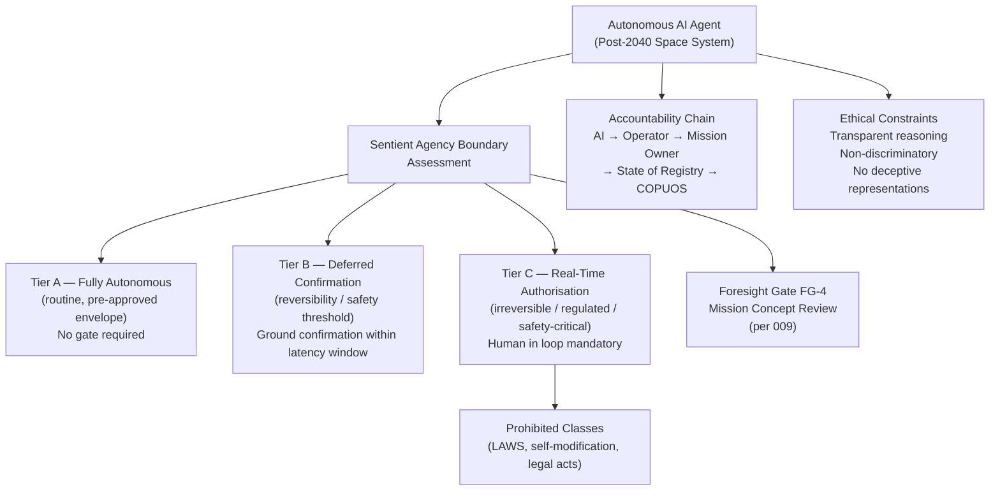

# STA 190-199 · 09.192.007 — Sentient Agency and Human-Machine Governance Boundaries

## §1 Purpose

This document establishes the Q+ATLANTIDE governance framework for highly autonomous AI agents in space operations, defining the concept of "sentient agency" as applied to post-2040 space systems, establishing the decision-authority matrix, the accountability chain for autonomous mission decisions, ethical constraints, the international regulatory context, and the classes of autonomous authority that are permanently prohibited under Q+ATLANTIDE governance.[^baseline]

The no-AAA rule (no Autonomous Authority Assumption) is foundational to this subsubject. No AI agent, regardless of capability level, may be admitted to Q+ATLANTIDE architecture status if it claims autonomous authority over life-safety decisions, weapons activation, self-modification without human authorisation, or irreversible planetary-scale interventions.[^gov] The framework is technology-neutral: it applies to rule-based automation, statistical machine learning systems, neural network architectures, and any future cognitive architecture deployed aboard post-2040 space systems.[^qdiv]

## §2 Scope

**In scope:**

- Definition of "sentient agency boundary": the Q+ATLANTIDE threshold at which an autonomous agent's decision-making complexity requires formal governance gate clearance — operationally defined as any system capable of modifying its own mission objectives, generating novel mission plans not derived from pre-approved templates, or making decisions with consequences that exceed predefined reversibility thresholds
- Decision-authority matrix: three-tier classification of decisions — (A) fully autonomous authorised (routine operations within pre-approved envelopes), (B) deferred human confirmation required (decisions approaching reversibility or safety thresholds), (C) real-time human authorisation mandatory (irreversible, safety-critical, or internationally regulated decisions)
- Accountability chain: formal attribution of decision responsibility for autonomous mission decisions; liability chain from AI system to operator, mission owner, state of registry, and international regulatory body
- Ethical constraints: prohibition of discriminatory algorithmic decision-making in resource allocation; transparent reasoning requirement (human-interpretable decision logs); prohibition of deceptive representations by autonomous agents to human operators
- International regulatory context: COPUOS guidelines on AI in space, ITU regulation of autonomous radio systems, Liability Convention (1972) applicability to autonomous system failures, proposed Treaty on AI in Space (foresight context)
- Prohibited autonomy classes: lethal autonomous weapons systems (LAWS) in space — absolute prohibition; autonomous self-modification of mission-critical AI without human authorisation; autonomous negotiation of legal instruments; autonomous override of ground safety commands

**Out of scope:** ground-based AI governance (covered by other governance instruments); AI development methodology; algorithmic fairness in commercial services; cybersecurity of AI systems (addressed separately).

## §3 Diagram

## §4 Footprint

| Attribute | Value |
|-----------|-------|
| Architecture | Space Technology Architecture (STA) |
| Master range | 100–199 |
| Code range | 190-199 |
| Section | 09 — Sistemas Avanzados, Conceptos y Futuro Espacial |
| Subsection | 192 — Conceptos Post-2040 |
| Subsubject | 007 — Sentient Agency and Human-Machine Governance Boundaries |
| Primary Q-Division | Q-HORIZON[^qdiv] |
| Support Q-Divisions | Q-SPACE, Q-DATAGOV, Q-HPC, Q-GREENTECH, Q-STRUCTURES, Q-INDUSTRY |
| ORB support | ORB-PMO, ORB-LEG |
| Governance class | baseline[^gov] |
| Folder path | `Q+ATLANTIDE/100-199_STA/190-199_Sistemas-Avanzados-Conceptos-y-Futuro-Espacial/192_Conceptos-Post-2040/` |
| Document | `007_Sentient-Agency-and-Human-Machine-Governance-Boundaries.md` |
| Parent subsection | [README.md](../README.md) · [000_Overview.md](./000_Overview.md) |
| Parent architecture | [../../README.md](../../README.md) |
| Parent baseline | [organization/Q+ATLANTIDE.md](../../../../organization/Q+ATLANTIDE.md) |

## §5 References & Citations

[^baseline]: Q+ATLANTIDE controlled baseline (v1.0.0).[^n001]
[^archtable]: §3 Architecture Table (parent) — see [../../README.md](../../README.md).
[^qdiv]: Q-Division authority — Q-HORIZON is the primary division authority for STA 192 AI governance in space.
[^gov]: Governance class — baseline. Changes require formal ORB-PMO change request and ORB-LEG review.
[^copuos]: UN COPUOS Long-Term Sustainability of Outer Space Activities — Guidelines (UN, 2019).
[^liab]: Convention on International Liability for Damage Caused by Space Objects (Liability Convention, UN, 1972).
[^itu]: ITU Radio Regulations (latest edition) — provisions on autonomous radio systems.
[^euai]: EU Artificial Intelligence Act (Regulation (EU) 2024/1689, European Parliament, 2024).
[^icrc]: ICRC — *Autonomous Weapon Systems and the Limits of Analogy* (ICRC, 2016).
[^n001]: Note N-001: Q+ATLANTIDE is a taxonomy and traceability ecosystem, not a mission or programme.

### Applicable industry standards

- UN COPUOS Long-Term Sustainability of Outer Space Activities — Guidelines (UN, 2019)[^copuos]
- Convention on International Liability for Damage Caused by Space Objects (UN, 1972)[^liab]
- ITU Radio Regulations — autonomous radio systems provisions[^itu]
- EU Artificial Intelligence Act (Regulation (EU) 2024/1689)[^euai]
- ISO/IEC 42001:2023 — Artificial Intelligence Management System
- IEEE Std 7000-2021 — Model Process for Addressing Ethical Concerns during System Design
- ICRC — Autonomous Weapon Systems and the Limits of Analogy (2016)[^icrc]
