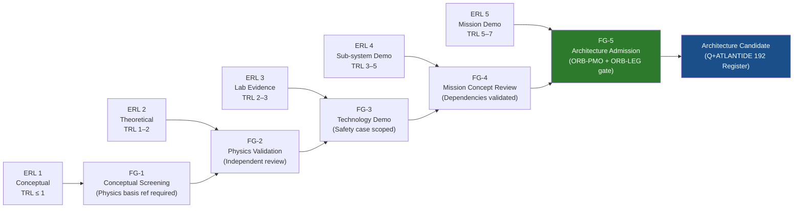

# STA 190-199 · 09.192.009 — Evidence Readiness, Claim Discipline and Foresight Gates

## §1 Purpose

This document establishes the Evidence Readiness Level (ERL) scale, claim discipline rules, foresight gate taxonomy, anti-hype language filter rules, and applicable standards linkage for the Q+ATLANTIDE Post-2040 Concepts subsection.[^baseline] The ERL scale and foresight gate sequence are the primary instruments by which speculative concepts advance from initial proposal to architecture candidacy under controlled, auditable governance.[^gov]

This subsubject occupies the slot that in other Q+ATLANTIDE subsections is used for standards mapping. In `192`, standards mapping is subsumed into the claim discipline framework itself — each claim discipline rule references the applicable standard that defines its evidentiary basis. This design ensures that standards compliance and claim validation are inseparable in the post-2040 foresight context.[^qdiv]

## §2 Scope

**In scope:**

- Evidence Readiness Level (ERL) scale 1–5:
  - ERL 1 — Conceptual: claim exists in literature or expert opinion; no experimental basis; TRL ≤ 1
  - ERL 2 — Theoretical basis: physics derivation or mathematical model published in peer-reviewed venue; no laboratory demonstration; TRL 1–2
  - ERL 3 — Laboratory evidence: controlled laboratory demonstration of core physical principle; reproducibility criteria met in at least two independent facilities; TRL 2–3
  - ERL 4 — Sub-system demonstration: sub-system or prototype demonstrated in relevant environment (vacuum, radiation, thermal); TRL 3–5
  - ERL 5 — Mission-relevant demonstration: full-system demonstration in space-like or space environment; TRL 5–7; sufficient for architecture candidacy gate (FG-5)
- Claim discipline rules — mandatory fields for each admitted claim:
  - Physics basis citation (peer-reviewed or equivalent): standard, journal, conference, or technical report reference
  - TRL assessment: ISO 16290 or ECSS-E-HB-11A method, assessor, and date
  - ERL classification: per scale above, with justification
  - Uncertainty range: quantified (e.g., specific impulse ± N%, mass ± N%, power ± N%)
  - Reproducibility criteria: dataset or experimental protocol reference; independent replication record
  - Foresight gate of origin: which gate generated this claim entry
- Foresight gate taxonomy:
  - FG-1 Conceptual Screening: concept proposed, ERL 1–2 sufficient, physics basis reference required, anti-hype filter applied, concept registered in 192 Claim Log
  - FG-2 Physics Validation: independent physics review, ERL 2–3 required, uncertainty range quantified, reproducibility criteria defined
  - FG-3 Technology Demonstration: laboratory or sub-system demonstration, ERL 3–4 required, TRL ≥ 3, safety case scoped
  - FG-4 Mission Concept Review: mission context defined, ERL 4–5 required, TRL ≥ 4, dependency chain validated, sustainability and planetary protection assessments completed (subsubject 008)
  - FG-5 Architecture Admission: full evidence package reviewed, ERL 5 required, TRL ≥ 5, independent review board sign-off, ORB-PMO and ORB-LEG gate clearance, no-AAA rule compliance confirmed
- Anti-hype language filter rules:
  - Forbidden terms without quantified evidence and ERL ≥ 3: "revolutionary", "game-changing", "breakthrough", "limitless", "infinite", "instantaneous", "zero-cost", "effortless"
  - Forbidden absolute performance claims without uncertainty range and reproducibility citation
  - Forbidden future tense assertions presented as established fact ("will achieve", "eliminates" without conditional framing)
  - Mandatory replacement constructions: speculative language framed as "concept projects", "modelling suggests", "if physics basis confirmed", "subject to FG-X gate clearance"

**Out of scope:** technology readiness assessment for currently operational (TRL ≥ 5) systems; programme management reporting; commercial investment prospectus content.

## §3 Diagram

## §4 Footprint

| Attribute | Value |
|-----------|-------|
| Architecture | Space Technology Architecture (STA) |
| Master range | 100–199 |
| Code range | 190-199 |
| Section | 09 — Sistemas Avanzados, Conceptos y Futuro Espacial |
| Subsection | 192 — Conceptos Post-2040 |
| Subsubject | 009 — Evidence Readiness, Claim Discipline and Foresight Gates |
| Primary Q-Division | Q-HORIZON[^qdiv] |
| Support Q-Divisions | Q-SPACE, Q-DATAGOV, Q-HPC, Q-GREENTECH, Q-STRUCTURES, Q-INDUSTRY |
| ORB support | ORB-PMO, ORB-LEG |
| Governance class | baseline[^gov] |
| Folder path | `Q+ATLANTIDE/100-199_STA/190-199_Sistemas-Avanzados-Conceptos-y-Futuro-Espacial/192_Conceptos-Post-2040/` |
| Document | `009_Evidence-Readiness-Claim-Discipline-and-Foresight-Gates.md` |
| Parent subsection | [README.md](../README.md) · [000_Overview.md](./000_Overview.md) |
| Parent architecture | [../../README.md](../../README.md) |
| Parent baseline | [organization/Q+ATLANTIDE.md](../../../../organization/Q+ATLANTIDE.md) |

## §5 References & Citations

[^baseline]: Q+ATLANTIDE controlled baseline (v1.0.0).[^n001]
[^archtable]: §3 Architecture Table (parent) — see [../../README.md](../../README.md).
[^qdiv]: Q-Division authority — Q-HORIZON is the primary division authority for STA 192 evidence readiness and claim discipline.
[^gov]: Governance class — baseline. Changes require formal ORB-PMO change request and ORB-LEG review.
[^iso16290]: ISO 16290:2013 — *Space systems — Definition of the Technology Readiness Levels (TRLs) and their criteria of assessment* (ISO, 2013).
[^ecss11a]: ECSS-E-HB-11A — *Space engineering: Technology Readiness Level (TRL) guidelines* (ESA, 2017).
[^nasa6105]: NASA/SP-2016-6105 — *NASA Systems Engineering Handbook* (NASA, 2016).
[^nasatr]: NASA/TM-2012-217519 — *Technology Readiness Level Definitions* (NASA, 2012).
[^n001]: Note N-001: Q+ATLANTIDE is a taxonomy and traceability ecosystem, not a mission or programme.

### Applicable industry standards

- ISO 16290:2013 — Space systems: Definition of the Technology Readiness Levels (TRLs) and their criteria of assessment[^iso16290]
- ECSS-E-HB-11A — Space engineering: Technology Readiness Level (TRL) guidelines (ESA, 2017)[^ecss11a]
- NASA/SP-2016-6105 — NASA Systems Engineering Handbook (NASA, 2016)[^nasa6105]
- NASA/TM-2012-217519 — Technology Readiness Level Definitions (NASA, 2012)[^nasatr]
- ECSS-M-ST-10C Rev.1 — Space project management: Project planning and implementation (ESA, 2009)
- IEEE Std 1012-2016 — Standard for System, Software, and Hardware Verification and Validation
