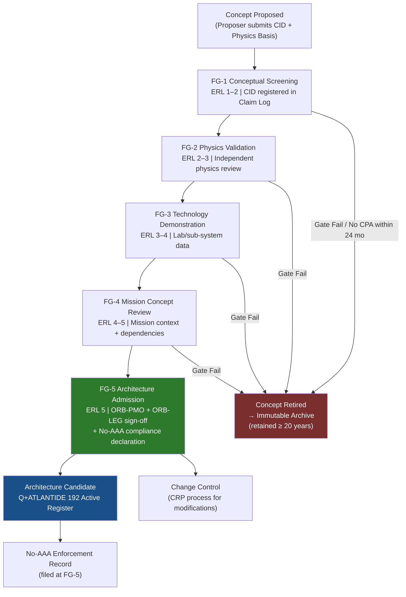

# STA 190-199 · 09.192.010 — Traceability, Evidence and Lifecycle Governance

## §1 Purpose

This document defines the lifecycle governance process for post-2040 concepts within the Q+ATLANTIDE STA 192 register, covering concept registration, foresight review gates, evidence package requirements per gate, concept retirement criteria, archive and audit trail obligations, change control interface, and no-AAA rule enforcement record-keeping.[^baseline]

Lifecycle governance ensures that every post-2040 concept admitted to the 192 register has a traceable, auditable history from initial proposal through each foresight gate to either architecture admission (FG-5) or formal retirement. The lifecycle record constitutes the evidentiary basis for any Q+ATLANTIDE claim that a given concept has been subject to rigorous independent review.[^gov] No concept may be cited as a "validated Q+ATLANTIDE architecture candidate" without a complete lifecycle record accessible in the register.[^qdiv]

## §2 Scope

**In scope:**

- Concept registration: mandatory fields for the Q+ATLANTIDE 192 Claim Log entry at FG-1 Conceptual Screening — concept identifier (CID), title, proposer, date, physics basis citation(s), ERL classification, TRL assessment, uncertainty range, reproducibility criteria statement, and initial civilisational risk tier (from subsubject 008)
- Foresight review gate records: for each gate FG-1 through FG-5, the lifecycle record must capture — gate date, review panel composition, evidence package version, gate outcome (pass / conditional pass / fail), conditions attached, and ORB-PMO/ORB-LEG approval reference (for FG-5)
- Evidence package requirements per gate:
  - FG-1: physics basis reference, ERL 1–2 justification, anti-hype compliance statement
  - FG-2: independent physics review report, ERL 2–3 justification, uncertainty quantification, reproducibility criteria
  - FG-3: laboratory or sub-system demonstration data, ERL 3–4 justification, safety case scope document, TRL ≥ 3 assessment
  - FG-4: mission concept document, dependency chain map, sustainability/planetary protection assessment (subsubject 008 reference), ERL 4–5 justification, TRL ≥ 4 assessment
  - FG-5: full evidence package (all prior gates), independent review board report, ORB-PMO gate clearance, ORB-LEG legal admissibility clearance, no-AAA rule compliance confirmation, ERL 5 justification, TRL ≥ 5 assessment
- Concept retirement criteria: a concept is retired from active register to archive when — (a) evidence package fails at any gate and no corrective action plan is submitted within 24 months; (b) TRL assessment is downgraded below ERL 2 following peer review contradiction; (c) concept is subsumed by an admitted architecture candidate; or (d) responsible Q-Division files a formal retirement notice with ORB-PMO
- Archive and audit trail: retired concepts are preserved in the immutable Q+ATLANTIDE 192 concept archive; all gate records, evidence packages, review reports, and retirement notices are retained for a minimum of 20 years post-retirement; access is unrestricted for audit purposes
- Interface with Q+ATLANTIDE change control: modifications to admitted architecture candidates must be processed through the standard Q+ATLANTIDE change request process (CRP); changes to foresight-stage concepts require a gate-revalidation assessment specifying which gates are affected
- No-AAA rule enforcement records: for each admitted concept, a formal no-AAA compliance declaration is filed at FG-5 specifying (a) the list of decision types that are prohibited from autonomous authority, (b) the human confirmation events mandated, and (c) the audit trail for any no-AAA rule exception requests and their disposition

**Out of scope:** change control for currently operational systems; technology development project management; programme-level configuration management plans; intellectual property records.

## §3 Diagram

## §4 Footprint

| Attribute | Value |
|-----------|-------|
| Architecture | Space Technology Architecture (STA) |
| Master range | 100–199 |
| Code range | 190-199 |
| Section | 09 — Sistemas Avanzados, Conceptos y Futuro Espacial |
| Subsection | 192 — Conceptos Post-2040 |
| Subsubject | 010 — Traceability, Evidence and Lifecycle Governance |
| Primary Q-Division | Q-HORIZON[^qdiv] |
| Support Q-Divisions | Q-SPACE, Q-DATAGOV, Q-HPC, Q-GREENTECH, Q-STRUCTURES, Q-INDUSTRY |
| ORB support | ORB-PMO, ORB-LEG |
| Governance class | baseline[^gov] |
| Folder path | `Q+ATLANTIDE/100-199_STA/190-199_Sistemas-Avanzados-Conceptos-y-Futuro-Espacial/192_Conceptos-Post-2040/` |
| Document | `010_Traceability-Evidence-and-Lifecycle-Governance.md` |
| Parent subsection | [README.md](../README.md) · [000_Overview.md](./000_Overview.md) |
| Parent architecture | [../../README.md](../../README.md) |
| Parent baseline | [organization/Q+ATLANTIDE.md](../../../../organization/Q+ATLANTIDE.md) |

## §5 References & Citations

[^baseline]: Q+ATLANTIDE controlled baseline (v1.0.0).[^n001]
[^archtable]: §3 Architecture Table (parent) — see [../../README.md](../../README.md).
[^qdiv]: Q-Division authority — Q-HORIZON is the primary division authority for STA 192 lifecycle governance.
[^gov]: Governance class — baseline. Changes require formal ORB-PMO change request and ORB-LEG review.
[^iso16290]: ISO 16290:2013 — *Space systems — Definition of the Technology Readiness Levels (TRLs) and their criteria of assessment* (ISO, 2013).
[^ecss11a]: ECSS-E-HB-11A — *Space engineering: Technology Readiness Level (TRL) guidelines* (ESA, 2017).
[^ecss10]: ECSS-M-ST-10C Rev.1 — *Space project management: Project planning and implementation* (ESA, 2009).
[^ecssq80]: ECSS-Q-ST-80C — *Space product assurance: Software product assurance* (ESA, 2014).
[^nasa6105]: NASA/SP-2016-6105 — *NASA Systems Engineering Handbook* (NASA, 2016).
[^n001]: Note N-001: Q+ATLANTIDE is a taxonomy and traceability ecosystem, not a mission or programme.

### Applicable industry standards

- ISO 16290:2013 — Space systems: Definition of the Technology Readiness Levels (TRLs) and their criteria of assessment[^iso16290]
- ECSS-E-HB-11A — Space engineering: Technology Readiness Level (TRL) guidelines (ESA, 2017)[^ecss11a]
- ECSS-M-ST-10C Rev.1 — Space project management: Project planning and implementation (ESA, 2009)[^ecss10]
- ECSS-Q-ST-80C — Space product assurance: Software product assurance (ESA, 2014)[^ecssq80]
- NASA/SP-2016-6105 — NASA Systems Engineering Handbook (NASA, 2016)[^nasa6105]
- ISO/IEC/IEEE 15288:2023 — Systems and software engineering: System lifecycle processes
- IEEE Std 1012-2016 — Standard for System, Software, and Hardware Verification and Validation
