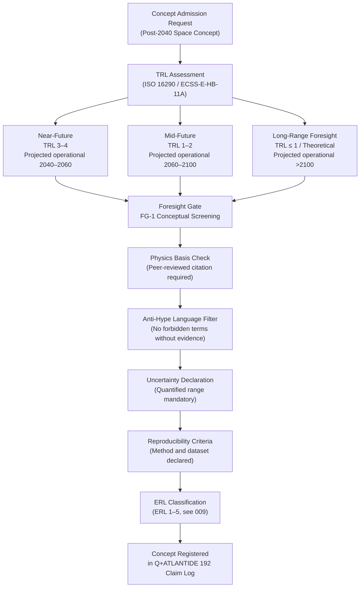

# STA 190-199 · 192-010 — Post 2040 Concepts Controlled Definition

## §1 Purpose

This document establishes the controlled Q+ATLANTIDE definition of a **Post-2040 Space Concept** as used across all STA `190-199` Section 09 Subsection 192 artefacts.[^baseline] The definition is binding for any Q+ATLANTIDE document that proposes, evaluates, references, or rejects a space technology concept projected to reach operational readiness after the calendar year 2040.[^gov]

The controlled definition enforces: (a) a taxonomy of temporal readiness classes; (b) mandatory TRL-basis declaration at the time of architectural admission; (c) anti-hype language rules; (d) reproducibility criteria; and (e) uncertainty declaration methodology. All downstream subsubject files in `192` must apply these rules. Violation of the definition rules constitutes an inadmissible claim under Q+ATLANTIDE governance.[^qdiv]

## §2 Scope

**In scope:**

- Controlled definition of "Post-2040 Space Concept" and the conditions under which a concept qualifies for admission to the Q+ATLANTIDE STA 192 register
- Temporal taxonomy: near-future (projected operational 2040–2060, TRL 3–4 at time of admission), mid-future (projected operational 2060–2100, TRL 1–2 at admission), long-range foresight (projected operational >2100 or TRL ≤ 1 / theoretical basis only)
- Mandatory declaration fields for each admitted concept: physics basis reference (peer-reviewed or equivalent), TRL assessment date and method, uncertainty range, reproducibility criteria, and originating foresight gate
- Anti-hype language filter rules applicable to all 192 documents
- Forbidden admission language list and enforcement procedure
- Cross-reference to the Evidence Readiness Level (ERL) scale defined in `009`

**Out of scope:** concepts with projected operational readiness before 2040; technology maturation plans for TRL 5–9 systems (covered under other STA subsections); programme management plans for funded missions.

## §3 Diagram

## §4 Footprint

| Attribute | Value |
|-----------|-------|
| Architecture | Space Technology Architecture (STA) |
| Master range | 100–199 |
| Code range | 190-199 |
| Section | 09 — Sistemas Avanzados, Conceptos y Futuro Espacial |
| Subsection | 192 — Conceptos Post-2040 |
| Subsubject | 001 — Post-2040 Concepts Controlled Definition |
| Primary Q-Division | Q-HORIZON[^qdiv] |
| Support Q-Divisions | Q-SPACE, Q-DATAGOV, Q-HPC, Q-GREENTECH, Q-STRUCTURES, Q-INDUSTRY |
| ORB support | ORB-PMO, ORB-LEG |
| Governance class | baseline[^gov] |
| Folder path | `Q+ATLANTIDE/100-199_STA/190-199_Sistemas-Avanzados-Conceptos-y-Futuro-Espacial/192_Conceptos-Post-2040/` |
| Document | `192-010-Post-2040-Concepts-Controlled-Definition.md` |
| Parent subsection | [README.md](../README.md) · [`192-000-General.md`](./192-000-General.md) |
| Parent architecture | [../../README.md](../../README.md) |
| Parent baseline | [organization/Q+ATLANTIDE.md](../../../../organization/Q+ATLANTIDE.md) |

## §5 References & Citations

[^baseline]: Q+ATLANTIDE controlled baseline (v1.0.0).[^n001]
[^archtable]: §3 Architecture Table (parent) — see [../../README.md](../../README.md).
[^qdiv]: Q-Division authority — Q-HORIZON is the primary division authority for STA 192 post-2040 concept definitions.
[^gov]: Governance class — baseline. Changes to controlled definitions require formal ORB-PMO change request and ORB-LEG review.
[^iso16290]: ISO 16290:2013 — *Space systems — Definition of the Technology Readiness Levels (TRLs) and their criteria of assessment* (ISO, 2013).
[^ecss11a]: ECSS-E-HB-11A — *Space engineering: Technology Readiness Level (TRL) guidelines* (ESA, 2017).
[^nasa6105]: NASA/SP-2016-6105 — *NASA Systems Engineering Handbook* (NASA, 2016).
[^nasatr]: NASA/TM-2012-217519 — *Technology Readiness Level Definitions* (NASA, 2012).
[^n001]: Note N-001: Q+ATLANTIDE is a taxonomy and traceability ecosystem, not a mission or programme.

### Applicable industry standards

- ISO 16290:2013 — Space systems: Definition of the Technology Readiness Levels (TRLs) and their criteria of assessment[^iso16290]
- ECSS-E-HB-11A — Space engineering: Technology Readiness Level (TRL) guidelines (ESA, 2017)[^ecss11a]
- NASA/SP-2016-6105 — NASA Systems Engineering Handbook (NASA, 2016)[^nasa6105]
- NASA/TM-2012-217519 — Technology Readiness Level Definitions (NASA, 2012)[^nasatr]
- ECSS-M-ST-10C Rev.1 — Space project management: Project planning and implementation (ESA, 2009)
