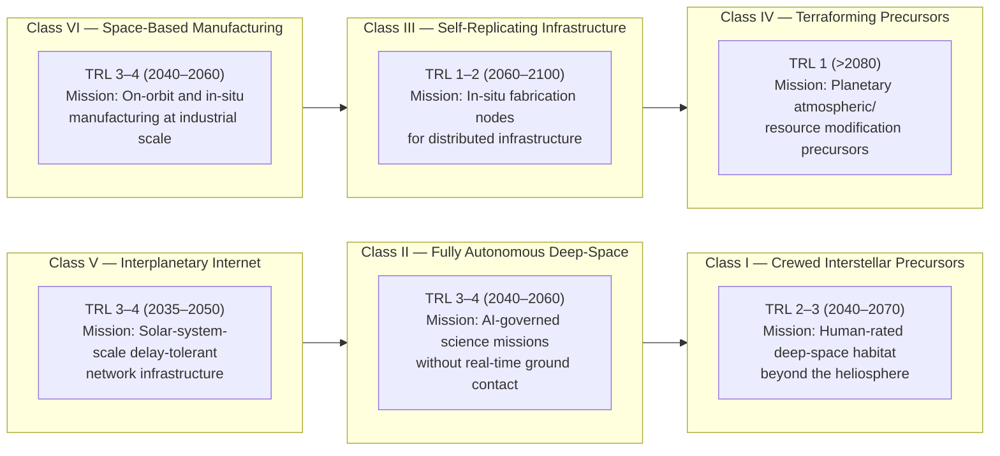

# STA 190-199 · 192-020 — Future Space System Classes and Mission Roles

## §1 Purpose

This document establishes the Q+ATLANTIDE classification of post-2040 space system types and their associated mission roles.[^baseline] Each class is defined with a projected operational window, a Technology Readiness Level (TRL) classification at time of conceptual admission, a canonical mission role definition, a dependency chain identifying prerequisite technologies, and explicit exclusions and boundary conditions.[^gov]

The classification is taxonomic, not a programme endorsement. No class listed herein implies funded development, operational commitment, or physics validation beyond the cited references. All class entries are subject to the claim-discipline rules of subsubject 001 and the foresight gates of subsubject 009.[^qdiv]

## §2 Scope

**In scope:**

- Six canonical post-2040 space system classes: crewed interstellar precursors, fully autonomous deep-space systems, self-replicating infrastructure nodes, planetary terraforming precursors, interplanetary internet infrastructure, and space-based manufacturing systems
- Per-class attributes: projected operational window, TRL readiness classification, mission role definition, technology dependency chain, exclusion conditions, and boundary conditions
- Cross-class dependency mapping and interdependency constraints
- Admission criteria for each class under Q+ATLANTIDE baseline governance

**Out of scope:** currently operational or near-term (pre-2040) space systems; mission design engineering for specific programmes; technology development roadmaps; funding or procurement instruments.

## §3 Diagram

## §4 Footprint

| Attribute | Value |
|-----------|-------|
| Architecture | Space Technology Architecture (STA) |
| Master range | 100–199 |
| Code range | 190-199 |
| Section | 09 — Sistemas Avanzados, Conceptos y Futuro Espacial |
| Subsection | 192 — Conceptos Post-2040 |
| Subsubject | 002 — Future Space System Classes and Mission Roles |
| Primary Q-Division | Q-HORIZON[^qdiv] |
| Support Q-Divisions | Q-SPACE, Q-DATAGOV, Q-HPC, Q-GREENTECH, Q-STRUCTURES, Q-INDUSTRY |
| ORB support | ORB-PMO, ORB-LEG |
| Governance class | baseline[^gov] |
| Folder path | `Q+ATLANTIDE/100-199_STA/190-199_Sistemas-Avanzados-Conceptos-y-Futuro-Espacial/192_Conceptos-Post-2040/` |
| Document | `192-020-Future-Space-System-Classes-and-Mission-Roles.md` |
| Parent subsection | [README.md](../README.md) · [`192-000-General.md`](./192-000-General.md) |
| Parent architecture | [../../README.md](../../README.md) |
| Parent baseline | [organization/Q+ATLANTIDE.md](../../../../organization/Q+ATLANTIDE.md) |

## §5 References & Citations

[^baseline]: Q+ATLANTIDE controlled baseline (v1.0.0).[^n001]
[^archtable]: §3 Architecture Table (parent) — see [../../README.md](../../README.md).
[^qdiv]: Q-Division authority — Q-HORIZON is the primary division authority for STA 192 future space system classification.
[^gov]: Governance class — baseline. Changes require formal ORB-PMO change request and ORB-LEG review.
[^iso16290]: ISO 16290:2013 — *Space systems — Definition of the Technology Readiness Levels (TRLs) and their criteria of assessment* (ISO, 2013).
[^nasa6105]: NASA/SP-2016-6105 — *NASA Systems Engineering Handbook* (NASA, 2016).
[^cospar]: COSPAR Planetary Protection Policy (COSPAR, 2020, as amended).
[^itu]: ITU-R S series — Space applications and meteorology (ITU, various editions).
[^n001]: Note N-001: Q+ATLANTIDE is a taxonomy and traceability ecosystem, not a mission or programme.

### Applicable industry standards

- ISO 16290:2013 — Space systems: Definition of the Technology Readiness Levels (TRLs) and their criteria of assessment[^iso16290]
- NASA/SP-2016-6105 — NASA Systems Engineering Handbook (NASA, 2016)[^nasa6105]
- COSPAR Planetary Protection Policy (COSPAR, 2020)[^cospar]
- ECSS-E-ST-10C — Space engineering: System engineering general requirements (ESA, 2009)
- ITU-R Space applications and meteorology standards[^itu]
- IAA — Study on Space Traffic Management (IAA, 2018)
