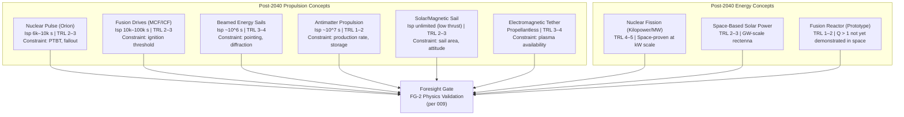

# STA 190-199 · 192-030 — Post 2040 Propulsion and Energy Concepts

## §1 Purpose

This document catalogues speculative propulsion and energy concepts projected for post-2040 operational use, each with a declared physics basis, specific impulse range, power requirement, Technology Readiness Level (TRL) classification, feasibility constraints, and a defined pathway to 2040+ readiness.[^baseline] Admission criteria are specified for each concept class.

All concepts herein are subject to the claim-discipline rules of subsubject 001. No propulsion concept is admitted as an architecture candidate without an explicit peer-reviewed physics basis. Extraordinary performance claims (e.g., specific impulse >10^6 s) require extraordinary evidence in accordance with reproducibility criteria.[^gov] The safety boundary mandates that nuclear, antimatter, and beamed-energy concepts require mission-specific safety cases, legal admissibility assessments under international space law, and independent review before any operational consideration.[^qdiv]

## §2 Scope

**In scope:**

- Nuclear pulse propulsion (Orion-class): physics basis in nuclear pulse detonation, specific impulse 6,000–10,000 s, power requirement >GW-class, TRL 2–3, feasibility constraints including Partial Test Ban Treaty compliance
- Fusion drives (Magnetic Confinement Fusion / MCF and Inertial Confinement Fusion / ICF): specific impulse 10,000–100,000 s, power requirement in MW-GW range, TRL 2–3, plasma confinement and ignition threshold constraints
- Beamed energy propulsion (laser and microwave sails): specific impulse up to ~10^6 s (photon sail), power requirement at transmitter in GW range, TRL 3–4 for near-term demonstrations, diffraction limit and pointing constraints
- Antimatter propulsion (proton-antiproton annihilation): specific impulse up to ~10^7 s, power requirement for antimatter production in PJ/mg range, TRL 1–2, production rate and storage constraints
- Solar wind / magnetic sails: specific impulse effectively unlimited for photon pressure but low thrust, TRL 2–3 for solar sails
- Electromagnetic tethers for orbital energy exchange: specific impulse not applicable (propellantless), TRL 3–4, requires conductive tether and ambient plasma
- Power generation concepts: space-based nuclear fission reactors (kilopower class to MW class), space-based solar power (SBSP) beaming, and fusion reactor prototypes

**Out of scope:** chemical propulsion systems; electric propulsion at current TRL ≥ 5 (covered under STA operational subsections); propellant logistics for near-Earth missions; launch vehicle propulsion.

## §3 Diagram

## §4 Footprint

| Attribute | Value |
|-----------|-------|
| Architecture | Space Technology Architecture (STA) |
| Master range | 100–199 |
| Code range | 190-199 |
| Section | 09 — Sistemas Avanzados, Conceptos y Futuro Espacial |
| Subsection | 192 — Conceptos Post-2040 |
| Subsubject | 003 — Post-2040 Propulsion and Energy Concepts |
| Primary Q-Division | Q-HORIZON[^qdiv] |
| Support Q-Divisions | Q-SPACE, Q-DATAGOV, Q-HPC, Q-GREENTECH, Q-STRUCTURES, Q-INDUSTRY |
| ORB support | ORB-PMO, ORB-LEG |
| Governance class | baseline[^gov] |
| Folder path | `Q+ATLANTIDE/100-199_STA/190-199_Sistemas-Avanzados-Conceptos-y-Futuro-Espacial/192_Conceptos-Post-2040/` |
| Document | `192-030-Post-2040-Propulsion-and-Energy-Concepts.md` |
| Parent subsection | [README.md](../README.md) · [`192-000-General.md`](./192-000-General.md) |
| Parent architecture | [../../README.md](../../README.md) |
| Parent baseline | [organization/Q+ATLANTIDE.md](../../../../organization/Q+ATLANTIDE.md) |

## §5 References & Citations

[^baseline]: Q+ATLANTIDE controlled baseline (v1.0.0).[^n001]
[^archtable]: §3 Architecture Table (parent) — see [../../README.md](../../README.md).
[^qdiv]: Q-Division authority — Q-HORIZON is the primary division authority for STA 192 propulsion and energy concepts.
[^gov]: Governance class — baseline. Changes require formal ORB-PMO change request and ORB-LEG review.
[^iso16290]: ISO 16290:2013 — *Space systems — Definition of the Technology Readiness Levels (TRLs) and their criteria of assessment* (ISO, 2013).
[^nasa6105]: NASA/SP-2016-6105 — *NASA Systems Engineering Handbook* (NASA, 2016).
[^dyson]: Dyson, F.J. — *Interstellar Transport* (Physics Today, 1968) — nuclear pulse propulsion physics basis.
[^benford]: Benford, J., Benford, G., Benford, D. — *Sail and Beamer Requirements for Laser-Pushed Lightsails* (Acta Astronautica, 2010).
[^frisbee]: Frisbee, R.H. — *How to Build an Antimatter Rocket for Interstellar Missions* (AIAA-2003-4676, AIAA, 2003).
[^ptbt]: Partial Test Ban Treaty (PTBT) — Treaty Banning Nuclear Weapon Tests in the Atmosphere, in Outer Space and Under Water (UN, 1963).
[^n001]: Note N-001: Q+ATLANTIDE is a taxonomy and traceability ecosystem, not a mission or programme.

### Applicable industry standards

- ISO 16290:2013 — Space systems: Definition of the Technology Readiness Levels (TRLs) and their criteria of assessment[^iso16290]
- NASA/SP-2016-6105 — NASA Systems Engineering Handbook (NASA, 2016)[^nasa6105]
- ECSS-E-HB-11A — Space engineering: Technology Readiness Level (TRL) guidelines (ESA, 2017)
- Partial Test Ban Treaty (PTBT) — relevant to nuclear pulse concepts[^ptbt]
- Outer Space Treaty (OST, UN, 1967) — Article IV prohibition on nuclear weapons in space
- NASA/TM-2012-217519 — Technology Readiness Level Definitions (NASA, 2012)
- AIAA-2003-4676 — Frisbee, R.H., How to Build an Antimatter Rocket (AIAA, 2003)[^frisbee]
