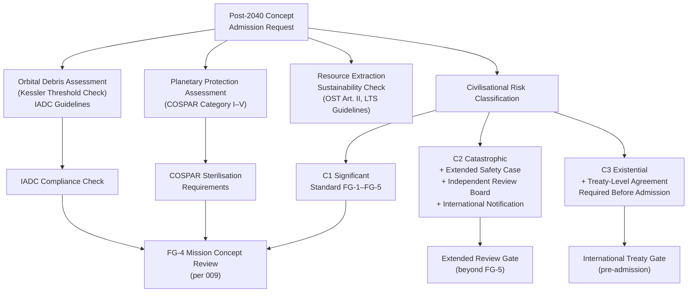

# STA 190-199 · 192-080 — Sustainability Planetary Protection and Civilisational Risk

## §1 Purpose

This document establishes the Q+ATLANTIDE sustainability, planetary protection, and civilisational-risk governance framework for post-2040 space concepts.[^baseline] It covers orbital debris cascade prevention with reference to the Kessler threshold, COSPAR planetary protection categories applicable to post-2040 mission classes, space resource extraction sustainability obligations, and a civilisational-risk classification scheme with mandatory risk-gate requirements for post-2040 concepts that may generate high-consequence outcomes.[^gov]

All post-2040 concepts assessed as posing civilisational-scale risk (existential, catastrophic, or significant tier) must clear additional risk-gate requirements beyond the standard foresight gate sequence defined in subsubject 009. No such concept may be admitted as an architecture candidate without a full independent safety case, formal international regulatory consultation, and evidence of COPUOS alignment.[^qdiv]

## §2 Scope

**In scope:**

- Orbital debris cascade prevention: Kessler syndrome threshold analysis, debris generation rate limits for post-2040 constellations, active debris removal (ADR) obligations, on-orbit servicing mission requirements, deorbit compliance at end-of-life (25-year rule and prospective post-2040 revisions), inter-agency debris mitigation guidelines (IADC) applicability
- Planetary protection categories (COSPAR Policy, 2020): Category I (flyby, no life contamination concern), II (flyby/orbiter, limited concern), III (flyby/orbiter, significant concern — e.g. Europa, Enceladus), IV (lander/probe), V (Earth-return) with post-2040 mission-specific interpretation; sterilisation requirements per category
- Space resource extraction sustainability: asteroid and lunar regolith extraction rate limits, in-situ propellant production constraints, obligation not to deplete shared-heritage bodies without international consent, interface with Outer Space Treaty Article II non-appropriation principle
- Civilisational-risk classification: three-tier taxonomy — (C1) Significant risk: mission failure consequences limited to mission assets; (C2) Catastrophic risk: consequences extend to shared orbital infrastructure, Earth systems, or celestial body ecosystems; (C3) Existential risk: irreversible harm to human civilisation or permanent loss of biological diversity including Earth life
- Risk-gate requirements per civilisational tier: C1 standard foresight gates (FG-1 through FG-5); C2 mandatory extended safety case, independent review board, international regulatory notification; C3 requires treaty-level international agreement before architecture admission
- UN COPUOS Long-Term Sustainability (LTS) Guidelines compliance mapping for post-2040 concepts

**Out of scope:** near-term debris mitigation for currently operational constellations; planetary science mission design; terrestrial environmental law; climate engineering not involving space-based interventions.

## §3 Diagram

## §4 Footprint

| Attribute | Value |
|-----------|-------|
| Architecture | Space Technology Architecture (STA) |
| Master range | 100–199 |
| Code range | 190-199 |
| Section | 09 — Sistemas Avanzados, Conceptos y Futuro Espacial |
| Subsection | 192 — Conceptos Post-2040 |
| Subsubject | 008 — Sustainability, Planetary Protection and Civilisational Risk |
| Primary Q-Division | Q-HORIZON[^qdiv] |
| Support Q-Divisions | Q-SPACE, Q-DATAGOV, Q-HPC, Q-GREENTECH, Q-STRUCTURES, Q-INDUSTRY |
| ORB support | ORB-PMO, ORB-LEG |
| Governance class | baseline[^gov] |
| Folder path | `Q+ATLANTIDE/100-199_STA/190-199_Sistemas-Avanzados-Conceptos-y-Futuro-Espacial/192_Conceptos-Post-2040/` |
| Document | `192-080-Sustainability-Planetary-Protection-and-Civilisational-Risk.md` |
| Parent subsection | [README.md](../README.md) · [`192-000-General.md`](./192-000-General.md) |
| Parent architecture | [../../README.md](../../README.md) |
| Parent baseline | [organization/Q+ATLANTIDE.md](../../../../organization/Q+ATLANTIDE.md) |

## §5 References & Citations

[^baseline]: Q+ATLANTIDE controlled baseline (v1.0.0).[^n001]
[^archtable]: §3 Architecture Table (parent) — see [../../README.md](../../README.md).
[^qdiv]: Q-Division authority — Q-HORIZON is the primary division authority for STA 192 sustainability and planetary protection.
[^gov]: Governance class — baseline. Changes require formal ORB-PMO change request and ORB-LEG review.
[^cospar]: COSPAR Planetary Protection Policy (COSPAR, 2020, as amended).
[^copuos]: UN COPUOS Long-Term Sustainability of Outer Space Activities — Guidelines (UN, 2019).
[^iadc]: Inter-Agency Space Debris Coordination Committee (IADC) — *Space Debris Mitigation Guidelines* (IADC, 2020).
[^ost]: Outer Space Treaty — *Treaty on Principles Governing the Activities of States in the Exploration and Use of Outer Space* (UN, 1967).
[^kessler]: Kessler, D.J., Cour-Palais, B.G. — *Collision Frequency of Artificial Satellites: The Creation of a Debris Belt* (Journal of Geophysical Research, 1978).
[^n001]: Note N-001: Q+ATLANTIDE is a taxonomy and traceability ecosystem, not a mission or programme.

### Applicable industry standards

- COSPAR Planetary Protection Policy (COSPAR, 2020, as amended)[^cospar]
- UN COPUOS Long-Term Sustainability of Outer Space Activities — Guidelines (UN, 2019)[^copuos]
- IADC Space Debris Mitigation Guidelines (IADC, 2020)[^iadc]
- Outer Space Treaty (OST, UN, 1967)[^ost]
- ISO 24113:2023 — Space systems: Space debris mitigation requirements
- ECSS-U-AS-10C — Space debris mitigation (ESA, 2015)
- NASA-STD-8719.14B — Process for Limiting Orbital Debris (NASA, 2019)
