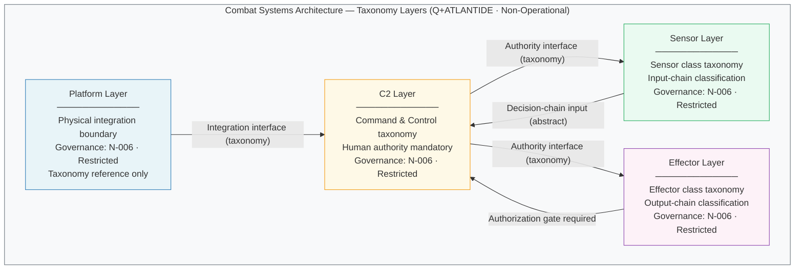

# DTTA 200-209 · 00.200.001 — Combat Systems Architecture Controlled Definition

---

> **⚠ NON-OPERATIONAL BOUNDARY NOTICE**
> This document is a **restricted taxonomy and governance definition** within the Q+ATLANTIDE ATLAS-1000 register.
> It does **not** define targeting logic, weapon construction, deployment methods, tactical employment, performance optimisation for harm, or operational combat procedures.
> All content is normative exclusively within the Q+ATLANTIDE taxonomy and traceability ecosystem.[^n001][^n006]
> The **No-AAA Rule** applies.[^n004]
> Documents in this band are classified `governance_class: restricted` per N-006.[^n006] Explicit human authority, rules-of-use governance, safety interlocks, legal admissibility, export-control review, independent assurance, and lifecycle traceability are **required**.

---

## §1 Purpose

This document establishes the **Q+ATLANTIDE controlled definition** of "Combat Systems Architecture" as the term is used across all DTTA 200-209 documents in the ATLAS-1000 register.[^baseline]

The controlled definition serves three functions:

1. **Disambiguation** — distinguishes the Q+ATLANTIDE taxonomy usage of "Combat Systems Architecture" from operational, programmatic, or weapons-specification usages found in other contexts.
2. **Normative vocabulary** — provides the authoritative taxonomy layer classification (Platform, C2, Sensor, Effector) that all child subsubjects (002–010) reference.
3. **Standards alignment** — aligns the Q+ATLANTIDE taxonomy with NATO AAP-06 terminology and applicable STANAG standards to ensure traceability across governance artefacts.

Within the Q+ATLANTIDE register, **"Combat Systems Architecture"** is defined as:

> *The taxonomy of functional layers, integration interfaces, authority structures, and governance boundaries that describe the abstract composition of a defence platform system for the purpose of classification, traceability, assurance, standards mapping, and export-control review — without specification of targeting logic, weapon construction, deployment methods, or operational combat procedures.*

This definition is **normative** within the Q+ATLANTIDE register only.[^n001] It does not constitute a design specification, operational doctrine, or authorisation for any system.

---

## §2 Scope

### In Scope

- Q+ATLANTIDE normative taxonomy definition of "Combat Systems Architecture"
- Classification of combat system architecture concepts: Platform Layer, C2 Layer, Sensor Layer, Effector Layer
- Disambiguation of the Q+ATLANTIDE definition from operational/weapon-construction usages
- Alignment with NATO AAP-06 and applicable STANAG terminology
- Governance boundary declarations between taxonomy layers

### Out of Scope

- Targeting logic or targeting architecture
- Weapon construction, materials, or performance specifications
- Deployment methods, operational procedures, or tactical employment
- Classified design specifications or programme-specific architectures
- Optimisation of any layer for lethality, range, or harm

---

## §3 Diagram

The following diagram represents the **taxonomy layer structure** of Combat Systems Architecture as defined in this document. All labels are Q+ATLANTIDE taxonomy identifiers — they do not represent any specific system, programme, or operational capability.

> **Diagram note:** This diagram is a governance taxonomy diagram. It does not represent any specific system architecture, programme, or operational design. All layer names are Q+ATLANTIDE taxonomy identifiers per this subsubject definition.

---

## §4 Footprint

| Attribute | Value |
|---|---|
| Architecture | Defence Technology Type Architecture (DTTA) |
| Master range | 200–299 |
| Code range | 200-209 |
| Section | 00 |
| Subsection | 200 |
| Subsubject | 001 |
| Primary Q-Division | Q-DATAGOV[^qdiv] |
| Support Q-Divisions | Q-SPACE, Q-HORIZON, Q-HPC, Q-STRUCTURES, Q-INDUSTRY |
| ORB support | ORB-LEG, ORB-PMO, ORB-FIN |
| Governance class | restricted[^gov] |
| Restricted rule | N-006[^n006] |
| Folder path | `Q+ATLANTIDE/200-299_DTTA/200-209_Sistemas-de-Combate-y-Armamento/200_Arquitectura-de-Sistemas-de-Combate/` |
| Document | `001_Combat-Systems-Architecture-Controlled-Definition.md` |
| Parent subsection | [README.md](./README.md) · [000_Overview.md](./000_Overview.md) |
| Parent section | [../README.md](../README.md) |
| Parent architecture | [../../README.md](../../README.md) |
| Parent baseline | [organization/Q+ATLANTIDE.md](../../../../organization/Q+ATLANTIDE.md) |

### Applicable Standards

| Standard | Issuing Body | Applicability |
|---|---|---|
| NATO AAP-06 | NATO | Glossary of Terms and Definitions — normative terminology alignment |
| STANAG 4586 | NATO | UAV Control System Interoperability — C2 and platform layer taxonomy reference |
| STANAG 4569 | NATO | Protection Levels for Armoured Vehicles — platform layer boundary reference |
| IEC 61508 | IEC | Functional Safety of E/E/PE Safety-related Systems — safety layer taxonomy alignment |

---

## §5 References & Citations

[^baseline]: Q+ATLANTIDE controlled baseline — authoritative taxonomy and traceability ecosystem governing all DTTA documents. See [organization/Q+ATLANTIDE.md](../../../../organization/Q+ATLANTIDE.md).
[^archtable]: §3 Architecture Table (parent) — see [../../README.md](../../README.md).
[^qdiv]: Q-Division authority — Q-DATAGOV is the primary authority for governance and data taxonomy within Q+ATLANTIDE DTTA band; Q-SPACE, Q-HORIZON, Q-HPC, Q-STRUCTURES, Q-INDUSTRY provide technical domain support.
[^gov]: Governance class `restricted` — documents in this class require formal evidence packages, export-control review, and access controls per N-006.
[^n001]: Note N-001: Q+ATLANTIDE is a taxonomy and traceability ecosystem, not an operational programme; definitions herein are normative within the Q+ATLANTIDE register only.
[^n004]: Note N-004 (No-AAA Rule) — "AAA" is not a valid domain, division, architecture, interface or function in this baseline.
[^n006]: Note N-006 (Restricted bands) — Defence-related (200-299 DTTA) bands require additional governance, evidence packages and access controls. See [organization/Q+ATLANTIDE.md](../../../../organization/Q+ATLANTIDE.md) §5.3.
