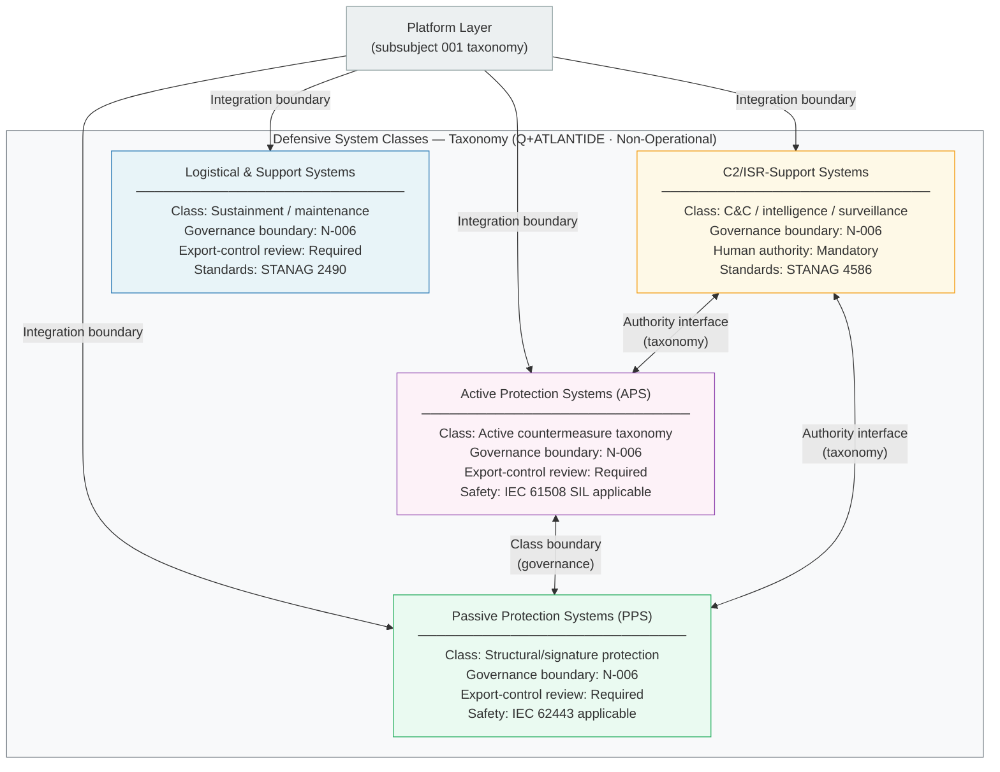

# DTTA 200-209 · 00.200.002 — Defensive System Classes and Boundaries

---

> **⚠ NON-OPERATIONAL BOUNDARY NOTICE**
> This document is a **restricted taxonomy and governance classification** within the Q+ATLANTIDE ATLAS-1000 register.
> It does **not** define weapon construction, deployment methods, tactical employment, performance optimisation for harm, offensive applications, or operational combat procedures.
> All content is normative exclusively within the Q+ATLANTIDE taxonomy and traceability ecosystem.[^n001][^n006]
> The **No-AAA Rule** applies.[^n004]
> Documents in this band are classified `governance_class: restricted` per N-006.[^n006] Explicit human authority, rules-of-use governance, safety interlocks, legal admissibility, export-control review, independent assurance, and lifecycle traceability are **required**.

---

## §1 Purpose

This document defines the **Q+ATLANTIDE taxonomy of defensive system classes** and their governance boundaries within the DTTA 200 subsection.[^baseline]

The taxonomy identifies four primary defensive system classes for classification and governance purposes:

1. **Active Protection Systems (APS)** — systems classified as providing kinetic or non-kinetic countermeasures against inbound threats, for taxonomy and governance classification only.
2. **Passive Protection Systems (PPS)** — systems classified as providing structural, material, or signature-reduction protection, for taxonomy classification only.
3. **C2/ISR-Support Systems** — systems classified as providing command, control, intelligence, surveillance, and reconnaissance support functions, for taxonomy classification only.
4. **Logistical and Support Systems** — systems classified as providing sustainment, maintenance, and logistical support, for taxonomy classification only.

All class definitions are **classification taxonomy only**. They do not constitute construction specifications, performance requirements, or operational employment guidance. The boundary between classes is a governance boundary, not a physical design boundary.

No content in this document addresses offensive applications, targeting, weapon construction, or performance optimisation. The classification taxonomy is designed to support export-control review, assurance scoping, and standards applicability mapping only.

---

## §2 Scope

### In Scope

- Classification taxonomy of defensive system classes (APS, PPS, C2/ISR-Support, Logistical/Support)
- Boundary definitions between classes for governance and export-control purposes
- Declarations of interface boundaries between defensive class taxonomy and other taxonomy layers defined in subsubject 001
- Mapping of defensive classes to applicable governance requirements (safety, assurance, export-control)
- Disambiguation of defensive vs. non-defensive categories within Q+ATLANTIDE taxonomy

### Out of Scope

- Construction details, materials specifications, or hardware design for any class
- Offensive applications, offensive-defensive hybrid systems performance parameters
- Lethality, range, or performance parameters of any system class
- Classified system specifications or programme-specific data
- Operational employment guidance or tactical procedures for any class

---

## §3 Diagram

> **Diagram note:** All class names and boundary labels are Q+ATLANTIDE governance taxonomy identifiers. This diagram does not represent any specific system, programme, or operational design.

---

## §4 Footprint

| Attribute | Value |
|---|---|
| Architecture | Defence Technology Type Architecture (DTTA) |
| Master range | 200–299 |
| Code range | 200-209 |
| Section | 00 |
| Subsection | 200 |
| Subsubject | 002 |
| Primary Q-Division | Q-DATAGOV[^qdiv] |
| Support Q-Divisions | Q-SPACE, Q-HORIZON, Q-HPC, Q-STRUCTURES, Q-INDUSTRY |
| ORB support | ORB-LEG, ORB-PMO, ORB-FIN |
| Governance class | restricted[^gov] |
| Restricted rule | N-006[^n006] |
| Folder path | `Q+ATLANTIDE/200-299_DTTA/200-209_Sistemas-de-Combate-y-Armamento/200_Arquitectura-de-Sistemas-de-Combate/` |
| Document | `002_Defensive-System-Classes-and-Boundaries.md` |
| Parent subsection | [README.md](./README.md) · [000_Overview.md](./000_Overview.md) |
| Parent section | [../README.md](../README.md) |
| Parent architecture | [../../README.md](../../README.md) |
| Parent baseline | [organization/Q+ATLANTIDE.md](../../../../organization/Q+ATLANTIDE.md) |

### Applicable Standards

| Standard | Issuing Body | Applicability |
|---|---|---|
| IEC 61508 | IEC | Functional Safety — SIL classification applicable to APS class taxonomy |
| IEC 62443 | IEC | Industrial Automation Security — applicable to PPS and C2/ISR class taxonomy |
| STANAG 4586 | NATO | UAV Control System Interoperability — C2/ISR-Support class taxonomy reference |
| STANAG 2490 | NATO | Defence Platform Integration — Logistical/Support class integration boundary reference |
| STANAG 4569 | NATO | Protection Levels for Armoured Vehicles — PPS class taxonomy reference |

---

## §5 References & Citations

[^baseline]: Q+ATLANTIDE controlled baseline — authoritative taxonomy and traceability ecosystem governing all DTTA documents. See [organization/Q+ATLANTIDE.md](../../../../organization/Q+ATLANTIDE.md).
[^archtable]: §3 Architecture Table (parent) — see [../../README.md](../../README.md).
[^qdiv]: Q-Division authority — Q-DATAGOV is the primary authority for governance and data taxonomy within Q+ATLANTIDE DTTA band; Q-SPACE, Q-HORIZON, Q-HPC, Q-STRUCTURES, Q-INDUSTRY provide technical domain support.
[^gov]: Governance class `restricted` — documents in this class require formal evidence packages, export-control review, and access controls per N-006.
[^n001]: Note N-001: Q+ATLANTIDE is a taxonomy and traceability ecosystem, not an operational programme; definitions herein are normative within the Q+ATLANTIDE register only.
[^n004]: Note N-004 (No-AAA Rule) — "AAA" is not a valid domain, division, architecture, interface or function in this baseline.
[^n006]: Note N-006 (Restricted bands) — Defence-related (200-299 DTTA) bands require additional governance, evidence packages and access controls. See [organization/Q+ATLANTIDE.md](../../../../organization/Q+ATLANTIDE.md) §5.3.
