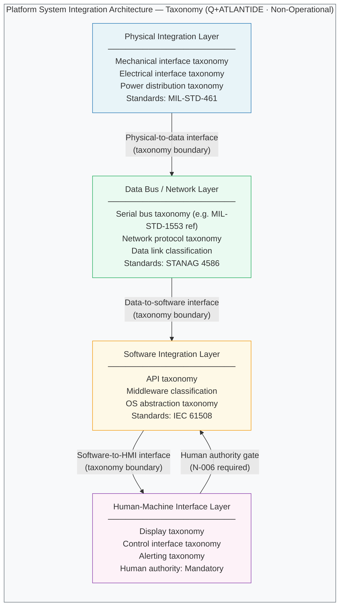

# DTTA 200-209 · 00.200.003 — Platform System Integration Architecture

---

> **⚠ NON-OPERATIONAL BOUNDARY NOTICE**
> This document is a **restricted taxonomy and governance classification** within the Q+ATLANTIDE ATLAS-1000 register.
> It does **not** define detailed hardware specifications, software source code, targeting interfaces, deployment methods, tactical employment, performance optimisation for harm, or operational combat procedures.
> All content is normative exclusively within the Q+ATLANTIDE taxonomy and traceability ecosystem.[^n001][^n006]
> The **No-AAA Rule** applies.[^n004]
> Documents in this band are classified `governance_class: restricted` per N-006.[^n006] Explicit human authority, rules-of-use governance, safety interlocks, legal admissibility, export-control review, independent assurance, and lifecycle traceability are **required**.

---

## §1 Purpose

This document defines the **integration architecture taxonomy** for combat system platforms within the DTTA 200 subsection.[^baseline]

The integration architecture taxonomy classifies the structural layers through which sub-systems are integrated into a coherent platform, for the purpose of governance, standards mapping, assurance scoping, and traceability. Four integration layers are defined:

1. **Physical Integration Layer** — taxonomy of physical interfaces (mechanical, electrical, power distribution) between platform sub-systems.
2. **Data Bus / Network Layer** — taxonomy of data communication interfaces (serial bus, network, protocol-layer) between platform sub-systems.
3. **Software Integration Layer** — taxonomy of software interface patterns (API, middleware, OS abstraction) for platform sub-system integration.
4. **Human-Machine Interface (HMI) Layer** — taxonomy of human-operator interface classifications (display, control, alerting) within integrated platforms.

All layer definitions are **integration taxonomy only**. They do not constitute hardware design specifications, software architecture documents, targeting interface designs, or operational employment guidance.

---

## §2 Scope

### In Scope

- Integration taxonomy: physical, data bus/network, software, and HMI layers
- Interface classification between integration layers
- Integration boundary declarations between platform sub-systems (taxonomy level)
- Mapping of integration layers to applicable governance requirements (safety, assurance, export-control)
- Reference to applicable standards (MIL-STD-1553, MIL-STD-461, STANAG 4586) for taxonomy alignment only

### Out of Scope

- Detailed hardware specifications or engineering drawings
- Software source code, firmware, or binary specifications
- Targeting interface designs or fire-control system integration details
- Classified integration specifications or programme-specific architectures
- Operational employment guidance or tactical integration procedures

---

## §3 Diagram

> **Diagram note:** Layer names and interface labels are Q+ATLANTIDE taxonomy identifiers. Standard references (e.g., MIL-STD-1553) appear as taxonomy alignment references only, not as design requirements.

---

## §4 Footprint

| Attribute | Value |
|---|---|
| Architecture | Defence Technology Type Architecture (DTTA) |
| Master range | 200–299 |
| Code range | 200-209 |
| Section | 00 |
| Subsection | 200 |
| Subsubject | 003 |
| Primary Q-Division | Q-DATAGOV[^qdiv] |
| Support Q-Divisions | Q-SPACE, Q-HORIZON, Q-HPC, Q-STRUCTURES, Q-INDUSTRY |
| ORB support | ORB-LEG, ORB-PMO, ORB-FIN |
| Governance class | restricted[^gov] |
| Restricted rule | N-006[^n006] |
| Folder path | `Q+ATLANTIDE/200-299_DTTA/200-209_Sistemas-de-Combate-y-Armamento/200_Arquitectura-de-Sistemas-de-Combate/` |
| Document | `003_Platform-System-Integration-Architecture.md` |
| Parent subsection | [README.md](./README.md) · [000_Overview.md](./000_Overview.md) |
| Parent section | [../README.md](../README.md) |
| Parent architecture | [../../README.md](../../README.md) |
| Parent baseline | [organization/Q+ATLANTIDE.md](../../../../organization/Q+ATLANTIDE.md) |

### Applicable Standards

| Standard | Issuing Body | Applicability |
|---|---|---|
| STANAG 4586 | NATO | UAV Control System Interoperability — data bus/network layer taxonomy reference |
| MIL-STD-1553 | US DoD | Digital Time Division Command/Response Multiplex Data Bus — data bus taxonomy alignment reference |
| MIL-STD-461 | US DoD | Requirements for the Control of Electromagnetic Interference — physical layer taxonomy reference |
| STANAG 2090 | NATO | Allocation of Frequencies — data bus/network layer standards alignment |
| IEC 61508 | IEC | Functional Safety of E/E/PE Safety-related Systems — software integration layer safety taxonomy |

---

## §5 References & Citations

[^baseline]: Q+ATLANTIDE controlled baseline — authoritative taxonomy and traceability ecosystem governing all DTTA documents. See [organization/Q+ATLANTIDE.md](../../../../organization/Q+ATLANTIDE.md).
[^archtable]: §3 Architecture Table (parent) — see [../../README.md](../../README.md).
[^qdiv]: Q-Division authority — Q-DATAGOV is the primary authority for governance and data taxonomy within Q+ATLANTIDE DTTA band; Q-SPACE, Q-HORIZON, Q-HPC, Q-STRUCTURES, Q-INDUSTRY provide technical domain support.
[^gov]: Governance class `restricted` — documents in this class require formal evidence packages, export-control review, and access controls per N-006.
[^n001]: Note N-001: Q+ATLANTIDE is a taxonomy and traceability ecosystem, not an operational programme; definitions herein are normative within the Q+ATLANTIDE register only.
[^n004]: Note N-004 (No-AAA Rule) — "AAA" is not a valid domain, division, architecture, interface or function in this baseline.
[^n006]: Note N-006 (Restricted bands) — Defence-related (200-299 DTTA) bands require additional governance, evidence packages and access controls. See [organization/Q+ATLANTIDE.md](../../../../organization/Q+ATLANTIDE.md) §5.3.
