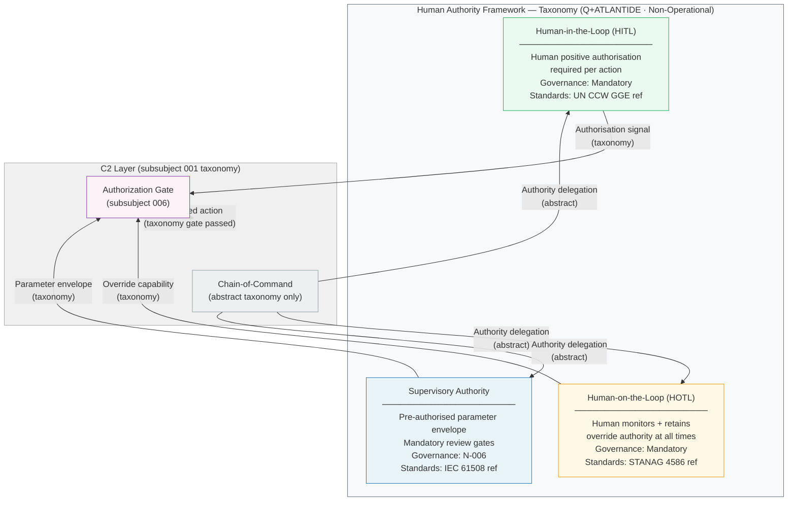

# DTTA 200-209 · 00.200.004 — Command, Control and Human Authority Interfaces

---

> **⚠ NON-OPERATIONAL BOUNDARY NOTICE**
> This document is a **restricted taxonomy and governance classification** within the Q+ATLANTIDE ATLAS-1000 register.
> It does **not** define operational command procedures, targeting authority, deployment orders, tactical employment, or operational combat procedures.
> All authority structures defined herein are **taxonomy abstractions** — they are not operational command chains.
> All content is normative exclusively within the Q+ATLANTIDE taxonomy and traceability ecosystem.[^n001][^n006]
> The **No-AAA Rule** applies.[^n004]
> Documents in this band are classified `governance_class: restricted` per N-006.[^n006] Explicit human authority, rules-of-use governance, safety interlocks, legal admissibility, export-control review, independent assurance, and lifecycle traceability are **required**.

---

## §1 Purpose

This document defines the **C2 interface taxonomy** and **human authority framework** for the DTTA 200 subsection within the Q+ATLANTIDE ATLAS-1000 register.[^baseline]

The taxonomy establishes mandatory human authority levels as an abstract governance structure — not as an operational command system. The Q+ATLANTIDE governance framework mandates that **all DTTA 200 artefacts must declare their human authority level** as a prerequisite for restricted-band classification, standards mapping, and evidence package submission.

Three human authority levels are defined for taxonomy purposes:

1. **Human-in-the-Loop (HITL)** — taxonomy classification for systems where a human must positively authorise each consequential action before it is taken. Represented abstractly; no system-specific criteria are defined here.
2. **Human-on-the-Loop (HOTL)** — taxonomy classification for systems where a human monitors ongoing operations and retains the authority and ability to intervene and override at any point.
3. **Supervisory Authority** — taxonomy classification for systems operating within pre-authorised parameters defined by a human supervisor, with mandatory review gates at defined intervals.

All authority levels are **taxonomy classifications only**. The specific technical implementation of human authority mechanisms is addressed in subsubject 006 (Safety Interlocks and Authorization Gates). Operational command procedures, chains of command, and targeting authority are explicitly outside scope.

The No-AAA Rule[^n004] and N-006[^n006] restrictions apply without exception.

---

## §2 Scope

### In Scope

- C2 taxonomy: command and control interface classification
- Human authority levels: HITL, HOTL, and Supervisory — abstract taxonomy definitions
- Authority interface classification between C2 Layer and Platform, Sensor, and Effector layers
- Chain-of-command taxonomy (abstract governance structure only)
- Authorization gate structure taxonomy (enabling conditions, human sign-off, legal review requirements)
- Alignment with UN CCW GGE on LAWS (Lethal Autonomous Weapons Systems) governance vocabulary

### Out of Scope

- Operational command procedures or standing orders
- Targeting authority, engagement authority, or rules of engagement
- Deployment orders or mission-specific command structures
- Classified command architectures or programme-specific C2 systems
- Technical implementation specifications for any authority mechanism

---

## §3 Diagram

> **Diagram note:** All authority levels and interface labels are Q+ATLANTIDE taxonomy identifiers. No operational command chain is depicted.

---

## §4 Footprint

| Attribute | Value |
|---|---|
| Architecture | Defence Technology Type Architecture (DTTA) |
| Master range | 200–299 |
| Code range | 200-209 |
| Section | 00 |
| Subsection | 200 |
| Subsubject | 004 |
| Primary Q-Division | Q-DATAGOV[^qdiv] |
| Support Q-Divisions | Q-SPACE, Q-HORIZON, Q-HPC, Q-STRUCTURES, Q-INDUSTRY |
| ORB support | ORB-LEG, ORB-PMO, ORB-FIN |
| Governance class | restricted[^gov] |
| Restricted rule | N-006[^n006] |
| Folder path | `Q+ATLANTIDE/200-299_DTTA/200-209_Sistemas-de-Combate-y-Armamento/200_Arquitectura-de-Sistemas-de-Combate/` |
| Document | `004_Command-Control-and-Human-Authority-Interfaces.md` |
| Parent subsection | [README.md](./README.md) · [000_Overview.md](./000_Overview.md) |
| Parent section | [../README.md](../README.md) |
| Parent architecture | [../../README.md](../../README.md) |
| Parent baseline | [organization/Q+ATLANTIDE.md](../../../../organization/Q+ATLANTIDE.md) |

### Applicable Standards

| Standard | Issuing Body | Applicability |
|---|---|---|
| NATO AJP-01 | NATO | Allied Joint Doctrine — C2 taxonomy alignment reference (non-operational, vocabulary only) |
| STANAG 4586 | NATO | UAV Control System Interoperability — HOTL/HITL interface taxonomy reference |
| IEC 61508 | IEC | Functional Safety — safety function authority level taxonomy reference |
| UN CCW GGE on LAWS | UN | Group of Governmental Experts on LAWS — human authority taxonomy vocabulary alignment |

---

## §5 References & Citations

[^baseline]: Q+ATLANTIDE controlled baseline — authoritative taxonomy and traceability ecosystem governing all DTTA documents. See [organization/Q+ATLANTIDE.md](../../../../organization/Q+ATLANTIDE.md).
[^archtable]: §3 Architecture Table (parent) — see [../../README.md](../../README.md).
[^qdiv]: Q-Division authority — Q-DATAGOV is the primary authority for governance and data taxonomy within Q+ATLANTIDE DTTA band; Q-SPACE, Q-HORIZON, Q-HPC, Q-STRUCTURES, Q-INDUSTRY provide technical domain support.
[^gov]: Governance class `restricted` — documents in this class require formal evidence packages, export-control review, and access controls per N-006.
[^n001]: Note N-001: Q+ATLANTIDE is a taxonomy and traceability ecosystem, not an operational programme; definitions herein are normative within the Q+ATLANTIDE register only.
[^n004]: Note N-004 (No-AAA Rule) — "AAA" is not a valid domain, division, architecture, interface or function in this baseline.
[^n006]: Note N-006 (Restricted bands) — Defence-related (200-299 DTTA) bands require additional governance, evidence packages and access controls. See [organization/Q+ATLANTIDE.md](../../../../organization/Q+ATLANTIDE.md) §5.3.
