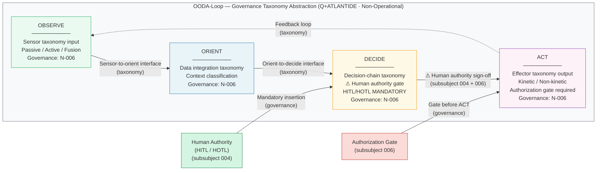

# DTTA 200-209 · 00.200.005 — Sensor, Effector and Decision-Chain Abstraction

---

> **⚠ NON-OPERATIONAL BOUNDARY NOTICE**
> This document is a **restricted taxonomy and governance abstraction** within the Q+ATLANTIDE ATLAS-1000 register.
> It does **not** define targeting algorithms, engagement optimisation, real-time decision logic, deployment methods, performance optimisation for harm, or operational combat procedures.
> The OODA-loop abstraction herein is a **governance taxonomy model only** — it is not an operational decision system.
> All content is normative exclusively within the Q+ATLANTIDE taxonomy and traceability ecosystem.[^n001][^n006]
> The **No-AAA Rule** applies.[^n004]
> Documents in this band are classified `governance_class: restricted` per N-006.[^n006] Explicit human authority, rules-of-use governance, safety interlocks, legal admissibility, export-control review, independent assurance, and lifecycle traceability are **required**.

---

## §1 Purpose

This document defines the **abstract taxonomy** of sensor-effector relationships and the **decision-chain abstraction model** for DTTA 200 systems within the Q+ATLANTIDE ATLAS-1000 register.[^baseline]

The purpose is purely for **taxonomy and governance** — to provide controlled vocabulary for describing the abstract relationships between sensing functions, decision functions, and effecting functions within a platform system, for the purposes of:

- Assurance scoping and evidence package structuring
- Standards mapping (subsubject 007)
- Safety interlock positioning (subsubject 006)
- Export-control classification review (subsubject 009)
- Human authority interface placement (subsubject 004)

The **decision-chain abstraction** adopts the OODA-loop framework (Observe, Orient, Decide, Act) as a **taxonomy-level governance model only**. The OODA framework is used here as a vocabulary reference for positioning governance requirements — it does not constitute an operational decision system, a targeting algorithm, or an engagement procedure.

This document explicitly does **not** provide:
- Targeting algorithms or engagement logic
- Optimisation criteria for harm, lethality, or effect
- Real-time decision logic specifications
- Operational procedures for sensor-effector employment

---

## §2 Scope

### In Scope

- Sensor taxonomy classes (passive sensing, active sensing, data-fusion input taxonomy)
- Effector taxonomy classes (kinetic effector taxonomy, non-kinetic effector taxonomy, information-output taxonomy)
- Decision-chain abstraction model (OODA-loop vocabulary at governance/taxonomy level only)
- Interface declarations between sensor, decision, and effector taxonomy layers
- Mandatory human authority insertion points within the decision-chain taxonomy

### Out of Scope

- Targeting algorithms or optimisation logic of any kind
- Engagement optimisation, lethality parameters, or harm-maximisation criteria
- Real-time or near-real-time decision system specifications
- Operational procedures for sensor employment or effector employment
- Classified sensor or effector specifications

---

## §3 Diagram

> **Diagram note:** This is a **governance taxonomy diagram**. The OODA-loop model is used as vocabulary reference for positioning human authority and safety interlock requirements. It does not represent any operational decision system or targeting architecture.

---

## §4 Footprint

| Attribute | Value |
|---|---|
| Architecture | Defence Technology Type Architecture (DTTA) |
| Master range | 200–299 |
| Code range | 200-209 |
| Section | 00 |
| Subsection | 200 |
| Subsubject | 005 |
| Primary Q-Division | Q-DATAGOV[^qdiv] |
| Support Q-Divisions | Q-SPACE, Q-HORIZON, Q-HPC, Q-STRUCTURES, Q-INDUSTRY |
| ORB support | ORB-LEG, ORB-PMO, ORB-FIN |
| Governance class | restricted[^gov] |
| Restricted rule | N-006[^n006] |
| Folder path | `Q+ATLANTIDE/200-299_DTTA/200-209_Sistemas-de-Combate-y-Armamento/200_Arquitectura-de-Sistemas-de-Combate/` |
| Document | `005_Sensor-Effector-and-Decision-Chain-Abstraction.md` |
| Parent subsection | [README.md](./README.md) · [000_Overview.md](./000_Overview.md) |
| Parent section | [../README.md](../README.md) |
| Parent architecture | [../../README.md](../../README.md) |
| Parent baseline | [organization/Q+ATLANTIDE.md](../../../../organization/Q+ATLANTIDE.md) |

### Applicable Standards

| Standard | Issuing Body | Applicability |
|---|---|---|
| STANAG 4586 | NATO | UAV Control System Interoperability — sensor/effector interface taxonomy reference |
| IEC 61508 | IEC | Functional Safety — safety function positioning within decision-chain taxonomy |
| IEEE SA-2857 | IEEE SA | Framework for Privacy of Internet of Things — sensor taxonomy governance alignment |
| NATO AAP-06 | NATO | Glossary of Terms and Definitions — sensor/effector vocabulary alignment |

---

## §5 References & Citations

[^baseline]: Q+ATLANTIDE controlled baseline — authoritative taxonomy and traceability ecosystem governing all DTTA documents. See [organization/Q+ATLANTIDE.md](../../../../organization/Q+ATLANTIDE.md).
[^archtable]: §3 Architecture Table (parent) — see [../../README.md](../../README.md).
[^qdiv]: Q-Division authority — Q-DATAGOV is the primary authority for governance and data taxonomy within Q+ATLANTIDE DTTA band; Q-SPACE, Q-HORIZON, Q-HPC, Q-STRUCTURES, Q-INDUSTRY provide technical domain support.
[^gov]: Governance class `restricted` — documents in this class require formal evidence packages, export-control review, and access controls per N-006.
[^n001]: Note N-001: Q+ATLANTIDE is a taxonomy and traceability ecosystem, not an operational programme; definitions herein are normative within the Q+ATLANTIDE register only.
[^n004]: Note N-004 (No-AAA Rule) — "AAA" is not a valid domain, division, architecture, interface or function in this baseline.
[^n006]: Note N-006 (Restricted bands) — Defence-related (200-299 DTTA) bands require additional governance, evidence packages and access controls. See [organization/Q+ATLANTIDE.md](../../../../organization/Q+ATLANTIDE.md) §5.3.
