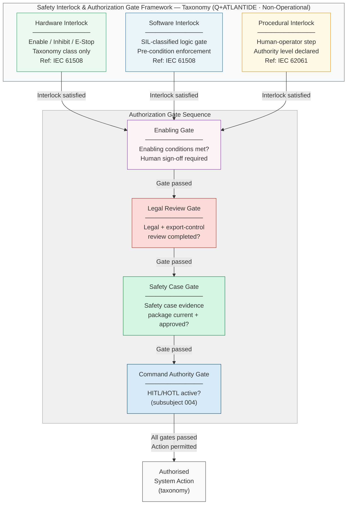

# DTTA 200-209 · 00.200.006 — Safety Interlocks, Rules-of-Use and Authorization Gates

---

> **⚠ NON-OPERATIONAL BOUNDARY NOTICE**
> This document is a **restricted taxonomy and governance framework** within the Q+ATLANTIDE ATLAS-1000 register.
> It does **not** define specific hardware interlock designs, classified authorization criteria, operational safety procedures, or operational combat procedures.
> All content is normative exclusively within the Q+ATLANTIDE taxonomy and traceability ecosystem.[^n001][^n006]
> The **No-AAA Rule** applies.[^n004]
> Documents in this band are classified `governance_class: restricted` per N-006.[^n006] Explicit human authority, rules-of-use governance, safety interlocks, legal admissibility, export-control review, independent assurance, and lifecycle traceability are **required**.

---

## §1 Purpose

This document defines the **taxonomy and governance framework** for safety interlocks, rules-of-use (ROU) declarations, and authorization gates for DTTA 200 systems within the Q+ATLANTIDE ATLAS-1000 register.[^baseline]

The framework establishes mandatory safety classes and authorization structures that all DTTA 200 subsubject artefacts must declare. Three primary taxonomy categories are defined:

**Safety Interlock Taxonomy**
- *Hardware interlocks* — physical mechanisms that prevent unauthorised or unsafe state transitions, classified by function (enable, inhibit, emergency-stop).
- *Software interlocks* — software logic gates that enforce pre-conditions before state transitions, classified by safety integrity level (SIL) per IEC 61508.
- *Procedural interlocks* — documented human-operator steps that must be completed before system state transitions, classified by authority level.

**Rules-of-Use (ROU) Classification Framework**
- *Enabling conditions* — conditions that must be satisfied before a system or function class may be activated; declared abstractly for taxonomy purposes.
- *Use restrictions* — conditions that constrain the operational envelope of a system or function class; declared for export-control and assurance scoping.
- *Override and emergency procedures* — human-authority override taxonomy for exceptional situations.

**Authorization Gate Structure**
- *Enabling gate* — confirms satisfaction of enabling conditions (human sign-off required).
- *Legal review gate* — confirms legal and export-control review has been completed.
- *Safety case gate* — confirms safety case evidence package is current and approved.
- *Command authority gate* — confirms appropriate human authority level (HITL/HOTL per subsubject 004) is active.

All categories are **taxonomy classifications only**. Specific hardware designs, software implementations, and operational authorization criteria are outside scope.

---

## §2 Scope

### In Scope

- Safety interlock taxonomy: hardware, software, and procedural classes
- Rules-of-use (ROU) classification framework: enabling conditions, use restrictions, override taxonomy
- Authorization gate structure: enabling gate, legal review gate, safety case gate, command authority gate
- SIL classification references per IEC 61508 for safety interlock taxonomy alignment
- Mandatory declaration requirements for all DTTA 200 artefacts

### Out of Scope

- Specific hardware interlock designs or engineering specifications
- Software source code or firmware for safety functions
- Classified authorization criteria or programme-specific enabling conditions
- Operational safety procedures or standing operating procedures
- Operational combat procedures or tactical employment guidance

---

## §3 Diagram

> **Diagram note:** This is a governance taxonomy diagram. No specific hardware, software, or operational criteria are depicted.

---

## §4 Footprint

| Attribute | Value |
|---|---|
| Architecture | Defence Technology Type Architecture (DTTA) |
| Master range | 200–299 |
| Code range | 200-209 |
| Section | 00 |
| Subsection | 200 |
| Subsubject | 006 |
| Primary Q-Division | Q-DATAGOV[^qdiv] |
| Support Q-Divisions | Q-SPACE, Q-HORIZON, Q-HPC, Q-STRUCTURES, Q-INDUSTRY |
| ORB support | ORB-LEG, ORB-PMO, ORB-FIN |
| Governance class | restricted[^gov] |
| Restricted rule | N-006[^n006] |
| Folder path | `Q+ATLANTIDE/200-299_DTTA/200-209_Sistemas-de-Combate-y-Armamento/200_Arquitectura-de-Sistemas-de-Combate/` |
| Document | `006_Safety-Interlocks-Rules-of-Use-and-Authorization-Gates.md` |
| Parent subsection | [README.md](./README.md) · [000_Overview.md](./000_Overview.md) |
| Parent section | [../README.md](../README.md) |
| Parent architecture | [../../README.md](../../README.md) |
| Parent baseline | [organization/Q+ATLANTIDE.md](../../../../organization/Q+ATLANTIDE.md) |

### Applicable Standards

| Standard | Issuing Body | Applicability |
|---|---|---|
| IEC 61508 | IEC | Functional Safety of E/E/PE Safety-related Systems — SIL classification taxonomy for hardware and software interlocks |
| IEC 62061 | IEC | Safety of Machinery — safety integrity requirements for procedural interlock taxonomy |
| IEC 61511 | IEC | Functional Safety for the Process Industry Sector — process-safety interlock taxonomy alignment |
| NATO STANAG 4187 | NATO | Fuze Safety Design — safety interlock taxonomy reference for fuze-related systems |
| MIL-STD-882E | US DoD | System Safety — system safety taxonomy and hazard classification reference |

---

## §5 References & Citations

[^baseline]: Q+ATLANTIDE controlled baseline — authoritative taxonomy and traceability ecosystem governing all DTTA documents. See [organization/Q+ATLANTIDE.md](../../../../organization/Q+ATLANTIDE.md).
[^archtable]: §3 Architecture Table (parent) — see [../../README.md](../../README.md).
[^qdiv]: Q-Division authority — Q-DATAGOV is the primary authority for governance and data taxonomy within Q+ATLANTIDE DTTA band; Q-SPACE, Q-HORIZON, Q-HPC, Q-STRUCTURES, Q-INDUSTRY provide technical domain support.
[^gov]: Governance class `restricted` — documents in this class require formal evidence packages, export-control review, and access controls per N-006.
[^n001]: Note N-001: Q+ATLANTIDE is a taxonomy and traceability ecosystem, not an operational programme; definitions herein are normative within the Q+ATLANTIDE register only.
[^n004]: Note N-004 (No-AAA Rule) — "AAA" is not a valid domain, division, architecture, interface or function in this baseline.
[^n006]: Note N-006 (Restricted bands) — Defence-related (200-299 DTTA) bands require additional governance, evidence packages and access controls. See [organization/Q+ATLANTIDE.md](../../../../organization/Q+ATLANTIDE.md) §5.3.
