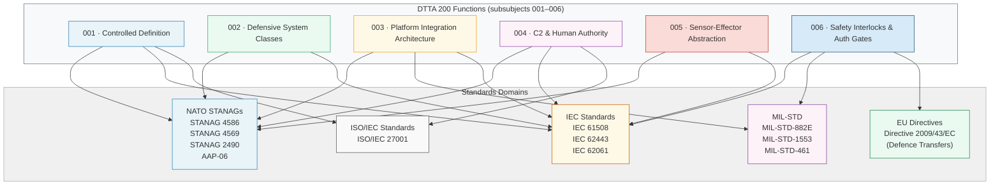

# DTTA 200-209 · 00.200.007 — Interoperability, NATO, EU and Standards Mapping

---

> **⚠ NON-OPERATIONAL BOUNDARY NOTICE**
> This document is a **restricted taxonomy and governance standards mapping** within the Q+ATLANTIDE ATLAS-1000 register.
> It does **not** reference classified NATO tactical doctrine, classified standards, operational employment standards, or operational combat procedures.
> All content is normative exclusively within the Q+ATLANTIDE taxonomy and traceability ecosystem.[^n001][^n006]
> The **No-AAA Rule** applies.[^n004]
> Documents in this band are classified `governance_class: restricted` per N-006.[^n006] Explicit human authority, rules-of-use governance, safety interlocks, legal admissibility, export-control review, independent assurance, and lifecycle traceability are **required**.

---

## §1 Purpose

This document provides the **single reference** for standards applicability within Q+ATLANTIDE DTTA 200 artefacts, mapping the combat systems architecture functions defined in subsubjects 001–006 to applicable NATO, EU, and international standards.[^baseline]

The mapping serves four purposes:

1. **Traceability** — enables evidence packages (subsubject 008) to cite applicable standards precisely and without ambiguity.
2. **Export-control scoping** — provides standards-based classification hooks for the export-control review framework (subsubject 009).
3. **Assurance boundary definition** — allows assurance scope to be specified in terms of named standards and their applicability domains.
4. **Waiver path declaration** — defines the conditions under which a standard's applicability may be waived, with required governance approval steps.

All standard references are for **taxonomy alignment and traceability purposes**. Compliance claims or certification obligations are not established by this document — they are established through the evidence package and assurance processes defined in subsubjects 008 and 010.

---

## §2 Scope

### In Scope

- NATO STANAG applicability matrix for DTTA 200 functions
- EU defence directive mapping (EU Directive 2009/43/EC)
- ISO/IEC standards applicability matrix
- Function-to-standard traceability table (subsubjects 001–006 → standards)
- Waiver path declarations with required governance approval steps

### Out of Scope

- Classified NATO tactical doctrine or classified STANAG annexes
- Classified standards or restricted standards not publicly referable
- Operational employment standards or operational procedures
- Programme-specific compliance status (addressed in evidence packages)
- Country-specific regulatory interpretations

---

## §3 Diagram

---

## §4 Footprint

| Attribute | Value |
|---|---|
| Architecture | Defence Technology Type Architecture (DTTA) |
| Master range | 200–299 |
| Code range | 200-209 |
| Section | 00 |
| Subsection | 200 |
| Subsubject | 007 |
| Primary Q-Division | Q-DATAGOV[^qdiv] |
| Support Q-Divisions | Q-SPACE, Q-HORIZON, Q-HPC, Q-STRUCTURES, Q-INDUSTRY |
| ORB support | ORB-LEG, ORB-PMO, ORB-FIN |
| Governance class | restricted[^gov] |
| Restricted rule | N-006[^n006] |
| Folder path | `Q+ATLANTIDE/200-299_DTTA/200-209_Sistemas-de-Combate-y-Armamento/200_Arquitectura-de-Sistemas-de-Combate/` |
| Document | `007_Interoperability-NATO-EU-and-Standards-Mapping.md` |
| Parent subsection | [README.md](./README.md) · [000_Overview.md](./000_Overview.md) |
| Parent section | [../README.md](../README.md) |
| Parent architecture | [../../README.md](../../README.md) |
| Parent baseline | [organization/Q+ATLANTIDE.md](../../../../organization/Q+ATLANTIDE.md) |

### Applicable Standards

| Standard | Issuing Body | Applicable Functions | Notes |
|---|---|---|---|
| STANAG 4586 | NATO | 001, 003, 004, 005 | UAV Control System Interoperability — C2, platform, sensor/effector taxonomy |
| STANAG 4569 | NATO | 001, 002 | Protection Levels for Armoured Vehicles — defensive class taxonomy |
| STANAG 2490 | NATO | 002, 003 | Defence Platform Integration — integration and logistical class taxonomy |
| MIL-STD-882E | US DoD | 005, 006 | System Safety — hazard taxonomy and safety interlock classification |
| IEC 61508 | IEC | 001–006 | Functional Safety — SIL classification applicable across all functions |
| IEC 62443 | IEC | 002, 003 | Industrial Automation Security — cybersecurity taxonomy for integrated systems |
| ISO/IEC 27001 | ISO/IEC | 001, 004 | Information Security Management — access control and governance alignment |
| EU Directive 2009/43/EC | EU | 006, 009 | Intra-EU transfers of defence-related products — export-control classification |

---

## §5 References & Citations

[^baseline]: Q+ATLANTIDE controlled baseline — authoritative taxonomy and traceability ecosystem governing all DTTA documents. See [organization/Q+ATLANTIDE.md](../../../../organization/Q+ATLANTIDE.md).
[^archtable]: §3 Architecture Table (parent) — see [../../README.md](../../README.md).
[^qdiv]: Q-Division authority — Q-DATAGOV is the primary authority for governance and data taxonomy within Q+ATLANTIDE DTTA band; Q-SPACE, Q-HORIZON, Q-HPC, Q-STRUCTURES, Q-INDUSTRY provide technical domain support.
[^gov]: Governance class `restricted` — documents in this class require formal evidence packages, export-control review, and access controls per N-006.
[^n001]: Note N-001: Q+ATLANTIDE is a taxonomy and traceability ecosystem, not an operational programme; definitions herein are normative within the Q+ATLANTIDE register only.
[^n004]: Note N-004 (No-AAA Rule) — "AAA" is not a valid domain, division, architecture, interface or function in this baseline.
[^n006]: Note N-006 (Restricted bands) — Defence-related (200-299 DTTA) bands require additional governance, evidence packages and access controls. See [organization/Q+ATLANTIDE.md](../../../../organization/Q+ATLANTIDE.md) §5.3.
