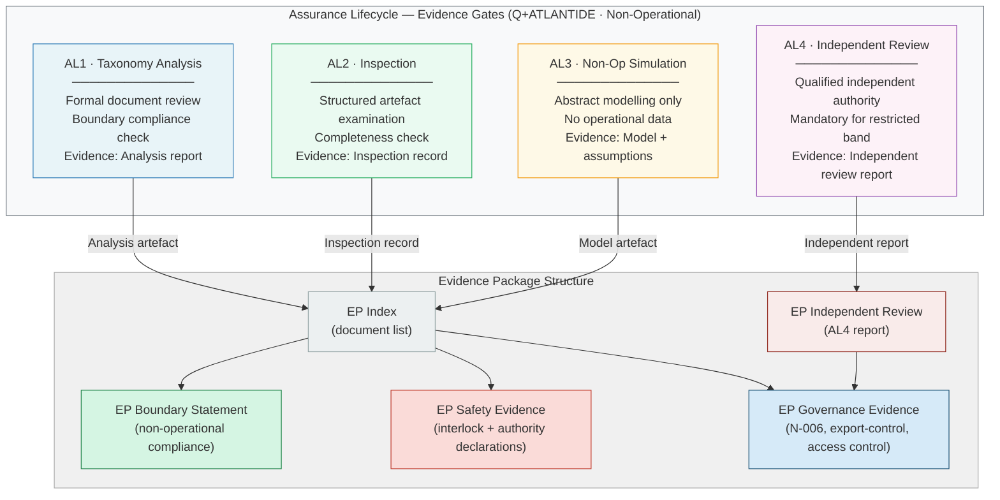

# DTTA 200-209 · 00.200.008 — Assurance, Verification and Non-Operational Evidence

---

> **⚠ NON-OPERATIONAL BOUNDARY NOTICE**
> This document is a **restricted taxonomy and governance framework** within the Q+ATLANTIDE ATLAS-1000 register.
> It does **not** define operational testing procedures, live-fire evidence requirements, classified test data, or operational combat procedures.
> All verification methods referenced herein are **non-operational** (analysis, inspection, review, and non-operational simulation only).
> All content is normative exclusively within the Q+ATLANTIDE taxonomy and traceability ecosystem.[^n001][^n006]
> The **No-AAA Rule** applies.[^n004]
> Documents in this band are classified `governance_class: restricted` per N-006.[^n006] Explicit human authority, rules-of-use governance, safety interlocks, legal admissibility, export-control review, independent assurance, and lifecycle traceability are **required**.

---

## §1 Purpose

This document defines the **assurance framework**, **verification taxonomy**, and **evidence package requirements** for the DTTA 200 subsection within the Q+ATLANTIDE ATLAS-1000 register.[^baseline]

The framework specifies what artefacts must be produced to demonstrate:

1. **Non-operational boundary compliance** — evidence that each subsubject document and associated artefact does not contain operational procedures, targeting logic, weapon construction, deployment methods, or performance optimisation for harm.
2. **Safety requirements compliance** — evidence that safety interlocks (subsubject 006) and human authority levels (subsubject 004) are correctly classified and declared.
3. **Governance constraint compliance** — evidence that restricted-band requirements (N-006), export-control review, and access-control profiles are satisfied.

**Four non-operational verification method classes** are defined:
- *Analysis* — formal review of taxonomy documents and governance declarations against stated requirements.
- *Inspection* — structured examination of artefacts for completeness and boundary compliance.
- *Non-operational simulation* — abstract modelling (taxonomy-level only) of system function interactions for assurance scoping purposes — no operational data, live-fire data, or performance optimisation.
- *Independent assurance review* — mandatory review by a qualified independent authority not involved in document production.

---

## §2 Scope

### In Scope

- Assurance levels taxonomy (AL1–AL4 for governance purposes, non-operational)
- Verification method taxonomy: analysis, inspection, non-operational simulation, independent review
- Evidence package structure for DTTA 200 artefacts
- Independent assurance requirement and qualification criteria
- Audit trail requirements for restricted-band documents

### Out of Scope

- Operational testing procedures or live-fire test requirements
- Test data from operational or live-fire trials
- Classified test records or classified assurance evidence
- Operational deployment evidence or mission evidence
- Performance measurements of any system for any operational purpose

---

## §3 Diagram

---

## §4 Footprint

| Attribute | Value |
|---|---|
| Architecture | Defence Technology Type Architecture (DTTA) |
| Master range | 200–299 |
| Code range | 200-209 |
| Section | 00 |
| Subsection | 200 |
| Subsubject | 008 |
| Primary Q-Division | Q-DATAGOV[^qdiv] |
| Support Q-Divisions | Q-SPACE, Q-HORIZON, Q-HPC, Q-STRUCTURES, Q-INDUSTRY |
| ORB support | ORB-LEG, ORB-PMO, ORB-FIN |
| Governance class | restricted[^gov] |
| Restricted rule | N-006[^n006] |
| Folder path | `Q+ATLANTIDE/200-299_DTTA/200-209_Sistemas-de-Combate-y-Armamento/200_Arquitectura-de-Sistemas-de-Combate/` |
| Document | `008_Assurance-Verification-and-Non-Operational-Evidence.md` |
| Parent subsection | [README.md](./README.md) · [000_Overview.md](./000_Overview.md) |
| Parent section | [../README.md](../README.md) |
| Parent architecture | [../../README.md](../../README.md) |
| Parent baseline | [organization/Q+ATLANTIDE.md](../../../../organization/Q+ATLANTIDE.md) |

### Applicable Standards

| Standard | Issuing Body | Applicability |
|---|---|---|
| IEC 61508 | IEC | Functional Safety — assurance level and SIL taxonomy alignment |
| MIL-STD-882E | US DoD | System Safety — hazard analysis and safety assurance method taxonomy reference |
| CENELEC EN 50126 | CENELEC | RAMS (Reliability, Availability, Maintainability, Safety) — assurance lifecycle taxonomy reference |
| AS9100D | SAE/IAQG | Quality Management Systems for Aviation, Space and Defence — quality assurance framework alignment |
| NATO STANAG 4187 | NATO | Fuze Safety Design — safety assurance taxonomy reference |
| ISO/IEC 15026 | ISO/IEC | Systems and Software Assurance — assurance case taxonomy and evidence package structure |

---

## §5 References & Citations

[^baseline]: Q+ATLANTIDE controlled baseline — authoritative taxonomy and traceability ecosystem governing all DTTA documents. See [organization/Q+ATLANTIDE.md](../../../../organization/Q+ATLANTIDE.md).
[^archtable]: §3 Architecture Table (parent) — see [../../README.md](../../README.md).
[^qdiv]: Q-Division authority — Q-DATAGOV is the primary authority for governance and data taxonomy within Q+ATLANTIDE DTTA band; Q-SPACE, Q-HORIZON, Q-HPC, Q-STRUCTURES, Q-INDUSTRY provide technical domain support.
[^gov]: Governance class `restricted` — documents in this class require formal evidence packages, export-control review, and access controls per N-006.
[^n001]: Note N-001: Q+ATLANTIDE is a taxonomy and traceability ecosystem, not an operational programme; definitions herein are normative within the Q+ATLANTIDE register only.
[^n004]: Note N-004 (No-AAA Rule) — "AAA" is not a valid domain, division, architecture, interface or function in this baseline.
[^n006]: Note N-006 (Restricted bands) — Defence-related (200-299 DTTA) bands require additional governance, evidence packages and access controls. See [organization/Q+ATLANTIDE.md](../../../../organization/Q+ATLANTIDE.md) §5.3.
