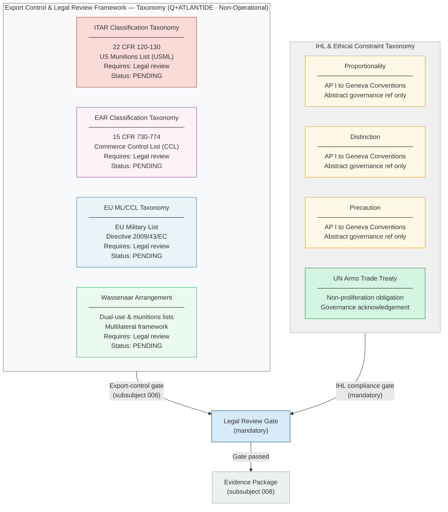

# DTTA 200-209 · 00.200.009 — Export Control, Legal and Ethical Boundaries

---

> **⚠ NON-OPERATIONAL BOUNDARY NOTICE**
> This document is a **restricted taxonomy and governance classification** within the Q+ATLANTIDE ATLAS-1000 register.
> It does **not** provide specific product classifications (classified), operational legal opinions, country-specific export licences, or operational combat procedures.
> All content is normative exclusively within the Q+ATLANTIDE taxonomy and traceability ecosystem.[^n001][^n006]
> The **No-AAA Rule** applies.[^n004]
> Documents in this band are classified `governance_class: restricted` per N-006.[^n006] Explicit human authority, rules-of-use governance, safety interlocks, legal admissibility, export-control review, independent assurance, and lifecycle traceability are **required**.

---

## §1 Purpose

This document defines the **export control classification framework**, **legal boundaries**, and **ethical constraints** applicable to DTTA 200 combat systems architecture taxonomy within the Q+ATLANTIDE ATLAS-1000 register.[^baseline]

The framework serves three governance functions:

1. **Export Control Classification Taxonomy** — establishes the classification framework vocabulary (ITAR, EAR, EU ML/CCL, Wassenaar Arrangement) for use in evidence packages and assurance reviews. Does not perform product-level classification — that requires a qualified export-control counsel review.

2. **Legal Boundary Declaration** — establishes the non-proliferation and international law obligations that all DTTA 200 artefacts must acknowledge and to which they must be traceable.

3. **Ethical Constraint Taxonomy** — establishes the International Humanitarian Law (IHL) alignment requirements and ethical constraint taxonomy at an abstract governance level. The principles of **proportionality** and **distinction** (IHL) are declared as mandatory governance references for all DTTA 200 systems, at the taxonomy level.

This document explicitly does **not** provide:
- Specific export classification determinations (requires qualified counsel)
- Operational legal opinions or legal advice
- Country-specific export licence guidance
- Classified export control data

---

## §2 Scope

### In Scope

- Export control classification taxonomy vocabulary: ITAR (22 CFR 120-130), EAR (15 CFR 730-774), EU Military List / Commerce Control List (ML/CCL), Wassenaar Arrangement
- Legal review requirement declarations for DTTA 200 artefacts
- International Humanitarian Law (IHL) alignment requirements: proportionality, distinction, precaution principles — abstract governance level only
- Ethical constraint taxonomy: proportionality, discrimination, precaution, human dignity — governance vocabulary
- Non-proliferation obligation acknowledgements: UN Arms Trade Treaty, CCW Convention

### Out of Scope

- Specific product-level export classification determinations
- Classified export control data or jurisdiction-specific rulings
- Operational legal opinions, compliance certificates, or export licences
- Country-specific regulatory interpretations or case-specific advice
- Operational combat procedures, targeting authority, or rules of engagement

---

## §3 Diagram

---

## §4 Footprint

| Attribute | Value |
|---|---|
| Architecture | Defence Technology Type Architecture (DTTA) |
| Master range | 200–299 |
| Code range | 200-209 |
| Section | 00 |
| Subsection | 200 |
| Subsubject | 009 |
| Primary Q-Division | Q-DATAGOV[^qdiv] |
| Support Q-Divisions | Q-SPACE, Q-HORIZON, Q-HPC, Q-STRUCTURES, Q-INDUSTRY |
| ORB support | ORB-LEG, ORB-PMO, ORB-FIN |
| Governance class | restricted[^gov] |
| Restricted rule | N-006[^n006] |
| Folder path | `Q+ATLANTIDE/200-299_DTTA/200-209_Sistemas-de-Combate-y-Armamento/200_Arquitectura-de-Sistemas-de-Combate/` |
| Document | `009_Export-Control-Legal-and-Ethical-Boundaries.md` |
| Parent subsection | [README.md](./README.md) · [000_Overview.md](./000_Overview.md) |
| Parent section | [../README.md](../README.md) |
| Parent architecture | [../../README.md](../../README.md) |
| Parent baseline | [organization/Q+ATLANTIDE.md](../../../../organization/Q+ATLANTIDE.md) |

### Applicable Standards and Legal Instruments

| Instrument | Issuing Body | Applicability |
|---|---|---|
| ITAR (22 CFR 120-130) | US Government | International Traffic in Arms Regulations — US Munitions List classification taxonomy reference |
| EAR (15 CFR 730-774) | US Government | Export Administration Regulations — Commerce Control List classification taxonomy reference |
| EU Directive 2009/43/EC | EU | Intra-EU transfers of defence-related products — EU Military List classification reference |
| Wassenaar Arrangement | Multilateral | Dual-use goods and munitions — multilateral export control classification reference |
| UN Arms Trade Treaty | UN | Non-proliferation obligations — governance acknowledgement reference |
| Additional Protocol I to Geneva Conventions | ICRC/UN | IHL proportionality and distinction principles — abstract ethical governance reference |
| CCW Convention | UN | Convention on Certain Conventional Weapons — IHL compliance governance reference |

---

## §5 References & Citations

[^baseline]: Q+ATLANTIDE controlled baseline — authoritative taxonomy and traceability ecosystem governing all DTTA documents. See [organization/Q+ATLANTIDE.md](../../../../organization/Q+ATLANTIDE.md).
[^archtable]: §3 Architecture Table (parent) — see [../../README.md](../../README.md).
[^qdiv]: Q-Division authority — Q-DATAGOV is the primary authority for governance and data taxonomy within Q+ATLANTIDE DTTA band; Q-SPACE, Q-HORIZON, Q-HPC, Q-STRUCTURES, Q-INDUSTRY provide technical domain support.
[^gov]: Governance class `restricted` — documents in this class require formal evidence packages, export-control review, and access controls per N-006.
[^n001]: Note N-001: Q+ATLANTIDE is a taxonomy and traceability ecosystem, not an operational programme; definitions herein are normative within the Q+ATLANTIDE register only.
[^n004]: Note N-004 (No-AAA Rule) — "AAA" is not a valid domain, division, architecture, interface or function in this baseline.
[^n006]: Note N-006 (Restricted bands) — Defence-related (200-299 DTTA) bands require additional governance, evidence packages and access controls. See [organization/Q+ATLANTIDE.md](../../../../organization/Q+ATLANTIDE.md) §5.3.
