# DTTA 200-209 · 00.200.010 — Traceability, Evidence and Lifecycle Governance

---

> **⚠ NON-OPERATIONAL BOUNDARY NOTICE**
> This document is a **restricted taxonomy and governance framework** within the Q+ATLANTIDE ATLAS-1000 register.
> It does **not** define operational mission evidence, classified test records, operational deployment evidence, or operational combat procedures.
> All content is normative exclusively within the Q+ATLANTIDE taxonomy and traceability ecosystem.[^n001][^n006]
> The **No-AAA Rule** applies.[^n004]
> Documents in this band are classified `governance_class: restricted` per N-006.[^n006] Explicit human authority, rules-of-use governance, safety interlocks, legal admissibility, export-control review, independent assurance, and lifecycle traceability are **required**.

---

## §1 Purpose

This document defines the **evidence package requirements**, **traceability obligations**, and **lifecycle governance** for the entire **Arquitectura de Sistemas de Combate** subsection (200) of the DTTA 200-209 code range within the Q+ATLANTIDE ATLAS-1000 register.[^baseline]

This document is the capstone governance artefact for subsection 200. It:

1. **Defines lifecycle phases** — establishes the canonical lifecycle phase taxonomy for DTTA 200 artefacts from concept through decommissioning.
2. **Specifies evidence packages per phase** — declares what artefacts must be produced and retained at each lifecycle phase to satisfy restricted-band governance (N-006).
3. **Establishes formal review gates** — defines mandatory review checkpoints (PDR, CDR, safety case review, export-control review, archive closure) with required approvals.
4. **Specifies traceability matrix requirements** — declares minimum traceability chain obligations linking each subsubject document to its evidence package, applicable standards, and review gate status.
5. **Defines archive and closure procedures** — specifies how lifecycle governance artefacts are archived and how formal closure notices are issued.

All lifecycle phase definitions and evidence requirements are for **governance and traceability purposes only**. Operational mission evidence, classified test records, and deployment evidence are explicitly outside scope.

---

## §2 Scope

### In Scope

- Lifecycle phase taxonomy: Concept → Design → Verification → Certification → Operations-Support → Decommission
- Evidence package structure per lifecycle phase
- Mandatory review gate declarations: PDR (Preliminary Design Review), CDR (Critical Design Review), Safety Case Review, Export Control Review, Archive and Closure Notice
- Traceability matrix requirements (subsubject → standards → evidence → review gate)
- Archive requirements and formal closure notice procedure

### Out of Scope

- Operational mission evidence or mission-specific records
- Classified test data or classified design review records
- Operational deployment evidence or field operations records
- Programme-specific schedules or cost data
- Operational combat procedures or tactical lifecycle planning

---

## §3 Diagram

```mermaid
flowchart LR
    subgraph LCP ["Lifecycle Phases — Governance Taxonomy (Q+ATLANTIDE · Non-Operational)"]
        direction LR
        CON["CONCEPT\n──────────\nInitial taxonomy scope\nDocument register open\nEvidence: Concept note\n+ Boundary declaration"]
        DES["DESIGN\n──────────\nSubsubject documents\nStandards mapping\nEvidence: All 000-010 docs\n+ Standards applicability"]
        VER["VERIFICATION\n──────────\nAssurance AL1-AL4\nNon-op verification only\nEvidence: Verification records\n+ Independent review"]
        CERT["CERTIFICATION\n──────────\nSafety case approval\nExport-control review\nEvidence: Safety case\n+ Export review record"]
        OPS["OPERATIONS-SUPPORT\n──────────\nGovernance maintenance\nEvidence package currency\nEvidence: Review records\n+ Change log"]
        DEC["DECOMMISSION\n──────────\nClosure notice\nArchive submission\nEvidence: Archive record\n+ Closure certificate"]
    end

    subgraph RG ["Review Gates"]
        PDR["PDR\nPreliminary\nDesign Review"]
        CDR["CDR\nCritical\nDesign Review"]
        SCR["Safety Case\nReview"]
        ECR["Export Control\nReview"]
        ACN["Archive &\nClosure Notice"]
    end

    CON -->|"Gate: PDR"| PDR
    PDR --> DES
    DES -->|"Gate: CDR"| CDR
    CDR --> VER
    VER -->|"Gate: Safety Case Review"| SCR
    SCR -->|"Gate: Export Control Review"| ECR
    ECR --> CERT
    CERT --> OPS
    OPS -->|"Gate: Archive & Closure"| ACN
    ACN --> DEC

    style CON fill:#e8f4f8,stroke:#2c7bb6
    style DES fill:#eafaf1,stroke:#27ae60
    style VER fill:#fef9e7,stroke:#f39c12
    style CERT fill:#fdf2f8,stroke:#8e44ad
    style OPS fill:#d5f5e3,stroke:#1e8449
    style DEC fill:#fadbd8,stroke:#c0392b
    style PDR fill:#d6eaf8,stroke:#1a5276
    style CDR fill:#d6eaf8,stroke:#1a5276
    style SCR fill:#d6eaf8,stroke:#1a5276
    style ECR fill:#d6eaf8,stroke:#1a5276
    style ACN fill:#d6eaf8,stroke:#1a5276
    style LCP fill:#f8f9fa,stroke:#6c757d
    style RG fill:#f0f0f0,stroke:#aaaaaa
```

### Traceability Matrix Summary

| Subsubject | Title | Standards (007) | Evidence (008) | Review Gate |
|---:|---|---|---|---|
| 000 | Overview | IEC 62443, ISO/IEC 27001 | Analysis, Inspection | PDR |
| 001 | Controlled Definition | NATO AAP-06, IEC 61508 | Analysis, Independent Review | PDR |
| 002 | Defensive System Classes | IEC 61508, STANAG 4569 | Analysis, Inspection | PDR |
| 003 | Platform Integration Architecture | STANAG 4586, MIL-STD-1553 | Analysis, Non-Op Simulation | CDR |
| 004 | C2 & Human Authority | STANAG 4586, IEC 61508 | Analysis, Independent Review | CDR |
| 005 | Sensor-Effector Abstraction | IEC 61508, NATO AAP-06 | Analysis, Non-Op Simulation | CDR |
| 006 | Safety Interlocks & Auth Gates | IEC 61508, MIL-STD-882E | Analysis, Inspection, Independent Review | Safety Case Review |
| 007 | Standards Mapping | All applicable | Analysis, Inspection | CDR |
| 008 | Assurance & Evidence | IEC 61508, ISO/IEC 15026 | Independent Review | Safety Case Review |
| 009 | Export Control & Legal | ITAR, EAR, EU 2009/43/EC | Legal Review, Independent Review | Export Control Review |
| 010 | Lifecycle Governance (this doc) | AS9100D, ISO/IEC 15026 | All above | Archive & Closure |

---

## §4 Footprint

| Attribute | Value |
|---|---|
| Architecture | Defence Technology Type Architecture (DTTA) |
| Master range | 200–299 |
| Code range | 200-209 |
| Section | 00 |
| Subsection | 200 |
| Subsubject | 010 |
| Primary Q-Division | Q-DATAGOV[^qdiv] |
| Support Q-Divisions | Q-SPACE, Q-HORIZON, Q-HPC, Q-STRUCTURES, Q-INDUSTRY |
| ORB support | ORB-LEG, ORB-PMO, ORB-FIN |
| Governance class | restricted[^gov] |
| Restricted rule | N-006[^n006] |
| Folder path | `Q+ATLANTIDE/200-299_DTTA/200-209_Sistemas-de-Combate-y-Armamento/200_Arquitectura-de-Sistemas-de-Combate/` |
| Document | `010_Traceability-Evidence-and-Lifecycle-Governance.md` |
| Parent subsection | [README.md](./README.md) · [000_Overview.md](./000_Overview.md) |
| Parent section | [../README.md](../README.md) |
| Parent architecture | [../../README.md](../../README.md) |
| Parent baseline | [organization/Q+ATLANTIDE.md](../../../../organization/Q+ATLANTIDE.md) |

### Applicable Standards

| Standard | Issuing Body | Applicability |
|---|---|---|
| AS9100D | SAE/IAQG | Quality Management Systems — lifecycle governance and audit trail framework |
| MIL-STD-882E | US DoD | System Safety — lifecycle hazard tracking and evidence requirements |
| IEC 61508 | IEC | Functional Safety — safety lifecycle phase taxonomy and evidence requirements |
| IEC 62443 | IEC | Industrial Automation Security — security lifecycle and evidence requirements |
| NATO STANAG 4187 | NATO | Fuze Safety Design — safety evidence package reference |
| ISO/IEC 15026 | ISO/IEC | Systems and Software Assurance — assurance case lifecycle and evidence closure |
| EU Directive 2009/43/EC | EU | Intra-EU transfers of defence-related products — lifecycle export-control review requirement |

---

## §5 References & Citations

[^baseline]: Q+ATLANTIDE controlled baseline — authoritative taxonomy and traceability ecosystem governing all DTTA documents. See [organization/Q+ATLANTIDE.md](../../../../organization/Q+ATLANTIDE.md).
[^archtable]: §3 Architecture Table (parent) — see [../../README.md](../../README.md).
[^qdiv]: Q-Division authority — Q-DATAGOV is the primary authority for governance and data taxonomy within Q+ATLANTIDE DTTA band; Q-SPACE, Q-HORIZON, Q-HPC, Q-STRUCTURES, Q-INDUSTRY provide technical domain support.
[^gov]: Governance class `restricted` — documents in this class require formal evidence packages, export-control review, and access controls per N-006.
[^n001]: Note N-001: Q+ATLANTIDE is a taxonomy and traceability ecosystem, not an operational programme; definitions herein are normative within the Q+ATLANTIDE register only.
[^n004]: Note N-004 (No-AAA Rule) — "AAA" is not a valid domain, division, architecture, interface or function in this baseline.
[^n006]: Note N-006 (Restricted bands) — Defence-related (200-299 DTTA) bands require additional governance, evidence packages and access controls. See [organization/Q+ATLANTIDE.md](../../../../organization/Q+ATLANTIDE.md) §5.3.
