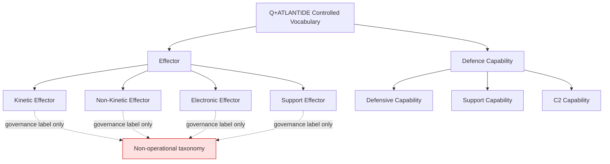

# DTTA 200-209 · 00.201.001 — Effectors and Capabilities Controlled Definition

## §1 Purpose

This document establishes the Q+ATLANTIDE controlled definitions of "effector" and "defence capability" for DTTA subsection 201. All definitions are normative at governance level and align with NATO AAP-06 glossary terms. Capability labels must be abstract, evidence-based, and non-operational.

**Non-operational boundary:** This document classifies effectors and defence capabilities at taxonomy, governance and assurance level only. It does not define performance optimization, targeting, employment tactics, deployment methods, construction parameters or operational procedures.

## §2 Scope

**In scope:**
- Controlled definitions of "effector" and "defence capability" within the Q+ATLANTIDE normative terminology framework.
- Disambiguation of "effector" from "offensive capability" in the governance taxonomy.
- Taxonomy of effector types: kinetic, non-kinetic, electronic, support.
- Alignment with NATO AAP-06 glossary and STANAG 4586 interface definitions.
- Q+ATLANTIDE normative terminology register entries.

**Out of scope:**
- Construction details, materials specifications, or engineering parameters.
- Performance specifications, range data, or accuracy data.
- Targeting logic, engagement sequences, or operational employment.

## §3 Diagram

> **Note:** All nodes in this diagram represent governance taxonomy labels only. No operational system, capability employment, or performance characteristic is defined or implied.

## §4 Footprint

| Field | Value |
|---|---|
| Architecture | Defence Technology Type Architecture (DTTA) |
| Master range | 200–299 |
| Code range | 200-209 |
| Section | 00 |
| Subsection | 201 |
| Subsubject | 001 |
| Primary Q-Division | Q-DATAGOV[^qdiv] |
| Support Q-Divisions | Q-SPACE, Q-HORIZON, Q-HPC, Q-STRUCTURES, Q-INDUSTRY |
| ORB support | ORB-LEG, ORB-PMO, ORB-FIN |
| Governance class | restricted[^gov] |
| Restricted rule | N-006[^n006] |
| Folder path | `Q+ATLANTIDE/200-299_DTTA/200-209_Sistemas-de-Combate-y-Armamento/201_Clasificacion-de-Efectores-y-Capacidades/` |
| Document | `001_Effectors-and-Capabilities-Controlled-Definition.md` |
| Parent subsection | [README.md](./README.md) · [000_Overview.md](./000_Overview.md) |
| Parent section | [../README.md](../README.md) |
| Parent architecture | [../../README.md](../../README.md) |
| Parent baseline | [organization/Q+ATLANTIDE.md](../../../../organization/Q+ATLANTIDE.md) |

## §5 References

[^baseline]: Q+ATLANTIDE controlled baseline — [organization/Q+ATLANTIDE.md](../../../../organization/Q+ATLANTIDE.md)
[^archtable]: §3 Architecture Table — parent architecture index [../../README.md](../../README.md)
[^qdiv]: Q-DATAGOV primary authority; Q-SPACE, Q-HORIZON, Q-HPC, Q-STRUCTURES, Q-INDUSTRY support.
[^gov]: Governance class `restricted` per N-006 for DTTA band documents.
[^n001]: Note N-001: taxonomy/traceability ecosystem only.
[^n004]: Note N-004 (No-AAA Rule).
[^n006]: Note N-006 (Restricted bands) — DTTA 200-299.

**Applicable standards:** NATO AAP-06 · STANAG 4586 · IEC 61508 · NATO STANAG 4569.
