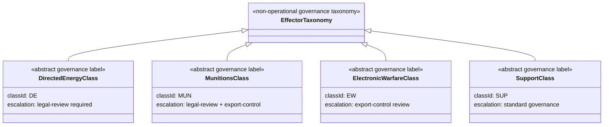

# DTTA 200-209 · 00.201.002 — Effector Classes and Non-Operational Taxonomy

## §1 Purpose

This document defines the non-operational taxonomy of effector classes for governance and classification purposes within DTTA subsection 201. All classes are defined abstractly for traceability only and carry no operational specification.

**Non-operational boundary:** This document classifies effectors at taxonomy, governance and assurance level only. It does not define performance optimization, targeting, employment tactics, deployment methods, construction parameters or operational procedures. All class labels are governance instruments only.

## §2 Scope

**In scope:**
- Effector class taxonomy: directed-energy class (abstract), munitions-class (abstract), electronic-warfare class, support-class.
- Classification hierarchy and parent-child class relationships for governance traceability.
- Boundary declarations between effector classes to prevent misclassification.
- Governance escalation trigger points per class.

**Out of scope:**
- Performance data, yield data, range, or accuracy characteristics.
- Construction specifications, materials, or engineering parameters.
- Targeting guidance, engagement parameters, or operational employment procedures.

## §3 Diagram

> **Note:** All classes in this diagram are non-operational governance taxonomy labels. No physical system, construction parameter, performance characteristic, or operational employment procedure is defined or implied.

## §4 Footprint

| Field | Value |
|---|---|
| Architecture | Defence Technology Type Architecture (DTTA) |
| Master range | 200–299 |
| Code range | 200-209 |
| Section | 00 |
| Subsection | 201 |
| Subsubject | 002 |
| Primary Q-Division | Q-DATAGOV[^qdiv] |
| Support Q-Divisions | Q-SPACE, Q-HORIZON, Q-HPC, Q-STRUCTURES, Q-INDUSTRY |
| ORB support | ORB-LEG, ORB-PMO, ORB-FIN |
| Governance class | restricted[^gov] |
| Restricted rule | N-006[^n006] |
| Folder path | `Q+ATLANTIDE/200-299_DTTA/200-209_Sistemas-de-Combate-y-Armamento/201_Clasificacion-de-Efectores-y-Capacidades/` |
| Document | `002_Effector-Classes-and-Non-Operational-Taxonomy.md` |
| Parent subsection | [README.md](./README.md) · [000_Overview.md](./000_Overview.md) |
| Parent section | [../README.md](../README.md) |
| Parent architecture | [../../README.md](../../README.md) |
| Parent baseline | [organization/Q+ATLANTIDE.md](../../../../organization/Q+ATLANTIDE.md) |

## §5 References

[^baseline]: Q+ATLANTIDE controlled baseline — [organization/Q+ATLANTIDE.md](../../../../organization/Q+ATLANTIDE.md)
[^archtable]: §3 Architecture Table — parent architecture index [../../README.md](../../README.md)
[^qdiv]: Q-DATAGOV primary authority; Q-SPACE, Q-HORIZON, Q-HPC, Q-STRUCTURES, Q-INDUSTRY support.
[^gov]: Governance class `restricted` per N-006 for DTTA band documents.
[^n001]: Note N-001: taxonomy/traceability ecosystem only.
[^n004]: Note N-004 (No-AAA Rule).
[^n006]: Note N-006 (Restricted bands) — DTTA 200-299.

**Applicable standards:** NATO AAP-06 · STANAG 4586 · IEC 61508 · MIL-STD-882E.
