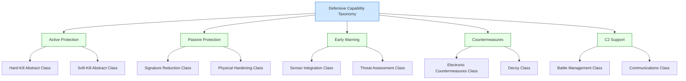

# DTTA 200-209 · 00.201.003 — Defensive Capability Categories

## §1 Purpose

This document defines the taxonomy of defensive capability categories for governance and traceability within DTTA subsection 201. Categories are abstract governance labels only, assigned for classification, audit, and proportionality assessment purposes.

**Non-operational boundary:** This document classifies defensive capabilities at taxonomy, governance and assurance level only. Categories defined here are not definitions of deployed systems, operational configurations, or employment procedures. No offensive capabilities are defined or implied. Proportionality taxonomy entries are governance instruments only and do not constitute targeting guidance.

## §2 Scope

**In scope:**
- Defensive capability category taxonomy: active protection, passive protection, early warning, countermeasures, C2 support.
- Category boundary definitions to prevent misclassification.
- Proportionality taxonomy labels for governance traceability.
- Alignment with IHL principles of distinction and proportionality at abstract taxonomy level.

**Out of scope:**
- Offensive capabilities, systems designed primarily for offensive action.
- Kinetic engagement specifications, terminal effect parameters.
- Operational employment procedures, rules of engagement.

## §3 Diagram

> **Note:** All nodes represent non-operational governance taxonomy labels. No specific system, platform, or operational procedure is defined or implied.

## §4 Footprint

| Field | Value |
|---|---|
| Architecture | Defence Technology Type Architecture (DTTA) |
| Master range | 200–299 |
| Code range | 200-209 |
| Section | 00 |
| Subsection | 201 |
| Subsubject | 003 |
| Primary Q-Division | Q-DATAGOV[^qdiv] |
| Support Q-Divisions | Q-SPACE, Q-HORIZON, Q-HPC, Q-STRUCTURES, Q-INDUSTRY |
| ORB support | ORB-LEG, ORB-PMO, ORB-FIN |
| Governance class | restricted[^gov] |
| Restricted rule | N-006[^n006] |
| Folder path | `Q+ATLANTIDE/200-299_DTTA/200-209_Sistemas-de-Combate-y-Armamento/201_Clasificacion-de-Efectores-y-Capacidades/` |
| Document | `003_Defensive-Capability-Categories.md` |
| Parent subsection | [README.md](./README.md) · [000_Overview.md](./000_Overview.md) |
| Parent section | [../README.md](../README.md) |
| Parent architecture | [../../README.md](../../README.md) |
| Parent baseline | [organization/Q+ATLANTIDE.md](../../../../organization/Q+ATLANTIDE.md) |

## §5 References

[^baseline]: Q+ATLANTIDE controlled baseline — [organization/Q+ATLANTIDE.md](../../../../organization/Q+ATLANTIDE.md)
[^archtable]: §3 Architecture Table — parent architecture index [../../README.md](../../README.md)
[^qdiv]: Q-DATAGOV primary authority; Q-SPACE, Q-HORIZON, Q-HPC, Q-STRUCTURES, Q-INDUSTRY support.
[^gov]: Governance class `restricted` per N-006 for DTTA band documents.
[^n001]: Note N-001: taxonomy/traceability ecosystem only.
[^n004]: Note N-004 (No-AAA Rule).
[^n006]: Note N-006 (Restricted bands) — DTTA 200-299.

**Applicable standards:** IEC 61508 · STANAG 4569 · MIL-STD-882E · Additional Protocol I (Geneva Conventions) — IHL proportionality and distinction principles · NATO AAP-06.
