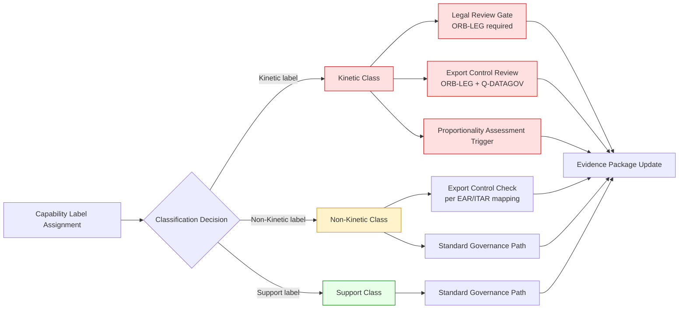

# DTTA 201 · 004 — Kinetic, Non-Kinetic and Support Capability Boundaries

## §1 Purpose

This document defines the Q+ATLANTIDE boundary taxonomy between kinetic, non-kinetic, and support capabilities for governance classification within DTTA subsection 201. It establishes which taxonomy labels require additional legal review and/or export-control review prior to further processing.

**Non-operational boundary:** This document classifies capability boundary labels at governance and taxonomy level only. It does not define specific kinetic system design, engagement parameters, targeting sequences, employment tactics, or operational procedures. All boundary declarations are governance instruments to ensure correct escalation routing.

## §2 Scope

**In scope:**
- Boundary definitions between kinetic, non-kinetic, and support capability taxonomy labels.
- Governance escalation requirements triggered by kinetic-labelled classification assignments.
- Interface declaration points between capability categories.
- Proportionality assessment trigger points at taxonomy level (abstract).

**Out of scope:**
- Specific kinetic system design, terminal effect parameters, or warhead specifications.
- Engagement sequences, targeting logic, or fire control procedures.
- Operational employment, rules of engagement, or mission planning.

## §3 Diagram

> **Note:** This diagram represents governance escalation routing only. No operational system, kinetic engagement, or tactical employment is defined or implied.

## §4 Footprint

| Field | Value |
|---|---|
| Architecture | Defence Technology Type Architecture (DTTA) |
| Master range | 200–299 |
| Code range | 200-209 |
| Section | 00 |
| Subsection | 201 |
| Subsubject | 004 |
| Primary Q-Division | Q-DATAGOV[^qdiv] |
| Support Q-Divisions | Q-SPACE, Q-HORIZON, Q-HPC, Q-STRUCTURES, Q-INDUSTRY |
| ORB support | ORB-LEG, ORB-PMO, ORB-FIN |
| Governance class | restricted[^gov] |
| Restricted rule | N-006[^n006] |
| Folder path | `Q+ATLANTIDE/200-299_DTTA/200-209_Sistemas-de-Combate-y-Armamento/201_Clasificacion-de-Efectores-y-Capacidades/` |
| Document | `004_Kinetic-Non-Kinetic-and-Support-Capability-Boundaries.md` |
| Parent subsection | [README.md](./README.md) · [000_Overview.md](./000_Overview.md) |
| Parent section | [../README.md](../README.md) |
| Parent architecture | [../../README.md](../../README.md) |
| Parent baseline | [organization/Q+ATLANTIDE.md](../../../../organization/Q+ATLANTIDE.md) |

## §5 References

[^baseline]: Q+ATLANTIDE controlled baseline — [organization/Q+ATLANTIDE.md](../../../../organization/Q+ATLANTIDE.md)
[^archtable]: §3 Architecture Table — parent architecture index [../../README.md](../../README.md)
[^qdiv]: Q-DATAGOV primary authority; Q-SPACE, Q-HORIZON, Q-HPC, Q-STRUCTURES, Q-INDUSTRY support.
[^gov]: Governance class `restricted` per N-006 for DTTA band documents.
[^n001]: Note N-001: taxonomy/traceability ecosystem only.
[^n004]: Note N-004 (No-AAA Rule).
[^n006]: Note N-006 (Restricted bands) — DTTA 200-299.

**Applicable standards:** IHL Additional Protocol I (AP-I) · Convention on Certain Conventional Weapons (CCW) · NATO AAP-06 · STANAG 4586 · IEC 61508 · UN Arms Trade Treaty (ATT) · MIL-STD-882E.
